# Mirai      


## Solution

### Scan with nmap

Type:

```
nmap -sC -sV {target ip} -v
```

`-sC` - This flag tells Nmap to use the default set of scripts during the scan. These scripts are part of the Nmap Scripting Engine (NSE) and are used for tasks such as version detection, vulnerability detection, and more. Using -sC enhances the scan by providing additional information about the target.

`-sV` - Version detection. Nmap will try to determine the version of the services running on open ports. This is useful for identifying specific software and versions, which can help in assessing potential vulnerabilities.

`-v` - Enables verbose mode. Verbose mode provides more detailed output during the scanning process, allowing you to see more information about what Nmap is doing. This can be helpful for debugging and understanding the progress of the scan.

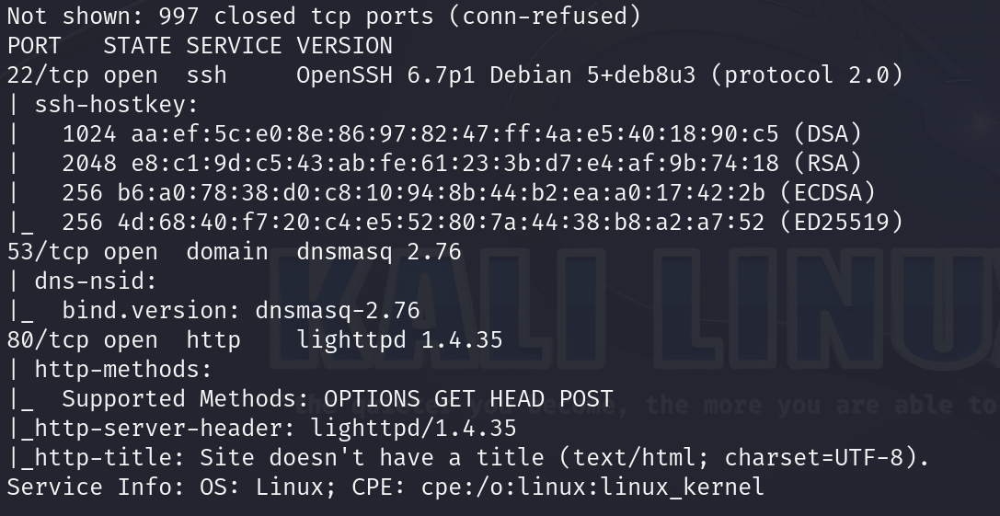

Here are the descriptions for the open ports shown in the screenshot:

### **22/tcp (SSH)**
This port is used by `OpenSSH`, version 6.7p1, running on a Debian system. The SSH service provides secure remote login and other secure network services over an unsecured network, using keys such as `DSA`, `RSA`, `ECDSA`, and `ED25519` for authentication. The service supports SSH protocol 2.0, ensuring that data transmitted between the client and server is encrypted and protected.

### **53/tcp (DNS)**
This port is used by `dnsmasq`, version 2.76, which provides DNS, DHCP, router advertisement, and network boot services. `Dnsmasq` is lightweight and is often used in small networks for name resolution and other related services. The service includes information like the DNS server version (`dnsmasq-2.76`) and supports basic DNS functionalities.

### **80/tcp (HTTP)**
This port is used by the `lighttpd` web server, version 1.4.35, which is known for being lightweight and optimized for high-performance environments. The server handles HTTP requests and supports standard methods like `OPTIONS`, `GET`, `HEAD`, and `POST`. The HTTP server header confirms the use of `lighttpd`, but the site currently lacks a defined title, indicating a basic or potentially misconfigured web service.

After pasting http://{target ip}/ into the browser we can see that nothing was found.

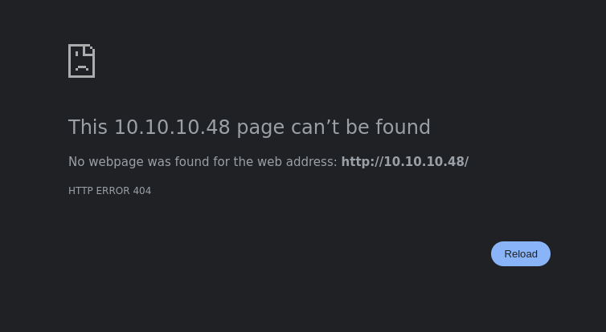

It's interesting as `HTTP` is open.

This observation suggests that the IP address might be hosting a subdomain dedicated to a service's dashboard or management interface. It's common for web services to segment their functionalities across different subdomains, with a specific one dedicated to administrative or user-facing dashboards. This subdomain could be where the main control panel or a specialized service interface is accessible, often used for monitoring, managing, or configuring the service.

### gobuster

Type:

```
gobuster dir -u http://{target ip}/ -w {path to the dictionary you want to use}
```

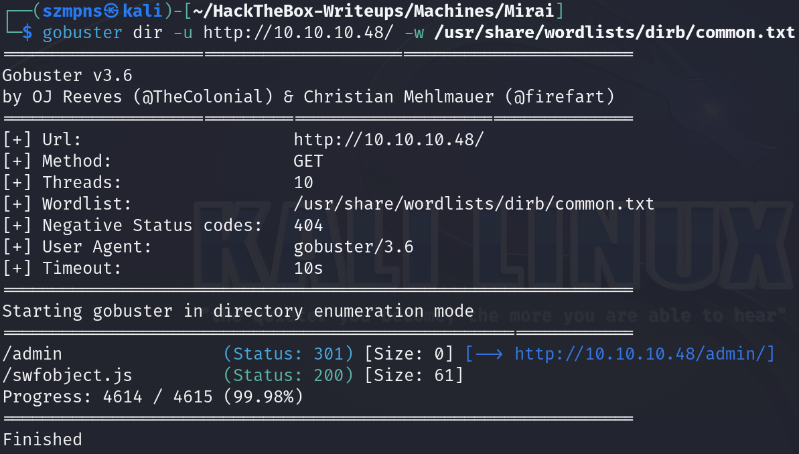

We can see that `Admin` panel has been found.

Let's paste http://{target ip}/admin/ into the browser.

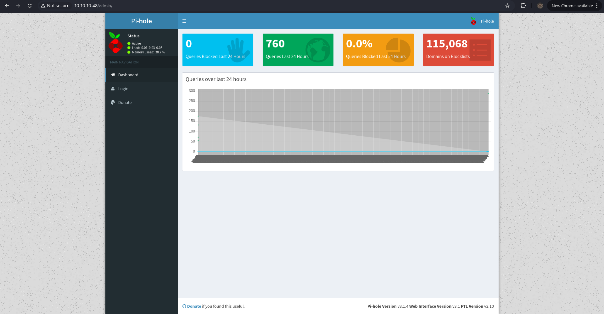

It's a `Pi-hole` dashboard.

`Pi-Hole` is a network-wide `ad blocker` that operates as a `DNS sinkhole`, designed to block ads, trackers, and unwanted content at the network level. By intercepting `DNS queries` for known ad-serving domains, `Pi-Hole` effectively prevents ads from being loaded on any device connected to the network. It is often installed on a `Raspberry Pi`, but it can also run on other platforms such as virtual machines or dedicated servers. `Pi-Hole` includes a `web-based interface` for managing and monitoring blocked domains, offering users a straightforward way to maintain control over their network traffic. Additionally, `it can be integrated with other tools` like Unbound for DNS encryption or OpenVPN for secure remote access. This not only improves privacy by blocking tracking scripts but also enhances network performance by reducing unnecessary data downloads. `Pi-Hole` is popular for its ease of use and effectiveness in creating an ad-free browsing experience across all devices on a network.

`Dashboard` does not have many functionalities. The only clue is to try to get the `Admin`'s `password`.

I found there: https://discourse.pi-hole.net/t/password-for-pre-configured-pi-hole/13629 that the `default password` for `user pi` is `raspberry`.

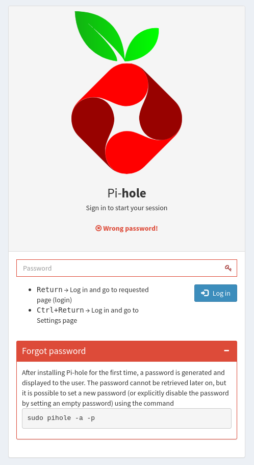

I tried to `login` but it didn't work.

It's not a big problem. From the `nmap` scan we know that the `SSH` is running.

I delved into the `Pi-hole` topic and I learnt that you can almost always connect to the service via `SSH`.

### SSH

From the link above, we know that the `default user` on a `Raspberry Pi` is `pi`, and the `password` is `raspberry`, unless it has been changed.

Type:

```
ssh pi@{target ip}
```

and provide the password.

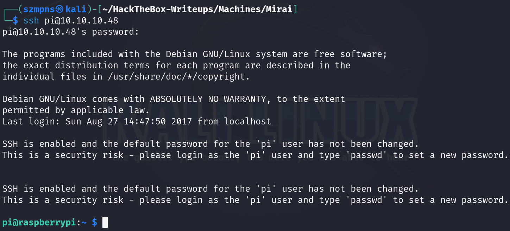

### Get the user flag

The `user` flag is on the `Desktop`.

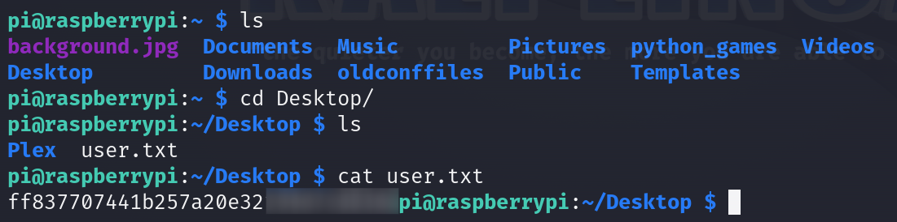

## Privilege Escalation

Let's do some reconnaissance that will help us `escalate` our `privileges`.

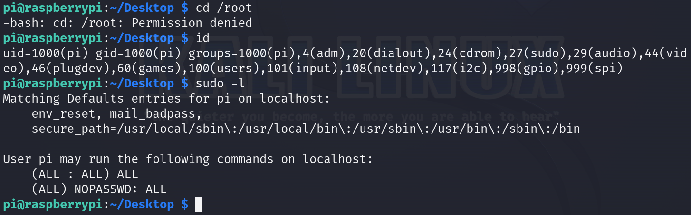

We are logged in as the user `pi`, who belongs to the `sudo` group. Nice.

We also know that the user `pi` may run every command without providing a password.

Knowing thate, let's type:

```
sudo su
```

or 

```
sudo -i
```

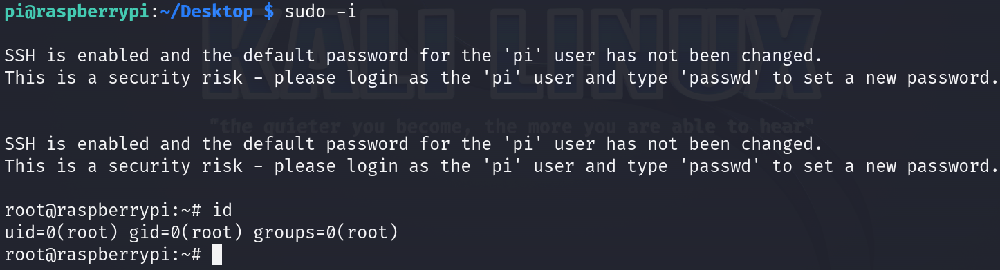

Boom. We are `root`.

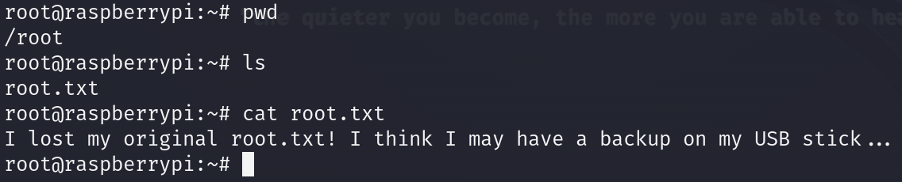

I thought it was over but it's not.

We get the following information instead of a flag:

`I lost my original root.txt! I think I may have a backup on my USB stick...`

As computer forensics is not unfamiliar to me, I instantly knew that I have to hit 

```
df -h
```

command.

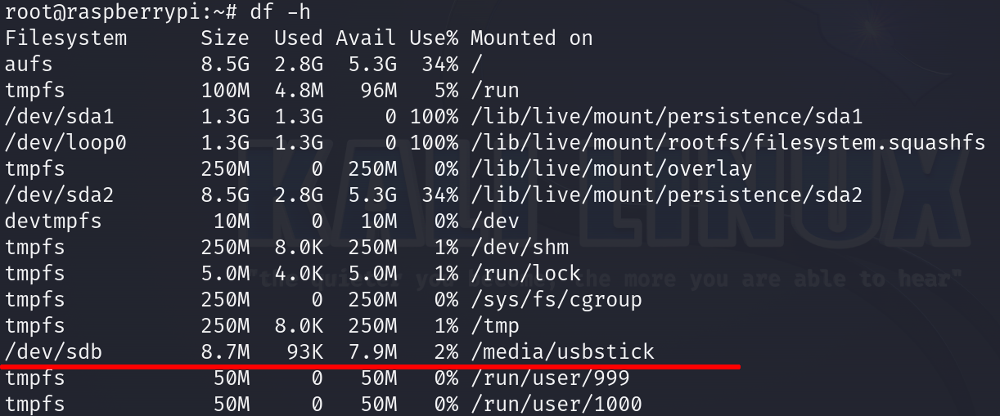

Now, let's go to `/media/usbstick`:

```
cd /media/usbstick
```

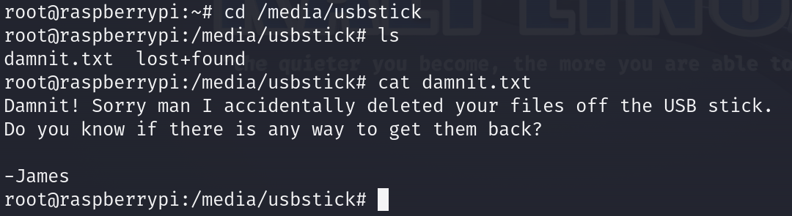

We still don't have a flag.

`lost+found` directory is empty, is not in our sphere of interest.

At first I tried to move `damnit.txt` to my machine.

I pasted:

```
scp pi@10.10.10.48:/media/usbstick/damnit.txt .
```

to get it.

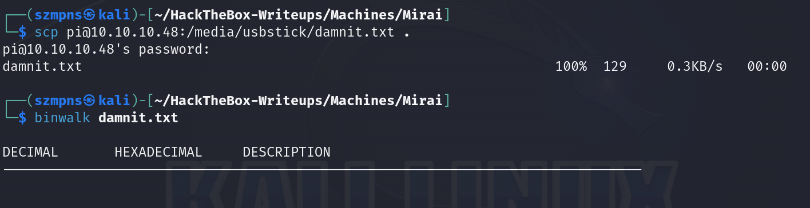

I tried with `Binwalk` and then even with `Foremost` but both tools found nothing in that file.

Let's go back to our target's tab.

### Get the root flag

We have to assume that the data may still be in the file.

Type:

```
strings /dev/sdb
```

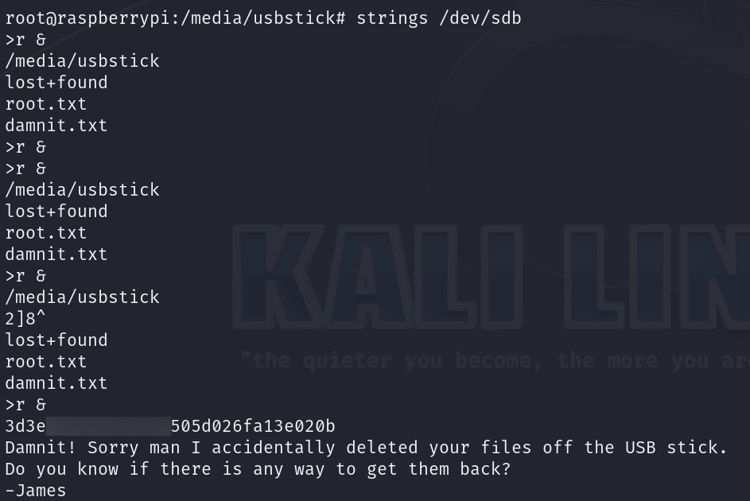

Flag is there.

### Paste the flags

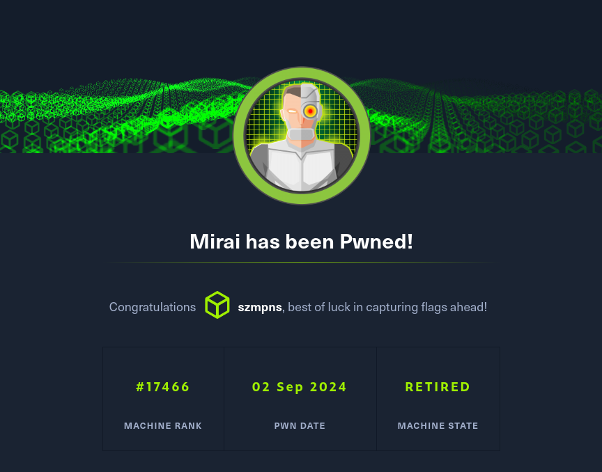