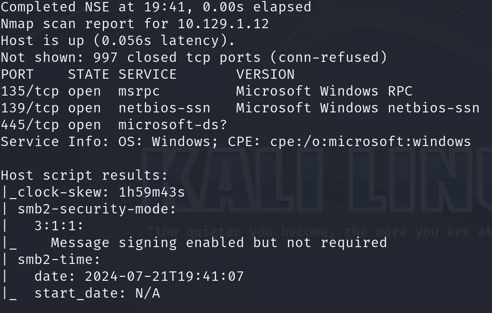
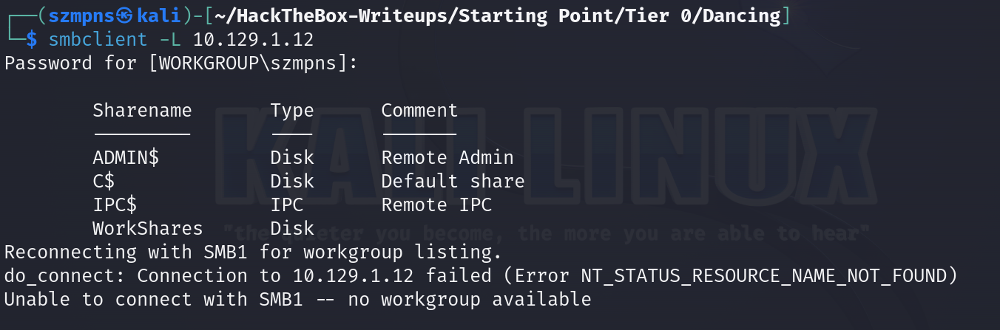
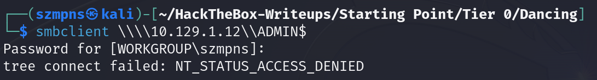
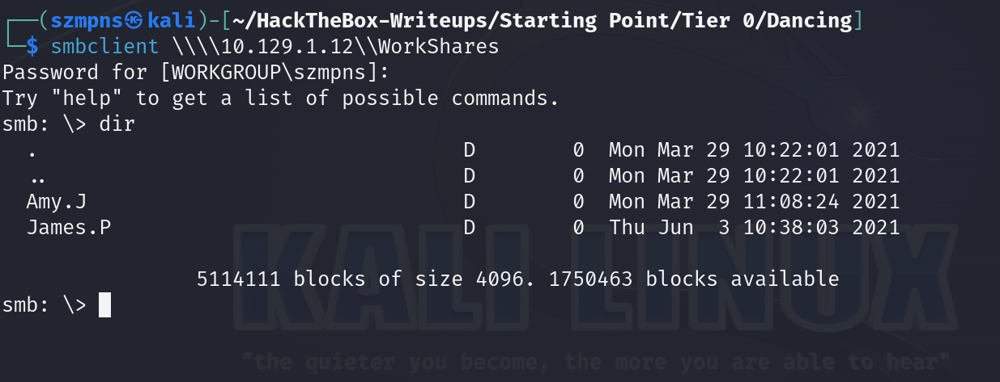
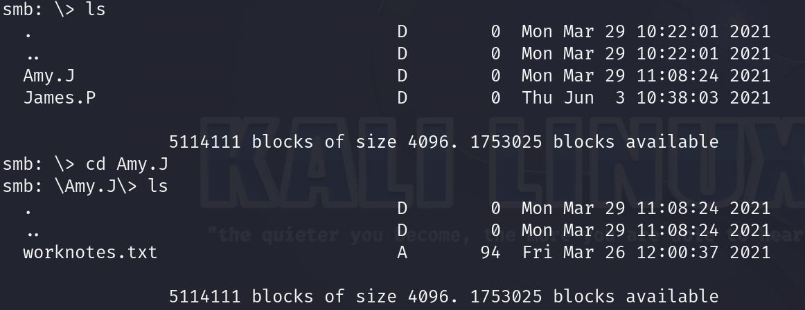
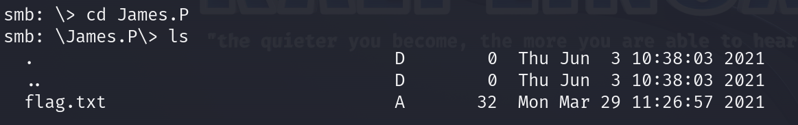
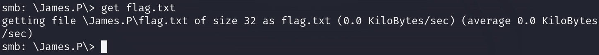
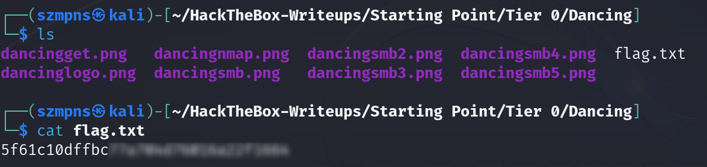

# Dancing      


## Solution

### Scan with nmap

Type:

```
nmap -sC -sV {target ip} -v
```



Three ports are open. But we want to focus at `SMB`(port 445).

### Server Message Block/SMB

If you want to search for a specific functionality type `smbclient -h`

We are going to use `-L` flag.

Type:

```
smbclient -L {target ip}
```

When it asks you to specify the password just press `enter`.



Four shares are displayed.

We can try to connect to some of them by pasting in terminal:

```
smbclient \\\\{target ip}\\{target sharename}
```



Go with:

```
smbclient \\\\{target ip}\\WorkShares
```



It is the only one share that we are able to access with a blank password.

You can type `help` if you are looking for commands.

`James.P` directory contains a flag.





### Get the flag

We want to simply `get` `flag.txt` file. To do that we have to be in `James.P` directory and type:

```
get flag.txt
```



### ls and cat

You can leave `smb` by just simply using `Ctrl + d` combination or open new terminal window.



Flag is there. Good job.

### Paste the flag


## Answers

### Task-1: What does the 3-letter acronym SMB stand for?

Server Message Block

### Task-2: What port does SMB use to operate at?

445

### Task-3: What is the service name for port 445 that came up in our Nmap scan?

microsoft-ds

### Task-4: What is the 'flag' or 'switch' that we can use with the smbclient utility to 'list' the available shares on Dancing?

-L 

### Task-5: How many shares are there on Dancing?

4

### Task-6: What is the name of the share we are able to access in the end with a blank password?

WorkShares

### Task-7: What is the command we can use within the SMB shell to download the files we find?

get

### Submit root flag

Congrats! Super job!