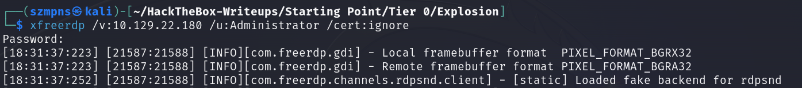
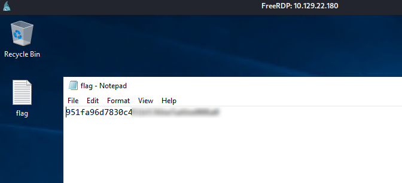

# Explosion      


## Solution

### Scan with nmap

Type:

```
nmap -sC -sV {target ip} -v
```


3389/tcp is open. Service is `ms-wbt-server` and version is `Microsoft Terminal Services`.

3389 TCP is typically used for `Windows Remote Desktop and Remote Assistance connections`.

### xfreerdp

I've helped myself with `tldr`. You can search how to execute proper command via `Internet` or some `AI` models. Even `xfreerdp -h` would help. OR MAYBE YOU DON'T HAVE TO BECAUSE YOU'LL FIND IT HERE.


Type:

```
xfreerdp /v:{target ip} /u:Administrator /cert:ignore
```



In our case, the `Administrator` account has not any `password` set. We can hit `Enter` to continue without it.

`RDP` window opens up.


### Get the flag

The flag is on the desktop. Just open `flag.txt` file.



### Paste the flag


## Answers

### Task-1: What does the 3-letter acronym RDP stand for?

Remote Desktop Protocol

### Task-2: What is a 3-letter acronym that refers to interaction with the host through a command line interface?

CLI

### Task-3: What about graphical user interface interactions?

GUI

### Task-4: What is the name of an old remote access tool that came without encryption by default and listens on TCP port 23?

telnet

### Task-5: What is the name of the service running on port 3389 TCP?

ms-wbt-server

### Task-6: What is the switch used to specify the target host's IP address when using xfreerdp?

/v: 

### Task-7: What username successfully returns a desktop projection to us with a blank password?

Administrator

### Submit root flag

Great job. I'm proud of you.