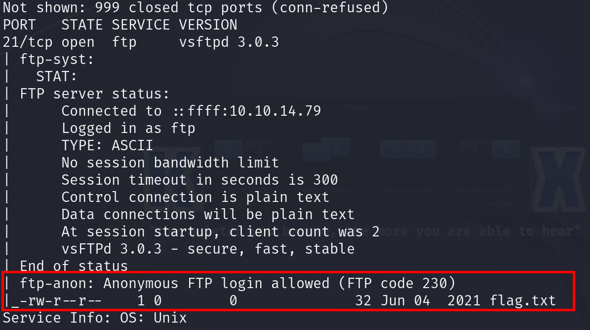
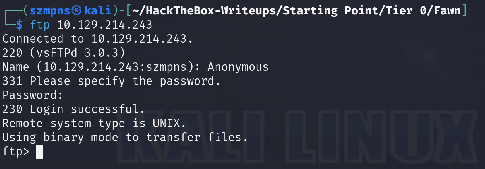
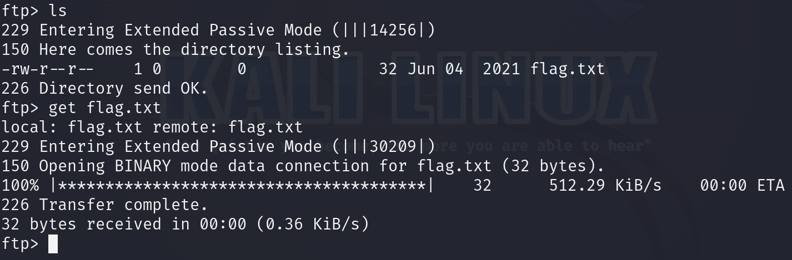
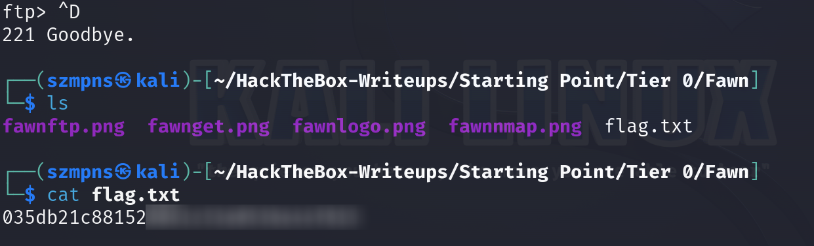

# Fawn      


## Solution

### Scan with nmap

Type:

```
nmap -sC -sV {target ip} -v
```



Port 21/tcp is open. The service is ftp. Version vsftpd 3.0.3.

We are able to log in as Anonymous and the flag is there. We are almost home.

### Ftp

Type:

```
ftp {target ip}
```

Use `Anonymous` as name.

When it asks you to specify the password just press `enter`.



### Get the flag

Once logged you can just type `help`. There will be a list of the commands you can use. In this example we are going to use the `get`. This command in FTP is used to download a file from the remote server to the local machine.

If you are not sure you can type `ls` to see that the `flag.txt` is there.

Go with:

```
get flag.txt
```



### ls and cat

You can leave `ftp` by just simply using `Ctrl + d` combination or open new terminal window.



Flag is there. Enjoy.

### Paste the flag


## Answers

### Task-1: What does the 3-letter acronym FTP stand for?

File Transfer Protocol

### Task-2: Which port does the FTP service listen on usually?

21

### Task-3: What acronym is used for the version of FTP secured by running over the SSH protocol?

SFTP

### Task-4: What is the command we can use to send an ICMP echo request to test our connection to the target?

ping 

### Task-5: From your scans, what version is FTP running on the target?

vsftpd 3.0.3

### Task-6: From your scans, what OS type is running on the target?

Unix

### Task-7: What is the command we need to run in order to display the 'ftp' client help menu?

ftp -h

### Task-8: What is username that is used over FTP when you want to log in without having an account?

anonymous

### Task-9: What is the response code we get for the FTP message 'Login successful'?

230

### Task-10: There are a couple of commands we can use to list the files and directories available on the FTP server. One is dir. What is the other that is a common way to list files on a Linux system.

ls

### Task-11: What is the command used to download the file we found on the FTP server?

get

### Submit root flag

Congrats!