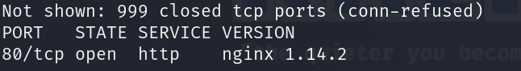
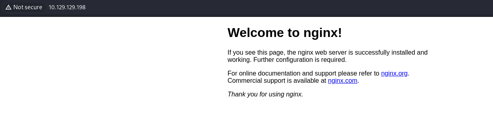
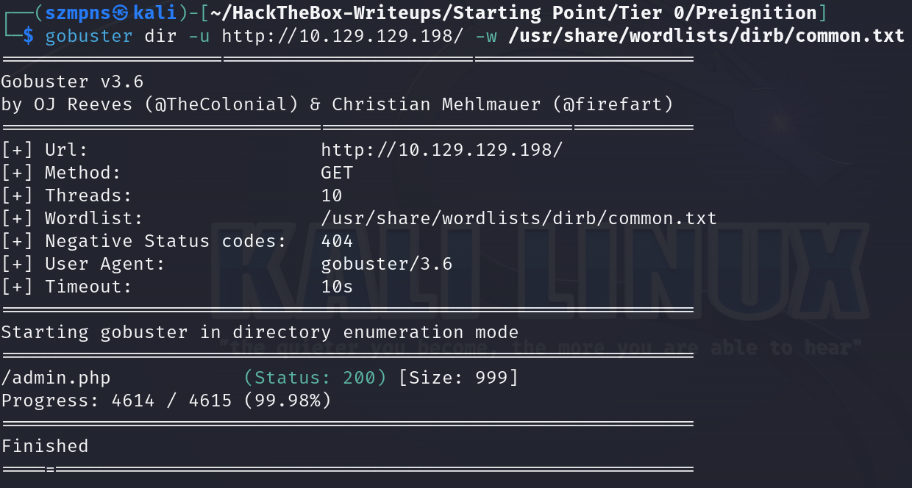
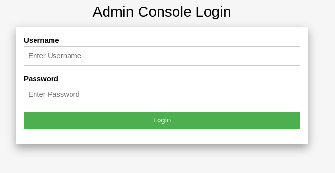
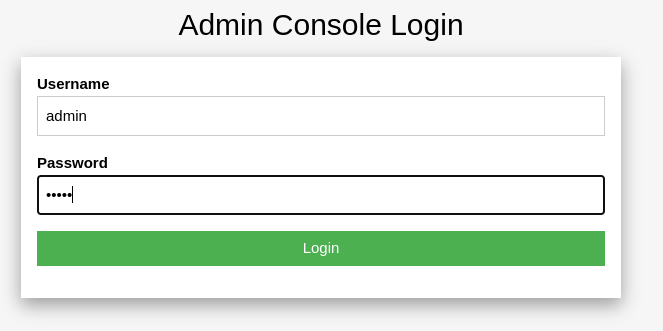
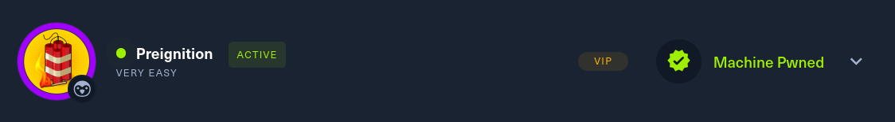

# Preignition      


## Solution

### Scan with nmap

Type:

```
nmap -sV {target ip} -v
```



80/tcp is open. Service is `http` and version is `nginx 1.14.2`.

Let's paste it to our browser.



### gobuster

`Gobuster` is a command-line tool used for brute-forcing `directories` and `files` on `web` servers. We will use it to discover hidden resources on a server, such as hidden directories, files, and subdomains, by sending a large number of HTTP requests in a short amount of time. This helps in identifying potential entry points and vulnerabilities during penetration testing.

Type:

```
gobuster dir -u http://{target ip}/ -w /usr/share/wordlists/dirb/common.txt
```


`dir` - Specifies that Gobuster should run in directory brute-forcing mode.

`-u` - Sets the target URL to scan.

`-w` - Specifies the wordlist file to use for the brute-force scan.



We found `admin` panel.

### Get the flag

Now type into your browser:

```
http://{target ip}/admin.php
```



Now we are met with an administrative panel for the website. It asks us for a username and password.

In usual, we would try to brute-force it but it is `very easy` level machine so we are going to put very basic and very common credentials.

We'll try with:

```
admin admin
```




Flag is there.

### Paste the flag



## Answers

### Task-1: Directory Brute-forcing is a technique used to check a lot of paths on a web server to find hidden pages. Which is another name for this? (i) Local File Inclusion, (ii) dir busting, (iii) hash cracking.

dir busting

### Task-2: What switch do we use for nmap's scan to specify that we want to perform version detection

-sV

### Task-3: What does Nmap report is the service identified as running on port 80/tcp?

http

### Task-4: What server name and version of service is running on port 80/tcp?

nginx 1.14.2

### Task-5: What switch do we use to specify to Gobuster we want to perform dir busting specifically?

dir

### Task-6:When using gobuster to dir bust, what switch do we add to make sure it finds PHP pages?

-x php

### Task-7: What page is found during our dir busting activities?

admin.php

### Task-8: What is the HTTP status code reported by Gobuster for the discovered page?

200

### Submit root flag

Great job. Very good.