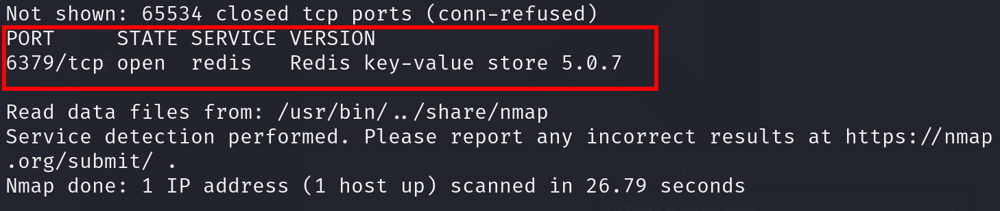
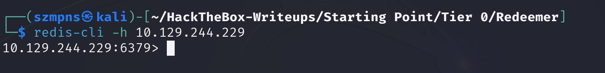
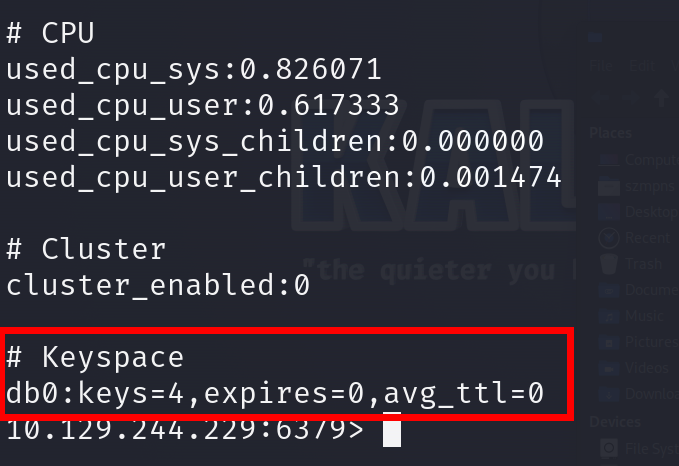
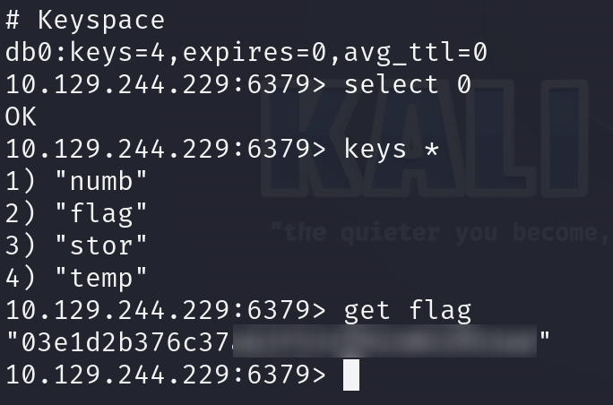
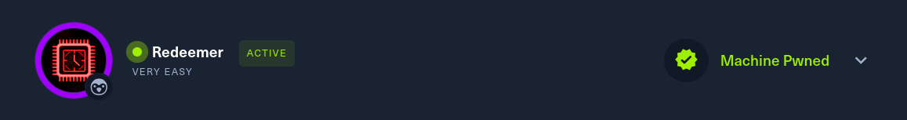

# Redeemer      


## Solution

### Scan with nmap

Type:

```
nmap -p- -sV -T4 {target ip} -v

```



Port 6379/tcp is open. Service is `redis` and its version is `Redis key-value store 5.0.7`.

### Redis

If you want to search for a specific functionality, type `redis-cli -h`.

We are going to use `-h` flag.

Type:

```
redis-cli -h {target ip}
```



When you are in type `info` for more informations.




### Get the flag

There is one database. Let's select it.

```
select 0
```
When database is selected, we can list all the keys present in it by typing:

```
keys *
```

Then we go with:

```
get flag
```



Here comes the flag.

### Paste the flag



## Answers

### Task-1: Which TCP port is open on the machine?

6379

### Task-2: Which service is running on the port that is open on the machine?

redis

### Task-3: What type of database is Redis? Choose from the following options: (i) In-memory Database, (ii) Traditional Database

In-memory Database

### Task-4: Which command-line utility is used to interact with the Redis server? Enter the program name you would enter into the terminal without any arguments.

redis-cli

### Task-5: Which flag is used with the Redis command-line utility to specify the hostname?

-h 

### Task-6: Once connected to a Redis server, which command is used to obtain the information and statistics about the Redis server?

info 

### Task-7: What is the version of the Redis server being used on the target machine?

5.0.7

### Task-8: Which command is used to select the desired database in Redis?

select

### Task-9: How many keys are present inside the database with index 0?

4

### Task-10: Which command is used to obtain all the keys in a database?

keys *

### Submit root flag

Good job!