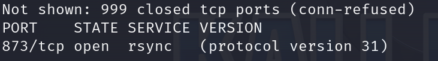
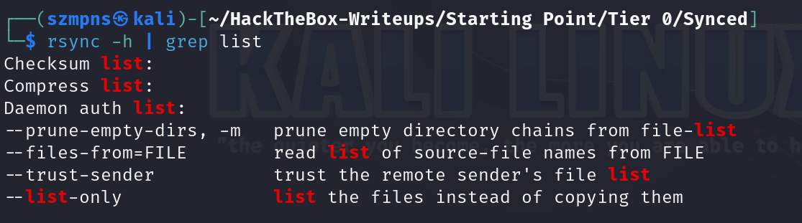
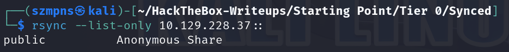
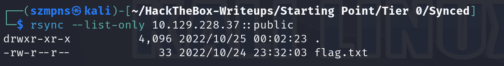
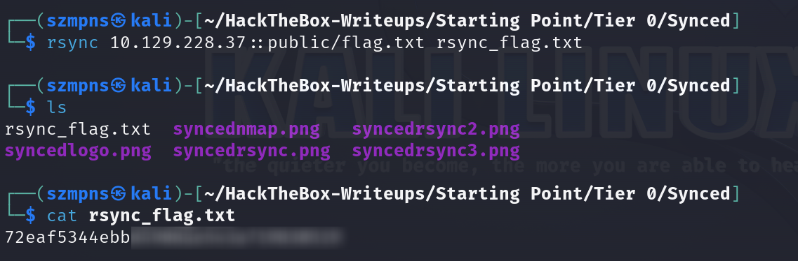

# Synced      


## Solution

### Scan with nmap

Type:

```
nmap -sC -sV {target ip} -v
```



Port 873/tcp is open. Service is `rsync` and protocol version is `31`.

### rsync

We want to list all the available directories.



To do it, we'll use:

```
rsync --list-only {target ip}::
```



Now, let's see what the public contains:

```
rsync --list-only {target ip}::public
```



### Get the flag

To do it, we have to paste:

```
rsync {target ip}::public/flag.txt {prefered name to your file}.txt
```



Done.

### Paste the flag


## Answers

### Task-1: What is the default port for rsync?

873

### Task-2: How many TCP ports are open on the remote host?

1

### Task-3: What is the protocol version used by rsync on the remote machine?

31

### Task-4: What is the most common command name on Linux to interact with rsync?

rsync

### Task-5: What credentials do you have to pass to rsync in order to use anonymous authentication? anonymous:anonymous, anonymous, None, rsync:rsync

None

### Task-6: What is the option to only list shares and files on rsync? (No need to include the leading -- characters)

list-only

### Submit root flag

GJ.