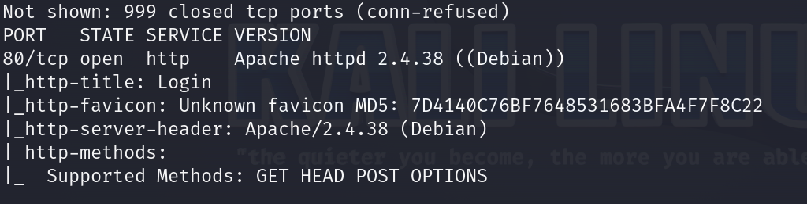
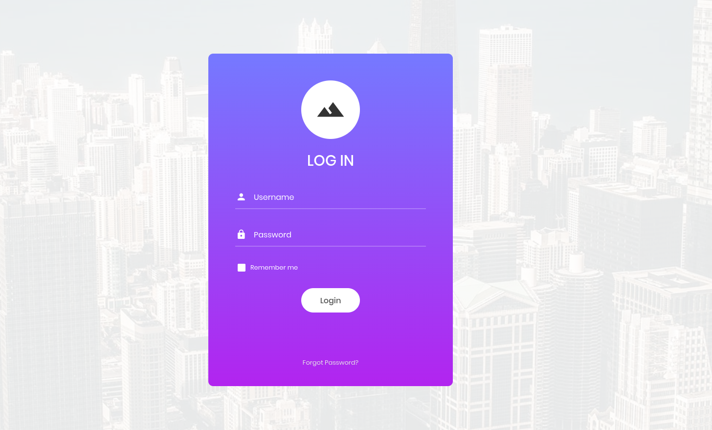
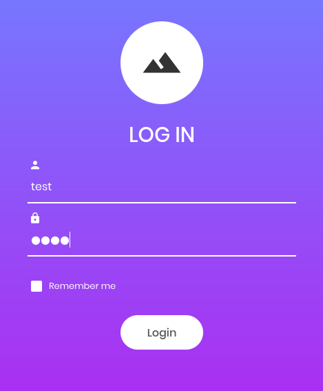
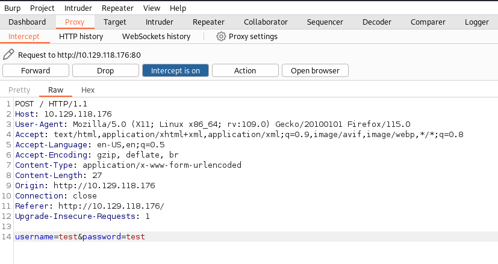
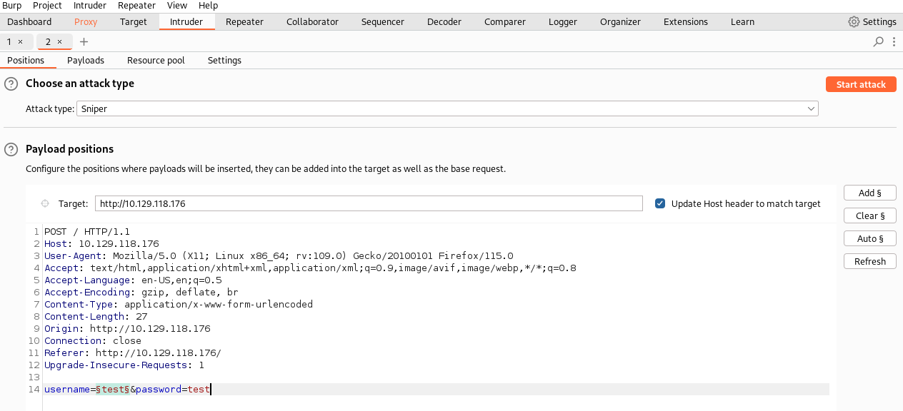
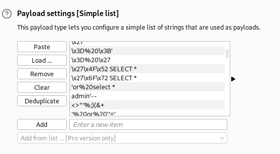
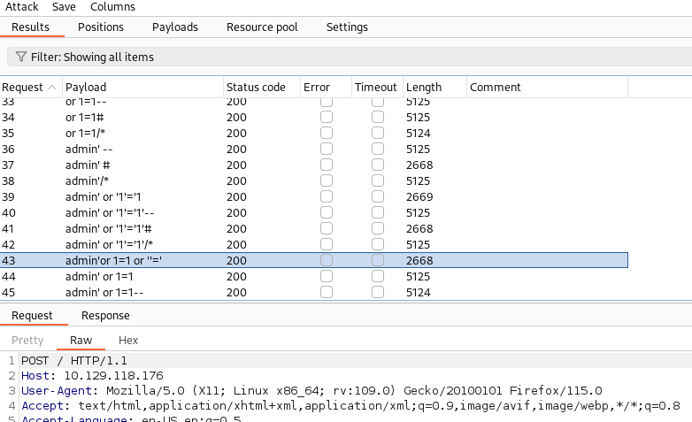
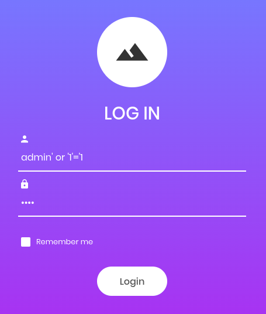
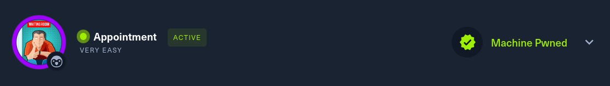

# Appointment      


## Solution

### Scan with nmap

Type:

```
nmap -sC -sV {target ip} -v
```



80/tcp is open. Service is `http`.

You can paste `target ip` into the browser and you should see this:



### Burpsuite with a SQL Injection

We will use `Burpsuite`. If you are not familiar with this tool, search for some tutorials via Internet. Also, make every effort to understand how to set up a proxy.

We are going to put fake credentials like `test` `test` to intercept the request.





Send this request to intruder.

Mark `test` after username and click `Add §` icon. 



Go to `Payloads` section and in `Payload settings` load payload which you want to use.



If all of the above is done press `Start attack`.



We can see that three payloads have worked:

```
admin' #
```

```
admin' or '1'='1
```

```
admin' or '1'='1'#
```

#### Disclaimer

To do this I recommend dictionary from `SecLists`. Full path:

```
SecLists/Fuzzing/SQLi/quick-SQLi.txt 
```

### Get the flag

To get the flag we have to paste one of the payloads above as `Username` and whatever you want as `Password`.



Here is the flag:


### Paste the flag



## Answers

### Task-1: What does the acronym SQL stand for?

Structured Query Language

### Task-2: What is one of the most common type of SQL vulnerabilities?

SQL injection

### Task-3: What is the 2021 OWASP Top 10 classification for this vulnerability?

A03:2021-Injection

### Task-4: What does Nmap report as the service and version that are running on port 80 of the target?

Apache httpd 2.4.38 ((Debian))

### Task-5: What is the standard port used for the HTTPS protocol?

443

### Task-6: What is a folder called in web-application terminology?

directory

### Task-7: What is the HTTP response code is given for 'Not Found' errors?

404

### Task-8: Gobuster is one tool used to brute force directories on a webserver. What switch do we use with Gobuster to specify we're looking to discover directories, and not subdomains?

dir  

### Task-9: What single character can be used to comment out the rest of a line in MySQL?

`#`

### Task-10: If user input is not handled carefully, it could be interpreted as a comment. Use a comment to login as admin without knowing the password. What is the first word on the webpage returned?

Congratulations

### Submit root flag

What a great day.