# Crocodile      


## Solution

### Scan with nmap

Type:

```
nmap -sC -sV {target ip} -v
```

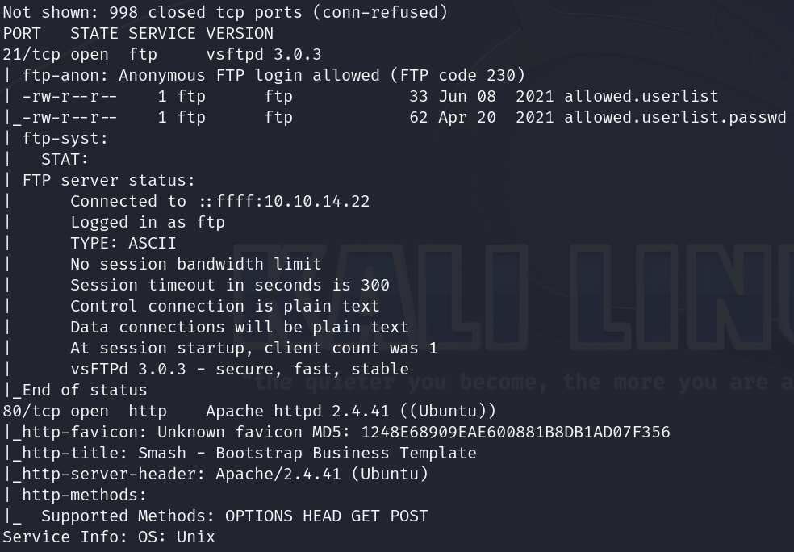

Two ports are open. 21/tcp, service - `ftp` and 80/tcp, service - `http`.

After pasting `target ip` into the browser we can see very well designed website.

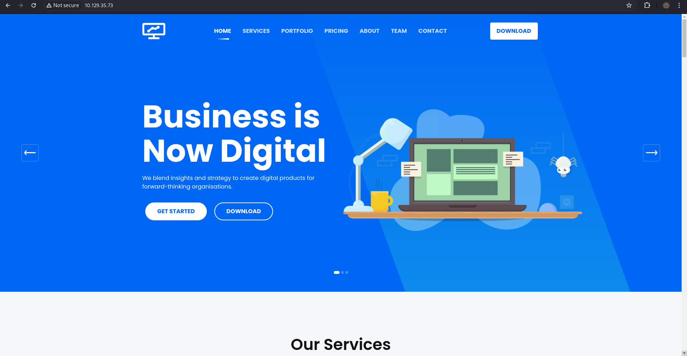

Despite this, we will focus more on `ftp` than `http` at first.

### ftp

Type:

```
ftp {target ip}
```

As a name use `Anonymous`.

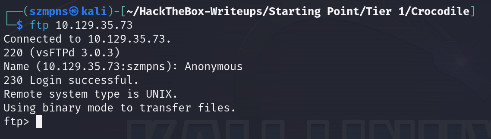

We can see that `Remote system type is UNIX` so basically, we can navigate through the server using unix commands.

After hitting `ls` we can see `allowed.userlist` and `allowed.userlist.passwd` files.

Let's get them.

Type:

```
get allowed.userlist.passwd
```

and 

```
get allowed.userlist
```

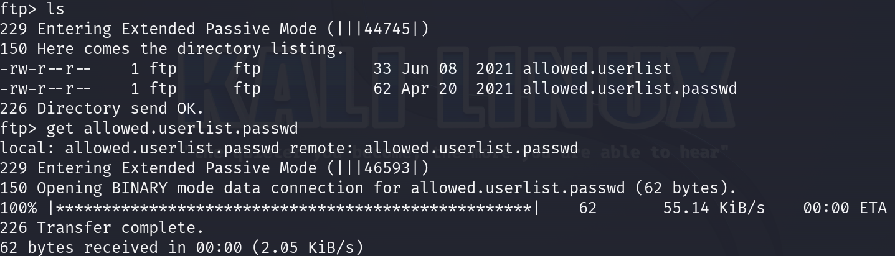

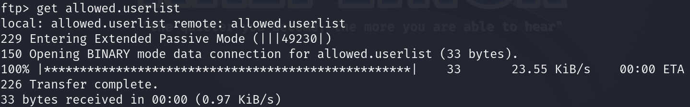

Now we can leave. Type `exit` and let's see the flags.

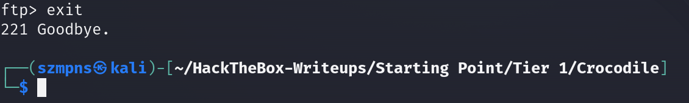

### Credentials

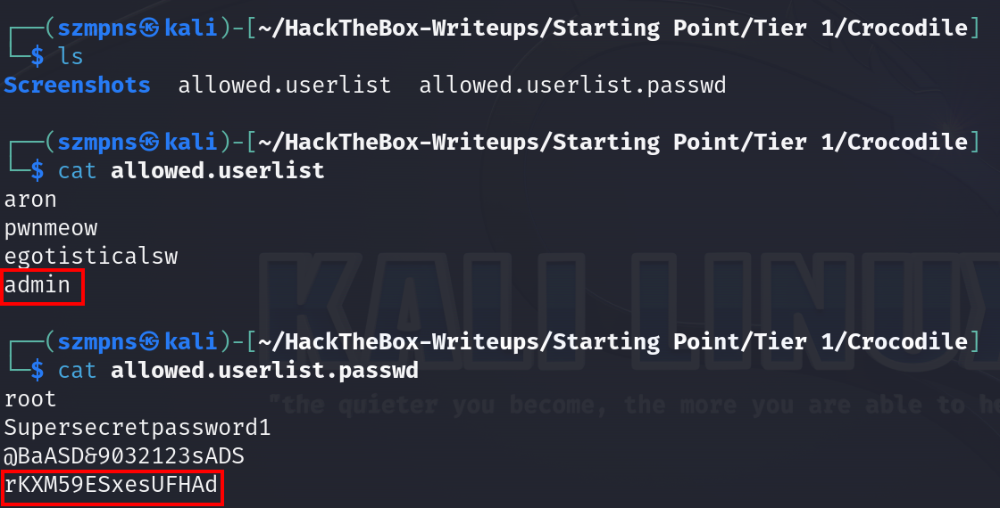

We got the `admin` `password`.

We could use it to log in to our website but there is no login panel.


### gobuster

Let's look for some hidden directories on the target website using `gobuster`.

Type:

```
gobuster dir -u http://{target ip}/ -w {path to dictionary you wanna use} -x php
```

`dir` - Specifies that Gobuster should run in directory brute-forcing mode.

`-u` - Sets the target URL to scan.

`-w` - Specifies the wordlist file to use for the brute-force scan.

`-x` - Specifies file extensions to search for during the scan. You can provide a comma-separated list of extensions (e.g., php,html,txt) to look for specific file types in addition to directories.

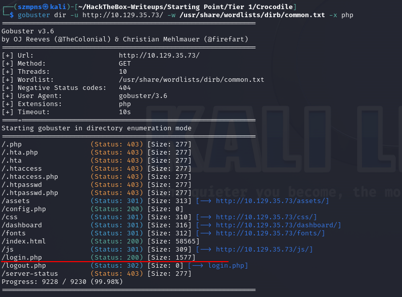

We have a login panel - `/login.php`.

### Get the flag

Paste into your browser:

```
http://{target ip}/login.php
```

You'll see the panel:

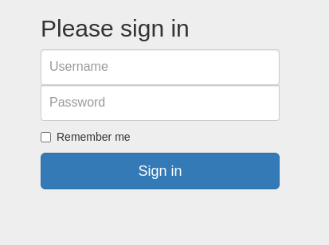

Paste `admin` credentials which we previously got.

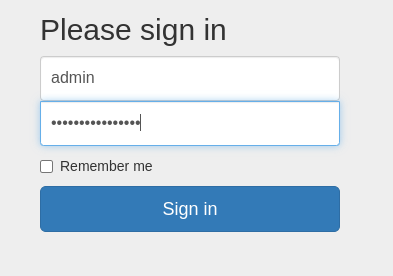

We are in admin panel.

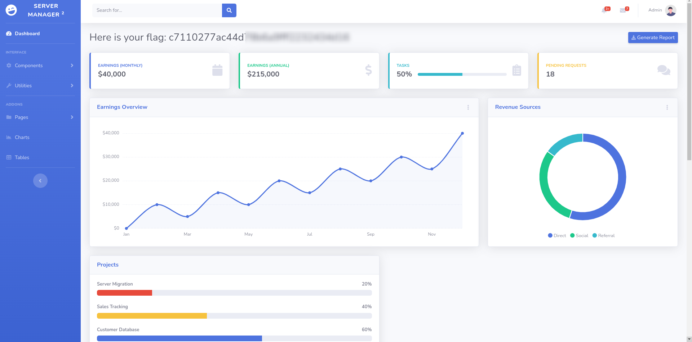

Here comes the flag.

### Paste the flag

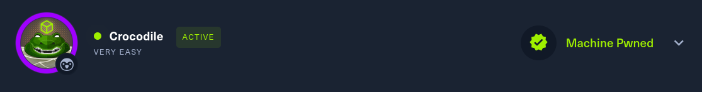

## Answers

### Task-1: What Nmap scanning switch employs the use of default scripts during a scan?

-sC

### Task-2: What service version is found to be running on port 21?

vsftpd 3.0.3

### Task-3: What FTP code is returned to us for the "Anonymous FTP login allowed" message?

230

### Task-4: After connecting to the FTP server using the ftp client, what username do we provide when prompted to log in anonymously?

Anonymous

### Task-5: After connecting to the FTP server anonymously, what command can we use to download the files we find on the FTP server?

get

### Task-6: What is one of the higher-privilege sounding usernames in 'allowed.userlist' that we download from the FTP server?

admin

### Task-7: What version of Apache HTTP Server is running on the target host?

Apache httpd 2.4.41

### Task-8: What switch can we use with Gobuster to specify we are looking for specific filetypes?

-x 

### Task-9: Which PHP file can we identify with directory brute force that will provide the opportunity to authenticate to the web service?

login.php

### Submit root flag

Great effort. GJ!