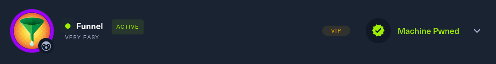

# Funnel      


## Solution

### Scan with nmap

Type:

```
nmap -sC -sV {target ip} -v
```


`21/tcp` is open. Service is `ftp`.

`22/tcp` is open. Service is `ssh`.

### ftp

Let's connect to the `FTP` server.

Type:

```
ftp {target ip}
```

As a login use `Anonymous`. When it asks you about password just press `Enter`.


There is `mail_backup` directory stored on the `FTP` server. 

Use `cd` to navigate inside it.

Hit `ls`.

Two files are there - `password_policy.pdf` and `welcome_28112022`.

SImply, `get` them by pasting:

```
get password_policy.pdf
```

and then:

```
get welcome_28112022
```


When it's done. `Exit` the `FTP` server.


Files should be in the directory, from which you connected to `ftp`.


Time to open them.

`welcome_28112022`


`password_policy.pdf`


From the `welcome` file we receive `usernames`:

```
root
optimus
albert
andreas 
christine 
maria
```

And from `password_policy` file we receive default `password`:

```
funnel123#!#
```

### SSH 

It's time to use `SSH`.

To connect to a remote server, paste:

```
ssh {username}@{target ip}
```

Let's try with all nicknames we have, maybe someone hasn't changed the `default` password yet.


We gained remote access to the machine, as `christine`.

The `ss` command can be used in the context of SSH to display information about active SSH connections and listening SSH sockets. By using `ss -t` for TCP sockets and `ss -l` for listening sockets, you can identify which ports are being used by SSH. Additionally, the `-n` flag prevents address resolution, displaying numerical addresses instead of hostnames.

Now we know that `PostgreSQL` is running at `port 5432`.


However, we cannot access it from `ssh` service.


Since we lack administrative privileges, we cannot do much. The service with the flag is likely hidden `locally` on the target machine, and the required tool isn't installed. Solution is `port-forwarding` or `tunneling` using SSH.

`Tunneling`, or `port forwarding`, allows secure data transfer between a local and a remote machine through an encrypted SSH connection. The command `ssh -L 1337:localhost:22 user@example.com` sets up a local port forwarding. It binds local port 1337 to the remote machine's port 22 (SSH port). When you connect to `localhost` on port 1337, the traffic is securely tunneled to `example.com`'s SSH service on port 22. This can be used to access services on the remote machine that are not directly accessible from your local machine. It ensures that data sent between the local and remote machines is encrypted, enhancing security. This method is useful for bypassing firewalls and accessing remote services securely.

Let's do it. Type:

```
ssh -L {port of your choice}:localhost:5432 christine@{target ip}
```


We can see it worked.

### PostgreSQL 

Time to interact with the `PostgreSQL` service.

In new tab type:

```
psql -U christine -h localhost -p {the port you have chosen}
```


Password as usual - `funnel123#!#`.

Type `\l` to list available databases.


`\c` to switch to another database. In our example `secrets`.


`\dt` to list tables in the current database.


Flag is here.

### Get the flag

To get flag type simple query:

```
SELECT * FROM flag;
```


### Paste the flag



## Answers

### Task-1: How many TCP ports are open?

2

### Task-2: What is the name of the directory that is available on the FTP server?

mail_backup

### Task-3: What is the default account password that every new member on the "Funnel" team should change as soon as possible?

funnel123#!#

### Task-4: Which user has not changed their default password yet?

christine

### Task-5: Which service is running on TCP port 5432 and listens only on localhost?

postgresql

### Task-6: Since you can't access the previously mentioned service from the local machine, you will have to create a tunnel and connect to it from your machine. What is the correct type of tunneling to use? remote port forwarding or local port forwarding?

local port forwarding

### Task-7: What is the name of the database that holds the flag?

secrets

### Task-8: Could you use a dynamic tunnel instead of local port forwarding? Yes or No.

Yes

### Submit root flag

Port forwarding is useful.