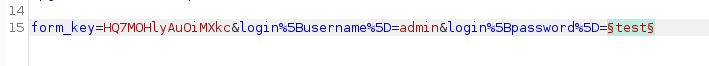
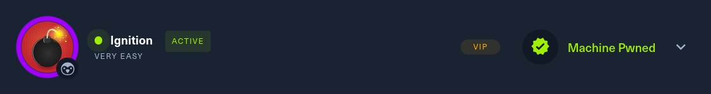

# Ignition      


## Solution

### Scan with nmap

Type:

```
nmap -sC -sV {target ip} -v
```


`80/tcp` is open. Service is `http`.

#### Disclaimer


As the nmap scan says `http-title: Did not follow redirect to http://ignition.htb/`, I would recommend adding `{target ip} ignition.htb` into your `/etc/hosts` file.

To do this type:

```
sudo nano /etc/hosts
```

At the very end paste section from above and `save` it. You can do that by `Ctrl + X`. Then press `Y`.


After pasting `target ip` into the browser we can see the website.


### gobuster

Type:

```
gobuster dir -u http://ignition.htb/ -w {path to dictionary you want to use}
```

`dir` - Specifies the mode of Gobuster to use, in this case, directory brute-forcing.

`-u` - Specifies the target URL to scan.

`-w` - Specifies the wordlist to use for the directory brute-forcing.


We found `admin` login panel.

```
http://ignition.htb/admin
```


I found it on the Internet that default `Magento` admin credentials are:

```
admin:123123
```


Let's try this combination.


It haven't worked.

### Burpsuite

As only one port is open - `80/tcp`, the only reasonable option is to brute force the password.

Usually the administrator's username is not changed, so since default `Magento` credentials are not working, focusing on password seems smart.

Let's intercept the `login request`:


Send it to `Intruder` by pressing `Ctrl + I`.


Now, select the password payload which you provided and press `Add §`.



Next, in the `Payloads` section `load` wordlist of passwords you want to try.


If it's done, press `Start attack`.


We found the `password`. It's `qwerty123`.

### Get the flag

Let's login.


The flag is displayed on the dashboard.


### Paste the flag



## Answers

### Task-1: Which service version is found to be running on port 80?

nginx 1.14.2

### Task-2: What is the 3-digit HTTP status code returned when you visit http://{machine IP}/?

302

### Task-3: What is the virtual host name the webpage expects to be accessed by?

ignition.htb

### Task-4: What is the full path to the file on a Linux computer that holds a local list of domain name to IP address pairs?

/etc/hosts

### Task-5: Use a tool to brute force directories on the webserver. What is the full URL to the Magento login page?

http://ignition.htb/admin

### Task-6: Look up the password requirements for Magento and also try searching for the most common passwords of 2023. Which password provides access to the admin account?

qwerty123

### Submit root flag

Good one.