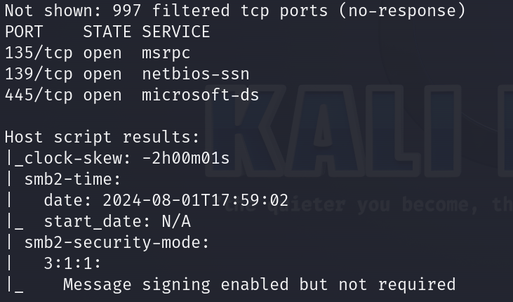
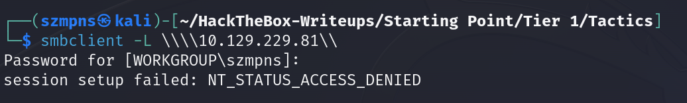
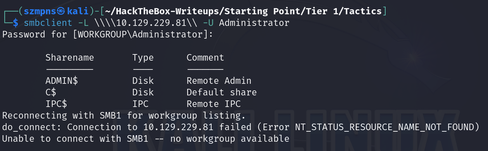
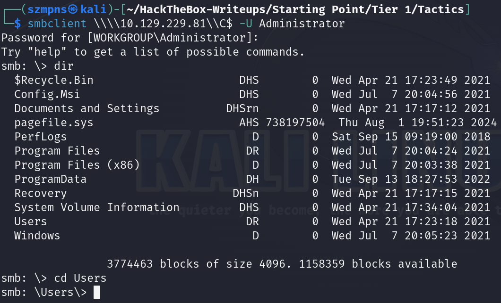
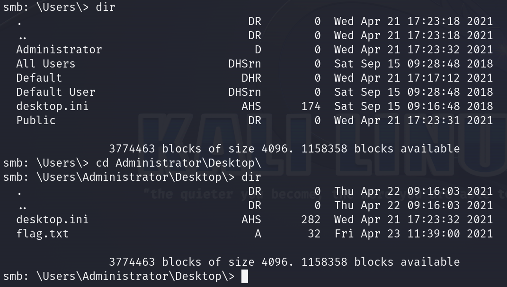
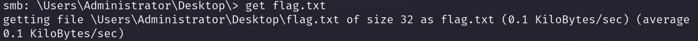
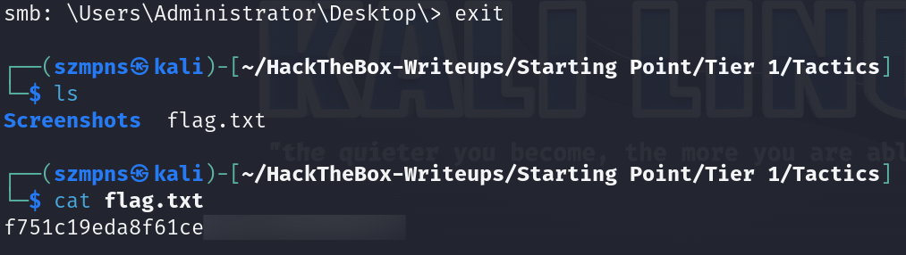

# Tactics      


## Solution

### Scan with nmap

Type:

```
nmap -sC -Pn {target ip} -v
```

`-sC` - This flag tells `Nmap` to use the default set of scripts during the scan. These scripts are part of the `Nmap Scripting Engine (NSE)` and are used for tasks such as version detection, vulnerability detection, and more. Using `-sC` enhances the scan by providing additional information about the target.

`-Pn` - This flag disables host discovery. Normally, `Nmap` performs a host discovery phase to determine if a target is online before scanning it. Using `-Pn` tells `Nmap` to skip this step and assume that the host is up. This is useful for scanning hosts that are behind firewalls or other network devices that block ping requests.

`-v` - This flag enables verbose mode. Verbose mode provides more detailed output during the scanning process, allowing you to see more information about what `Nmap` is doing. This can be helpful for debugging and understanding the progress of the scan.



`135/tcp (msrpc)` - This port is used by `Microsoft RPC (Remote Procedure Call)` services, which facilitate communication between applications on different computers in a network. It is commonly associated with `DCOM (Distributed Component Object Model)` services on `Windows` systems.

`139/tcp (netbios-ssn)` - This port is used by `NetBIOS Session Service`. It allows applications on separate computers to communicate over a local area network and is primarily used for file and printer sharing on `Windows` networks.

`445/tcp (microsoft-ds)` - This port is used by `Microsoft Directory Services` and is associated with `SMB (Server Message Block)` protocol. It is used for providing shared access to files, printers, and other network resources on `Windows` networks, replacing the older NetBIOS over TCP/IP method.

### smbclient 

`SMB (Server Message Block)` is a file sharing protocol. Let's try to extract some useful data by exploring it. 

Type:

```
smbclient -L \\\\{target ip}\\
```
This command lists the available shared resources (such as files and printers) on the specified target machine using the `SMB` protocol.



Failed attempt.

Let's proceeded to authenticate as the `Administrator` user in order to attempt a passwordless login. 

We are trying that because `Administrator` account is the high-privilege standard account for `Windows` operating systems.

To do this, type:

```
smbclient -L \\\\{target ip}\\ -U Administrator
```

When it asks you for password just press `Enter`.



We can see that it worked. 

Since we can log in passwordless, there is nothing against to access all three shares.

Type:

```
smbclient \\\\{target ip}\\{name of share you want to access} -U Administrator
```

There is nothing interesting in `ADMIN$` and `IPC$` but in `C$`, we can find the flag.





Flag is there. It's on the `Desktop` of the `Administrator` user account.

### Get the flag

Let's just `get` it.

Type:

```
get flag.txt
```



Remember to be in `\Users\Administrator\Desktop\` path.

Then you can `exit` and flag should be in the directory you connected from.



### Paste the flag


## Answers

### Task-1: Which Nmap switch can we use to enumerate machines when our ping ICMP packets are blocked by the Windows firewall?

-Pn

### Task-2: What does the 3-letter acronym SMB stand for?

Server Message Block

### Task-3: What port does SMB use to operate at?

445

### Task-4: What command line argument do you give to `smbclient` to list available shares?

-L

### Task-5: What character at the end of a share name indicates it's an administrative share?

$

### Task-6: Which Administrative share is accessible on the box that allows users to view the whole file system?

C$

### Task-7: What command can we use to download the files we find on the SMB Share?

get

### Task-8: Which tool that is part of the Impacket collection can be used to get an interactive shell on the system?

psexec.py

### Submit root flag

That was easy one.